# Analisi Unificata dell'Architettura Sistec HMI

> **Progetti analizzati:** Sistec.5315 (LAG) — HMI Pressopiegatrice / Cella di Produzione  
> **+** Sistec.5309 (FAEL) — HMI Cella di Produzione  
> **Data:** Luglio 2026  
> **Scopo:** Analisi trasversale dell'architettura Sistec HMI, identificazione degli antipattern comuni, e proposta di un'architettura modulare unificata applicabile a qualsiasi commessa

---

## Premessa

Le codebase `5315_LAG` e `5309_FAEL` condividono lo stesso software di base HMI per celle di produzione Sistec. Ogni commessa (LAG, FAEL, future) presenta un layout impianto diverso con macchinari differenti, ma il fulcro applicativo — interfaccia PLC, gestione produzione, robot KUKA, presse, tracciamento job — è comune.

### Decisione Strategica

**Le commesse esistenti (LAG, FAEL) non vengono refattorizzate.** L'architettura target descritta in questo documento è il blueprint per la **prossima commessa**, da sviluppare ex-novo seguendo i principi di stack verticali, NuGet, DI, Layout Engine e Avalonia.

| Codice esistente | Nuova commessa |
|---|---|
| Manutenzione correttiva soltanto | Sviluppo greenfield |
| Nessun refactoring strutturale | Architettura a stack verticali |
| WinForms legacy | Avalonia cross-platform |
| God Project Common | NuGet packages verticali |
| Statico/globale | DI Container |
| Password in chiaro | BCrypt + badge RFID |

| Dimensione | 5315 LAG | 5309 FAEL |
|---|---|---|
| Progetti `.csproj` | 14 | 53 |
| Soluzioni `.sln` | 6 | 22 |
| File C# totali | ~684 | ~800 (solo main) + 35+ test |
| Varianti HMI | 1 (monolitica) | 3 (AB, C, BS) |
| Pressa | Safan (TCP) | ESA (Modbus) |
| Robot | KUKA (in Common) | KUKA (libreria separata) |
| CNC | Sinumerik / ONE | Assente |
| Bus messaggi | Assente | Zebus (`Sistec.Bus`) |
| Test automatici | NUnit 4.3.2 (net10.0) | Prevalentemente manuali/UI |
| God Project | `Sistec.5315/Common` | `Sistec.HMI/Common` |
| God Class | `MainForm` (19 partial) | `FrmHMI` (~5.156 righe AB) |

---

## 1. Architettura Corrente: Monolite Condiviso

### 1.1 Progetti Fondazione (identici in entrambi)

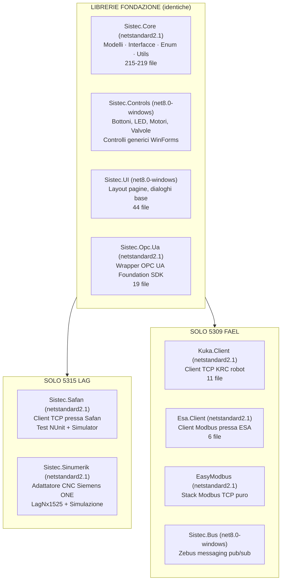

### 1.2 Il God Project: `Sistec.HMI/Common` / `Sistec.5315/Common`

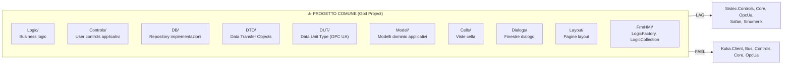

Metriche comuni:

| Metrica | LAG | FAEL |
|---|---|---|
| Directory in Common | 15+ | 12+ |
| File C# in Common | ~270 | ~270 |
| Progetti referenziati da Common | 5 | 5 |
| RootNamespace incoerente | `Sistec` (uguale a HMI) | `Sistec.Common` |

### 1.3 Le God Class

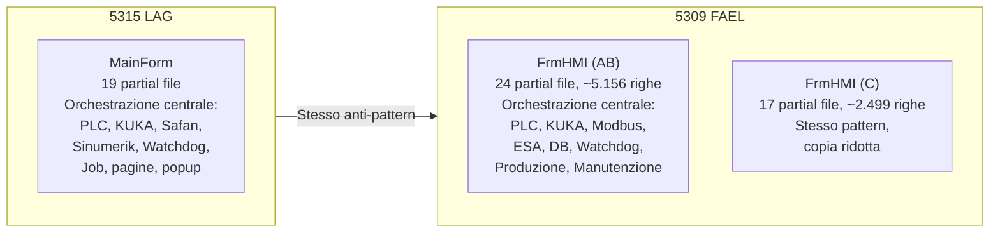

In entrambi i casi: il costruttore del Form principale inizializza manualmente TUTTO (OPC UA, tag PLC, logics, watchdog, eventi) senza DI container.

### 1.4 Stack Frammentato: KUKA Robot

Il robot KUKA è l'esempio perfetto di bassa coesione in entrambe le codebase:

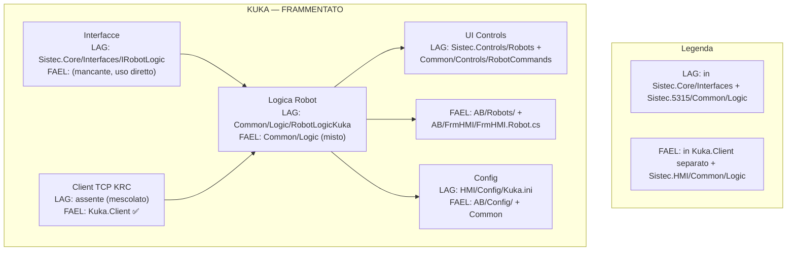

**Per capire KUKA servono 5 progetti diversi in entrambe le codebase.**

### 1.5 Anti-Pattern Trasversali

| # | Anti-Pattern | LAG | FAEL |
|---|---|---|---|
| 1 | **God Project** | `Sistec.5315/Common` (21 dir) | `Sistec.HMI/Common` (12+ dir) |
| 2 | **God Class** | `MainForm` (19 partial) | `FrmHMI` (24 partial, ~5.156 righe) |
| 3 | **No DI Container** | Tutto `new`, `.Use()` fluente | Tutto `new`, `LogicCollection` come service locator |
| 4 | **Service Locator** | `Configuration.PlcConfig[...]` statico | `ObjectUsageMonitor.Instance`, `LogicCollection` |
| 5 | **Concrete Coupling** | `CellLogic(SafanPressBrakeLogic, ...)` | `FrmHMI` referenzia `OpcUaClient`, `KrcClient` direttamente |
| 6 | **Business Logic in UI** | `MainForm.cs:90-368` costruttore | `FrmHMI.cs` costruttore ~490 righe |
| 7 | **Technology Lock-In** | DUT OPC UA `EncodeableBase` | DUT OPC UA `EncodeableBase` |
| 8 | **DB Access Sparso** | Repository in Core + Common | Repository in Core + Common |
| 9 | **Magic Strings** | Tag name hardcoded | Tag name hardcoded, `Shared.cs` ha 5 costanti |
| 10 | **Lava Flow** | `Contracts\**` escluso da compilazione | `FrmHMI.Substations.cs` ~80% commentato |
| 11 | **Shotgun Surgery** | Aggiungere device: modifiche a N file | Aggiungere device: modifiche a N file |
| 12 | **SafeInvoke** | Pattern `Control.SafeInvoke` | Pattern `Control.SafeInvoke` in `Bus.cs`, `KrcClientCollection` |
| 13 | **Namespace Incoerente** | `RootNamespace = Sistec` in HMI e Common | DUT in namespace `Sistec.DUT` invece di `Sistec.Common.DUT` |

---

## 2. Architettura Proposta: Stack Verticali Unificati

### 2.1 Principi Guida

| Principio | Applicazione |
|---|---|
| **Vertical Slicing** | Ogni macchina/dispositivo è uno stack autonomo (Client → Driver → Services → UI → Simulator) |
| **Dependency Inversion** | Tutto dipende da interfacce, mai da classi concrete |
| **DI Container** | `Microsoft.Extensions.DependencyInjection` per composizione e lifetime |
| **Sep. Responsabilità** | Ogni progetto ha UN solo scopo. **5 layer per stack** |
| **Coesione** | Tutto KUKA in `Sistec.Kuka.Stack.*` |
| **Anti-Corruption Layer** | Ogni stack traduce dal protocollo nativo al dominio |
| **Configurabilità** | `IOptions<T>` invece di Configuration statica |
| **Code Generation** | DUT generati da definizioni CODESYS |
| **Hexagonal Architecture** (Ports & Adapters) | Il Core (`Sistec.Core`) non importa mai framework, DB, HTTP o librerie di terze parti. Gli Adapter (Client TCP, Persistence Dapper, Simulator) sono intercambiabili senza toccare il Core. Il Core dipende solo da primitive del linguaggio e dalle interfacce che definisce (Ports). |
| **Test Standard** | NUnit per ogni stack + Simulator per test di integrazione |

### 2.2 Struttura a Stack Verticali

Ogni dispositivo/dominio diventa uno **stack verticale** con 5 layer:

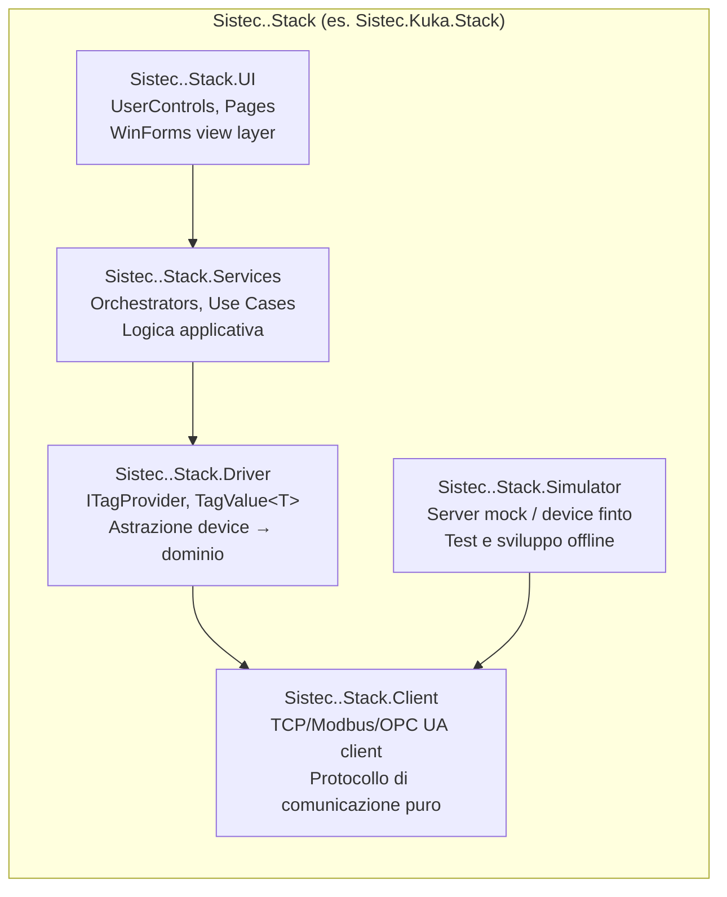

### 2.3 Mappa degli Stack

```mermaid
flowchart TB
    subgraph Fondazione["FONDAZIONE"]
        Core["Sistec.Core<br/>Modelli dominio, Interfacce pure<br/>Enum, Eccezioni, Eventi<br/>netstandard2.1"]
        Controls["Sistec.Controls<br/>Controlli WinForms generici<br/>Led, Button, Container, Motors, Valves<br/>Nessuna logica di dominio"]
        SistecUI["Sistec.UI<br/>Layout pagine, menu,<br/>alarm banner, user management"]
    end

    subgraph Comunicazione["LIBRERIE ORIZZONTALI"]
        OpcUaLib["Sistec.OpcUa.Library<br/>IUAClient, MonitoredItem<br/>Session management puro"]
        ModbusLib["Sistec.Modbus.Library<br/>EasyModbus puro<br/>Client/Server Modbus TCP"]
        BusLib["Sistec.Bus.Library<br/>Zebus pub/sub o HTTP+Redis<br/>Comunicazione inter-pannello"]
    end

    subgraph Macchine["STACK VERTICALI — MACCHINE"]
        Kuka["Sistec.Kuka.Stack<br/>Robot KUKA KRC<br/>Client TCP · Driver · Services · UI · Simulator"]
        Safan["Sistec.Safan.Stack<br/>Pressa Safan (TCP)<br/>Client · Driver · Services · UI · Simulator"]
        Esa["Sistec.Esa.Stack<br/>Pressa ESA (Modbus)<br/>Client · Driver · Services · UI · Simulator"]
        PlcInt["Sistec.PLC.Stack<br/>Interfaccia PLC (OPC UA)<br/>Client · Driver · Services · UI · Simulator"]
        Sinumerik["Sistec.Sinumerik.Stack<br/>CNC Siemens ONE<br/>Client · Driver · Services · UI · Simulator"]
    end

    subgraph Applicazione["STACK VERTICALI — APPLICAZIONE"]
        Production["Sistec.Production.Stack<br/>Orchestrazione produzione<br/>Services + UI"]
        JobMgmt["Sistec.JobManagement.Stack<br/>Job lifecycle, tracking<br/>Services + UI"]
        Maintenance["Sistec.Maintenance.Stack<br/>Manutenzione, safety<br/>Services + UI"]
        Alarms["Sistec.Alarms.Stack<br/>Alarm journal, notifiche<br/>Services + UI"]
    end

    subgraph Persistence["PERSISTENZA (multi-progetto)"]
        PersAbst["Sistec.Infra.Persistence<br/>Interfacce repository,<br/>Unit of Work contract"]
        PersDapper["Sistec.Infra.Persistence.Dapper<br/>Implementazione Dapper"]
        PersMySql["Sistec.Infra.Persistence.MySql<br/>MySqlConnector"]
        PersSqlSrv["Sistec.Infra.Persistence.SqlServer<br/>Microsoft.Data.SqlClient"]
        PersUoW["Sistec.Infra.Persistence.UnitOfWork<br/>Transaction scope"]
    end

    subgraph Config["CONFIGURAZIONE"]
        ConfigLib["Sistec.Configuration<br/>Options pattern, INI/XML reader<br/>IOptions&lt;T&gt;"]
    end

    subgraph CodeGen["CODE GENERATION"]
        DUTGen["Sistec.Infra.CodeGen<br/>dotnet tool<br/>CODESYS → POCO + OPC UA + TagConstants"]
    end

    Production -->|usa| Kuka
    Production -->|usa| Safan
    Production -->|usa| Esa
    Production -->|usa| PlcInt
    Production -->|usa| Sinumerik
    Production -->|usa| JobMgmt

    Kuka --> OpcUaLib
    Safan --> Core
    Esa --> ModbusLib
    PlcInt --> OpcUaLib
    Sinumerik --> OpcUaLib

    Kuka --> Core
    Safan --> Core
    Esa --> Core
    PlcInt --> Core
    Sinumerik --> Core

    PersAbst --> Core
    PersDapper --> PersAbst
    PersMySql --> PersDapper
    PersSqlSrv --> PersDapper
    PersUoW --> PersDapper

    ConfigLib --> Core
    DUTGen --> PlcInt

    classDef foundation fill:#e1f5e1,stroke:#2e7d32
    classDef comm fill:#fce4ec,stroke:#c62828
    classDef machine fill:#e8f5e9,stroke:#2e7d32
    classDef app fill:#fff8e1,stroke:#f57f17
    classDef data fill:#f3e5f5,stroke:#7b1fa2
    classDef infra fill:#e0f7fa,stroke:#006064

    class Core,Controls,SistecUI foundation
    class OpcUaLib,ModbusLib,BusLib comm
    class Kuka,Safan,Esa,PlcInt,Sinumerik machine
    class Production,JobMgmt,Maintenance,Alarms app
    class PersAbst,PersDapper,PersMySql,PersSqlSrv,PersUoW data
    class ConfigLib,DUTGen infra
```

### 2.4 Stack KUKA — Dettaglio (Esempio Completo)

| Layer | Progetto | Contenuto | Dipende da |
|---|---|---|---|
| **Client** | `Sistec.Kuka.Stack.Client` | `KrcClient`, `KrcConnectionPool`, protocollo TCP KRC | — |
| **Driver** | `Sistec.Kuka.Stack.Driver` | `IKukaTagProvider`, `KukaTagValue<T>`, mappatura tag → nomi KUKA | `Sistec.Kuka.Stack.Client`, `Sistec.Core` |
| **Services** | `Sistec.Kuka.Stack.Services` | `KukaRobotLogic`, `RobotFollowService`, `CommandService`, `OverrideService` | `Sistec.Kuka.Stack.Driver`, `Sistec.Core` |
| **UI** | `Sistec.Kuka.Stack.UI` | `ucKukaInfo`, `KukaOverrideControl`, `ConnectionStatusControl` | `Sistec.Kuka.Stack.Services`, `Sistec.Controls` |
| **Simulator** | `Sistec.Kuka.Stack.Simulator` | Server KRC falso (WinForms/Console) | `Sistec.Kuka.Stack.Client` |

### 2.5 Stack Safan (LAG) — Dettaglio

| Layer | Progetto | Contenuto | Dipende da |
|---|---|---|---|
| **Client** | `Sistec.Safan.Stack.Client` | `SafanClient` (TCP Winsock), `ISafanClient` | — |
| **Driver** | `Sistec.Safan.Stack.Driver` | `ISafanPressBrakeLogic` (migliorato), mappatura comandi Safan | `Sistec.Safan.Stack.Client`, `Sistec.Core` |
| **Services** | `Sistec.Safan.Stack.Services` | `SafanPressBrakeLogic` (business logic pura), `BendingStatusService` | `Sistec.Safan.Stack.Driver`, `Sistec.Core` |
| **UI** | `Sistec.Safan.Stack.UI` | `SafanBrakeView`, `BendCycleMonitor` | `Sistec.Safan.Stack.Services`, `Sistec.Controls` |
| **Simulator** | `Sistec.Safan.Stack.Simulator` | `SafanPressSimulator` (esistente, da restructure) | `Sistec.Safan.Stack.Client` |

### 2.6 Stack ESA (FAEL) — Dettaglio

| Layer | Progetto | Contenuto | Dipende da |
|---|---|---|---|
| **Client** | `Sistec.Esa.Stack.Client` | `EsaModbusClient`, protocollo Modbus ESA | `Sistec.Modbus.Library` |
| **Driver** | `Sistec.Esa.Stack.Driver` | `IPressBrakeTagProvider`, mappatura registri Modbus | `Sistec.Esa.Stack.Client`, `Sistec.Core` |
| **Services** | `Sistec.Esa.Stack.Services` | `PressOrchestrator`, `BendingProgramService`, `PressStateService` | `Sistec.Esa.Stack.Driver`, `Sistec.Core` |
| **UI** | `Sistec.Esa.Stack.UI` | `PressBrakeView`, `ProgramSelectionControl`, `PressConfigDialog` | `Sistec.Esa.Stack.Services`, `Sistec.Controls` |
| **Simulator** | `Sistec.Esa.Stack.Simulator` | Server Modbus falso (ESA-compatible) | `Sistec.Esa.Stack.Client` |

### 2.7 Stack PLC — Dettaglio

| Layer | Progetto | Contenuto | Dipende da |
|---|---|---|---|
| **Client** | `Sistec.PLC.Stack.Client` | `OpcUaClientCollection`, `IUAClient`, autodiscovery | `Sistec.OpcUa.Library` |
| **Driver** | `Sistec.PLC.Stack.Driver` | `IPlcTagProvider`, `OpcUaTagFactory`, tag DUT (da codegen) | `Sistec.PLC.Stack.Client`, `Sistec.Core` |
| **Services** | `Sistec.PLC.Stack.Services` | `PlcConnectionService`, `WatchdogService`, `SheetMonitorService`, `ModeService` | `Sistec.PLC.Stack.Driver`, `Sistec.Core` |
| **UI** | `Sistec.PLC.Stack.UI` | `PlcStatusControl`, `WatchdogIndicator`, `ModeSelector`, viste sensori | `Sistec.PLC.Stack.Services`, `Sistec.Controls` |
| **Simulator** | `Sistec.PLC.Stack.Simulator` | `FakeOpcUa`, server OPC UA falso (CODESYS emulation) | `Sistec.PLC.Stack.Client` |

### 2.8 Stack Sinumerik (LAG) — Dettaglio

| Layer | Progetto | Contenuto | Dipende da |
|---|---|---|---|
| **Client** | `Sistec.Sinumerik.Stack.Client` | Wrapper OPC UA ONE CNC | `Sistec.OpcUa.Library` |
| **Driver** | `Sistec.Sinumerik.Stack.Driver` | `ISinumerikTagProvider`, mappatura tag CNC | `Sistec.Sinumerik.Stack.Client`, `Sistec.Core` |
| **Services** | `Sistec.Sinumerik.Stack.Services` | `LagNx1525`, `PunchingProgramService`, `ProgramContentGetter` | `Sistec.Sinumerik.Stack.Driver`, `Sistec.Core` |
| **UI** | `Sistec.Sinumerik.Stack.UI` | `PunchingProgramView`, `SinumerikStatusControl` | `Sistec.Sinumerik.Stack.Services`, `Sistec.Controls` |
| **Simulator** | `Sistec.Sinumerik.Stack.Simulator` | `LagNx1525Simulation` (esistente, da restructure) | `Sistec.Sinumerik.Stack.Client` |

### 2.9 Stack Produzione / Job Management — Dettaglio

| Layer | Progetto | Contenuto | Dipende da |
|---|---|---|---|
| **Services** | `Sistec.Production.Stack.Services` | `CellLogic`, `ProductionOrchestrator`, `PressRobotTeamService`, `PlcPunchingTeamService` | Tutti gli stack macchina, `Sistec.Core` |
| **UI** | `Sistec.Production.Stack.UI` | `JobView`, `CutPlanView`, `PanelTrackingView`, `PalletStateView` | `Sistec.Production.Stack.Services`, `Sistec.Controls` |
| **Services** | `Sistec.JobManagement.Stack.Services` | `JobManager`, `ProgramLogic`, `TrackerService` | `Sistec.Core`, `Sistec.Infra.Persistence` |
| **UI** | `Sistec.JobManagement.Stack.UI` | `JobDialog`, `ProgramSelectionView` | `Sistec.JobManagement.Stack.Services`, `Sistec.Controls` |

### 2.10 Grafo Dipendenze (Unificato)

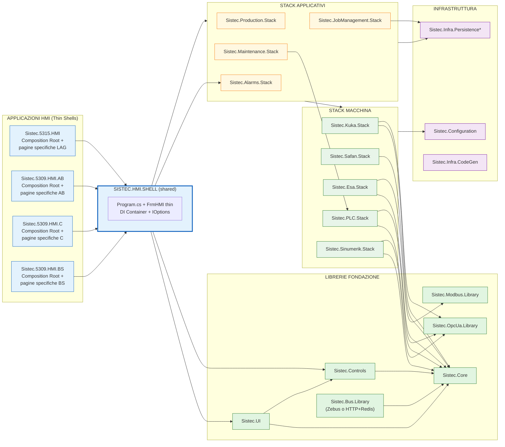

### 2.11 Code Generation per DUT

I file DUT (tag mapping OPC UA) sono attualmente **scritti a mano** in entrambe le codebase con commenti `//order matters: use the same order used in the codesys structure` — estremamente fragili e fonte di bug.

**Soluzione:** Code generation da definizioni CODESYS:

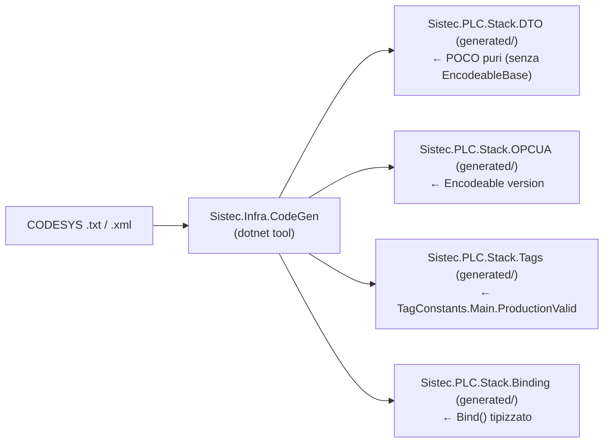

**Vantaggi:**
- Elimina errori di ordinamento campi
- Elimina codice duplicato (AB vs C in FAEL)
- Aggiungere nuovo DUT = aggiungere definizione CODESYS + rigenerare
- Tag type-safe (non più `"Main_ProductionValid"` ma `TagConstants.Main.ProductionValid`)
- POCO puri separati da `EncodeableBase` — rompe il technology lock-in OPC UA

### 2.12 Gestione Varianti HMI (Problema Aperto)

FAEL presenta 3 varianti (AB, C, BS) con ~45-55% di codice duplicato. LAG ha una singola variante.

**Problema identificato ma non risolto nel presente documento:** La strategia per unificare le varianti HMI (feature flags, configurazione, o mantenimento di progetti separati snelli) va discussa separatamente, in quanto:
- Dipende dalle effettive differenze di layout e macchinari
- Impatta il piano di refactoring complessivo
- Richiede validazione con il team di sviluppo

**Raccomandazione preliminare:** Iniziare comunque con la creazione degli stack verticali (Fase 1-2). La gestione varianti può essere affrontata in Fase 3 quando gli stack saranno stabili e le differenze tra varianti saranno più visibili.

### 2.13 Pattern di Composizione: DI Container

```csharp
// Program.cs — Composition Root unificato
public static void Main()
{
    var builder = Host.CreateApplicationBuilder(args);

    // Configurazione
    builder.Services.Configure<PlcOptions>(builder.Configuration.GetSection("Plc"));
    builder.Services.Configure<KukaOptions>(builder.Configuration.GetSection("Kuka"));
    builder.Services.Configure<SafanOptions>(builder.Configuration.GetSection("Safan"));
    builder.Services.Configure<EsaOptions>(builder.Configuration.GetSection("Esa"));

    // Stack macchina (attivazione condizionale per variante)
    builder.Services.AddKukaStack();
    builder.Services.AddSafanStack();    // LAG
    // builder.Services.AddEsaStack();   // FAEL (alternativo a Safan)
    builder.Services.AddPlcStack();
    builder.Services.AddSinumerikStack(); // LAG

    // Stack applicativi
    builder.Services.AddProductionStack();
    builder.Services.AddJobManagementStack();
    builder.Services.AddMaintenanceStack();
    builder.Services.AddAlarmsStack();

    // UI
    builder.Services.AddSingleton<FrmHMI>();

    var host = builder.Build();
    var form = host.Services.GetRequiredService<FrmHMI>();
    Application.Run(form);
}

// Metodo extension per stack KUKA
public static IServiceCollection AddKukaStack(this IServiceCollection services)
{
    services.AddSingleton<IKrcClient, KrcClient>();
    services.AddSingleton<IKukaTagProvider, KukaTagProvider>();
    services.AddSingleton<IKukaRobotLogic, KukaRobotLogic>();
    services.AddSingleton<IRobotFollowService, RobotFollowService>();
    return services;
}
```

### 2.14 Strategia di Test Unificata

| Layer | Tipo Test | Framework | Tool |
|---|---|---|---|
| **Client** | Unit test + Integration | NUnit 4.x | Simulator dello stack |
| **Driver** | Unit test con mock | NUnit 4.x | Mock del Client |
| **Services** | Unit test con mock | NUnit 4.x | Mock del Driver |
| **UI** | Test manuali / visuali | — | WinForms test runner |
| **Simulator** | Integration test end-to-end | NUnit 4.x | Simulator → Client |
| **Cross-stack** | Integration test | NUnit 4.x | Tutti gli stack + simulatori |

**Standard:** NUnit 4.3.2 (già presente in LAG per Safan su net10.0) come framework unico per tutti i test automatici. `coverlet.collector` per code coverage. Ogni stack ha il suo progetto di test.

### 2.15 Design Pattern Applicati

L'architettura target adotta esplicitamente i seguenti pattern creazionali e strutturali nei layer indicati:

| Pattern | Tipo | Layer | Applicazione | Esempio |
|---|---|---|---|---|
| **Factory Method** | Creazionale | Client / Driver | Crea driver/client senza accoppiamento al tipo concreto. La configurazione (`IOptions<T>`) decide quale protocollo istanziare. | `IClientFactory.Create(StackType.Kuka)` restituisce un `IKrcClient` senza che il chiamante sappia se è TCP reale o Simulator |
| **Facade** | Strutturale | Services | Ogni Services layer nasconde la complessità del sottosistema macchina (Client + Driver + stato + riconnessione) esponendo solo metodi di dominio. | `KukaRobotLogic.ExecuteProgram(programId)` incapsula comandi TCP, polling stato, gestione errori, riconnessione |
| **Proxy** | Strutturale | Client | Virtual proxy per connessione lazy a macchine costose; Protection proxy per controllo accessi; Logging proxy per monitoraggio performance. | `KrcClientProxy` inizializza la connessione TCP solo al primo comando. `LoggedKrcClient` registra latenza e throughput in ILogger<T> |
| **Mediator** | Comportamentale | Orchestration / Production | Disaccoppia la comunicazione tra UI Views e servizi incrociati. Un mediator centralizza le interazioni senza che le parti si conoscano. | `ProductionOrchestrator` media tra `KukaRobotLogic`, `SafanPressBrakeLogic`, `PlcConnectionService` e `JobManager` — le UI parlano solo con l'Orchestrator |

**Dove nascono:**

- **Factory Method** — nel Driver layer ogni stack ha un `TagFactory` che produce `TagValue<T>` tipizzati dal DTO CODESYS. Anche nel Layout Engine: `ControlFactory` (sez. 8.4) istanzia controlli UI da nome dichiarato in `layout.json`.
- **Facade** — è il pattern strutturale dominante in ogni `Sistec.*.Stack.Services`. Il Client sa solo di byte/stream, il Driver sa di tag/mapping, il Services orchesta e presenta una superficie di dominio pulita.
- **Proxy** — il Simulator di ogni stack (`Sistec.*.Stack.Simulator`) è un Proxy dell'implementazione reale. La DI sceglie quale registrare: `services.AddSingleton<KrcClient>` (produzione) vs `services.AddSingleton<IKrcClient, SimulatorKrcClient>` (test).
- **Mediator** — lo stack `Sistec.Production.Stack` (sez. 2.9) è di fatto un Mediator tra tutti gli stack macchina, senza che KUKA conosca Safan o viceversa.

---

## 3. Roadmap Greenfield: Costruire per la Nuova Commessa

L'architettura target descritta nelle sezioni successive **non si applica alle commesse LAG e FAEL esistenti**, che rimangono in manutenzione correttiva con WinForms legacy. Viene invece costruita **ex-novo per la prossima commessa**, partendo da zero con le fondazioni condivise e aggiungendo via via gli stack macchina necessari.

### Principi

```
┌─────────────────────────────────────────────────────┐
│              NUOVA COMMESSA (GREENFIELD)              │
│                                                       │
│  Fase 1 ─── Fondazioni (interfacce + infrastruttura) │
│  Fase 2 ─── Stack macchina necessari alla commessa    │
│  Fase 3 ─── Applicativi + UI                          │
│  Fase 4 ─── Deploy + collaudo                         │
│                                                       │
│  Esistenti (LAG, FAEL) restano invariati              │
└─────────────────────────────────────────────────────┘
```

### Fase 1: Fondazioni Condivise (4-5 settimane)

Tutto ciò che serve a qualsiasi commessa — indipendente dalla macchina specifica.

```
Sistec.Infra.*                     ← NuGet packages
├── Sistec.Infra.Persistence          Interfacce + Dapper + MySql + SqlServer
├── Sistec.Infra.Configuration        Options pattern (sostituisce Configuration statica)
├── Sistec.Infra.Authentication       BCrypt + badge RFID + Employee/Role management
├── Sistec.Infra.Logging              ILogger<T> strutturato, output JSON
└── Sistec.Infra.CodeGen              dotnet tool → DUT da CODESYS → POCO + TagConstants

Sistec.Platform.*                   ← NuGet packages
├── Sistec.Platform.Controls          Controlli base (Button, Led, Numeric, Valve, Motor)
├── Sistec.Platform.OpcUa             Wrapper OPC UA Foundation SDK
├── Sistec.Platform.Modbus            Stack Modbus TCP/RTU
└── Sistec.Platform.Cloud             MQTT connector opzionale
```

### Fase 2: Stack Macchina della Commessa (2-3 settimane per stack)

Solo gli stack necessari alla commessa in corso. Ogni stack è un pacchetto NuGet indipendente.

```
Sistec.Kuka.Stack.*                 ← Se la commessa ha KUKA
├── Client    → TCP/IP KRC
├── Driver    → Comandi robot
├── Services  → Logica robot
├── UI        → Pagine Avalonia
└── Simulator → Test

Sistec.Safan.Stack.*                ← Se la commessa ha pressa Safan
├── Client    → TCP/IP Winsock
├── Driver    → Comandi pressa
├── Services  → Logica pressa
├── UI        → Pagine Avalonia
└── Simulator → Test

... stesso pattern per ESA, Sinumerik, PLC, Bus ...
```

### Fase 3: Applicativi + UI (3-4 settimane)

```
Sistec.Production.Stack             ← Orchestrazione cella
Sistec.JobManagement.Stack          ← Cicli di vita job
Sistec.Maintenance.Stack            ← Manutenzione predittiva (ONNX)
Sistec.Alarms.Stack                 ← Alarm journal
Sistec.RecipeEngine                 ← Workflow configurabile JSON
Sistec.PalletStateMachine           ← Macchina a stati pallet

Sistec.HMI.Shell                    ← Composition Root Avalonia
├── LayoutEngine                    ← layout.json → UI
└── EmployeeStatsPage               ← Statistiche produzione per dipendente
```

### Fase 4: Deploy + Collaudo (1-2 settimane)

```
Ansible playbook                    ← Setup PC industriale
├── roles/common                    ← Hostname, utenti, firewall
├── roles/mysql                     ← MySQL + seed DB
├── roles/hmi_app                   ← Deploy HMI + servizio Windows
└── roles/codesys                   ← WSL2 + Docker + container CODESYS

Test ricevimento                    ← Collaudo in fabbrica
├── smoke test su ogni stack
├── test layout.json
└── test statistiche operatore
```

### Riepilogo Tempi

| Fase | Durata | Cosa si ottiene |
|---|---|---|
| **Fase 1** — Fondazioni | 4-5 settimane | NuGet infrastruttura, pronto per qualsiasi stack |
| **Fase 2** — Stack macchina | 2-3 settimane/stack | Solo gli stack necessari alla commessa |
| **Fase 3** — Applicativi + UI | 3-4 settimane | HMI completo + Layout Engine |
| **Fase 4** — Deploy | 1-2 settimane | PC industriale configurato + collaudo |
| **Totale prima commessa** | **~12-16 settimane** | Prima HMI greenfield, con tutti i fondamenti |

Le commesse successive riutilizzano Fase 1 + gli stack già esistenti, riducendo i tempi a **6-10 settimane** (solo Fase 2-4).

---

## 4. Confronto: Situazione Attuale vs Architettura Proposta

| Aspetto | Oggi | Domani |
|---|---|---|
| **KUKA Robot** | 5 progetti, frammentato | `Sistec.Kuka.Stack` (Client→UI) |
| **Pressa** | Safan (TCP) in LAG, ESA (Modbus) in FAEL | Stack specifico per protocollo, interfaccia comune |
| **PLC** | DUT manuali, legati a EncodeableBase | DUT generati, POCO puri + mapping |
| **MainForm/FrmHMI** | 19-24 partial file, migliaia di righe | Thin orchestrator, ~300 righe |
| **Common Project** | God Project da eliminare | Smantellato, logica nei moduli |
| **Configurazione** | `Configuration.PlcConfig[...]` statico | `IOptions<T>` con DI |
| **DB** | Repository in 2 layer, no Unit of Work | Persistence multi-progetto con UoW |
| **Messaggi** | Solo in FAEL (Zebus) | `Sistec.Bus.Library` opzionale |
| **Test** | 2 progetti NUnit (LAG), test manuali (FAEL) | NUnit per ogni stack + Simulator |
| **Code Generation** | Assente | DUT generati da CODESYS |
| **Onboarding** | "Da dove inizio?" | "Leggi Sistec.Kuka.Stack" |

---

## 5. Vantaggi dell'Architettura Unificata

| Vantaggio | Spiegazione |
|---|---|
| **Coesione** | Ogni macchina è un unico stack verticale. KUKA in `Sistec.Kuka.Stack.*` |
| **Manutenibilità** | Modifica della pressa Safan? Solo `Sistec.Safan.Stack.*` |
| **Testabilità** | Ogni layer testabile isolatamente con mock/simulatore |
| **Riutilizzo** | Uno stack può servire più commesse (LAG e FAEL condividono Kuka.Stack) |
| **Configurabilità** | Per commessa: quali stack attivare, configurazione via IOptions |
| **Technology Switch** | Sostituire OPC UA con gRPC? Solo `Sistec.PLC.Stack.Client` |
| **Code Quality** | Nessun DUT manuale, tag type-safe, nessuna dipendenza OPC UA nei modelli |
| **Caricamento Mentale** | Basso: 1 stack = 1 macchina, 5 layer ben definiti |

---

## 6. Anti-Pattern e Soluzioni (Riepilogo Trasversale)

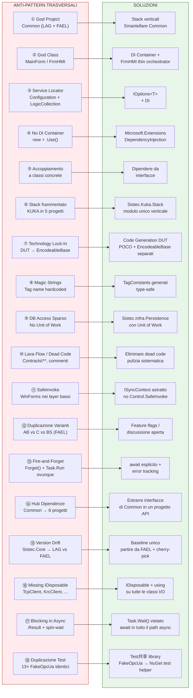

---

### 6.1 Dettaglio Anti-Pattern Aggiuntivi (dall'Analisi Approfondita)

| # | Anti-Pattern | Gravità | Codebase | Dove | Dettaglio |
|---|--------------|---------|----------|------|-----------|
| ⑬ | **Fire-and-Forget con `Forget()`** | 🔴 CRITICA | Entrambe | `TaskExtensions.cs`, `EasyModbus\Extensions.cs` | Extension `Forget()` su Task scarta ogni eccezione. Usata in Watchdog reconnect, TagValue writes (LAG: `Task.Run` senza error handling), PropertyNotifier, RealTimeAlarmEvents. FAEL ha risolto parzialmente con `TagValueBase<T>` (coda writes SemaphoreSlim), LAG usa ancora `Task.Run` fire-and-forget. |
| ⑭ | **Hub Dipendenze (Common)** | 🔴 CRITICA | LAG | `Sistec.5315/Common` | Common reference 6 progetti interni (Controls, Core, OpcUa, Safan, Sinumerik, UI). Crea un diamante di dipendenze: impossibile testare uno stack senza trascinare tutto. La soluzione è estrarre interfacce in un progetto API snello e spostare le implementazioni negli stack verticali. |
| ⑮ | **Sistec.Core Version Drift** | 🔴 CRITICA | LAG vs FAEL | `Sistec.Core/` intero | Le due codebase condividono nominalmente Sistec.Core ma hanno divergenze sostanziali: (a) **TagValue**: FAEL ha `TagValueBase<T>` con coda writes SemaphoreSlim (latest-wins), LAG ha `Task.Run` fire-and-forget. (b) **Motori/Valvole**: FAEL ha `CommandType<T>` + regex parsing, LAG ha struct semplici inline. (c) **SafeInvoke**: in LAG in `Extensions.cs`, in FAEL spostato in `Utilities.cs`. (d) **Dialogs**: FAEL ha `IContainedControl`, LAG no. La riconciliazione branch (Fase 0a) deve decidere da che baseline partire. |
| ⑯ | **Missing IDisposable** | 🟠 ALTA | Entrambe | `TcpClient`, `KrcClient`, `KrcClientLogic`, `ModbusConnector`, `LagNx1525` | Classi critiche di rete/device non implementano `IDisposable`. In una HMI che gira 24/7 su PC industriali, socket e connessioni non rilasciati causano memory leak certi. Necessario: `Dispose(bool)` pattern su tutte, con `using` nei consumer. |
| ⑰ | **Blocco in Path Async** | 🟠 ALTA | Entrambe | `ModbusClient.cs:1596`, `PressBrakeCollection.cs:33`, `Sistec.Tcp\Program.cs:144` | `ModbusClient.Dispose()` usa `.GetAwaiter().GetResult()` (deadlock risk in contesto UI). `PressBrakeCollection.Close()` ha spin-wait `while (pressBrake.IsConnected)`. `Sistec.Tcp` (simulatore) ha `Thread.Sleep(270)` in metodo async. Vietare `Task.Wait()`/`.Result` in tutto il codebase, usare `await` in ogni path. |
| ⑱ | **Touch Subsystem solo in FAEL** | 🟠 ALTA | Solo FAEL | `Sistec.Controls/Touch/` (5 file) | FAEL ha implementato un sottosistema completo di input touch Win32 (penna/dito, long-press, swipe). LAG non ha nulla. Se un cliente LAG richiedesse touch screen, l'implementazione andrebbe riscritta da zero. Nella migrazione ad Avalonia il touch è nativo, ma fino ad allora LAG è esposto. |
| ⑲ | **Buffer Management Assente** | 🟡 MEDIA | Entrambe | `TcpClient.cs`, `EasyModbus\DataBuffer.cs`, `Kuka.Client\Utils.cs` | Nessun pooling dei buffer: `TcpClient` alloca `char[2048]` a ogni connessione; `DataBuffer.AddBytes()` crea nuovo `byte[]` a ogni aggiunta ricopiando tutto; Kuka alloca stringhe a ogni messaggio. Usare `ArrayPool<T>.Shared` o `MemoryPool<T>`. |
| ⑳ | **Magic Numbers nel Parsing Kuka** | 🟡 MEDIA | FAEL | `Kuka.Client\Utils.cs:59-65` | Offset fissi hardcoded (`14`, `18`, `message.Length - 18`, `message.Length - 4`) per estrarre header/payload/checksum dal protocollo KRC. Un cambiamento nel protocollo KUKA richiederebbe riscrittura manuale. Sostituire con costanti nominate + test di parsing. |
| ㉑ | **Duplicazione FakeOpcUa (13 copie)** | 🟡 MEDIA | Entrambe | 13 progetti di test | Stessa identica classe mock/fake `FakeOpcUa` replicata in 13 progetti di test diversi (`Test/*/FakeOpcUa.cs`, `Sistec.HMI/*/FakeOpcUa.cs`). Ogni modifica va propagata manualmente. Estrarre in un pacchetto NuGet `Sistec.TestHelpers` o in una shared library di test. |
| ㉒ | **Monitor.TryEnter in KukaTagValue** | 🟡 MEDIA | FAEL | `Kuka.Client\KukaTagValue.cs:90-107` | Pattern fragile: `Monitor.TryEnter` + `return` dentro il lock. Tecnicamente corretto ma estremamente delicato per manutenzione futura. Refactoring banale in `lock` statement. |
| ㉓ | **COM/Interop Legacy (Kuka)** | 🟡 MEDIA | Solo simulatore | `KukaServerSimulator\WBC_KrcLib\*.cs` | 8 interfacce `[ComImport]` per KUKA KRC Win32 COM. Blocca la migrazione a Linux del simulatore. Valutare sostituzione con protocollo TCP nativo o舍弃 del simulatore se il Kuka.Stack.Client ha già un simulatore C# puro. |
| ㉔ | **ReconnectAgent Timeout Hardcoded** | 🟡 MEDIA | Entrambe | `Sistec.Core\Utils\ReconnectAgent.cs:24` | `s_cts.CancelAfter(10_000)` — ogni tentativo di riconnessione ha timeout massimo fissato a 10 secondi, non configurabile. Rendere parametro di `IReconnectionPolicy`. |
| ㉕ | **Resource.Designer.cs Giganti** | 🟢 BASSA | Entrambe | `*.Resources.Designer.cs` (4 file > 1000 righe) | File `Resources.Designer.cs` di Controls (1838 righe), UI (1417), Common (1322), HMI (1172). Auto-generati ma sintomo di risorse embedded non ottimizzate. Valutare Resource Manager personalizzato o lazy loading. |

### 6.2 Gestione Utenti Inadeguata

L'analisi della gestione utenti rivela un sistema **funzionante ma insufficiente** per gli standard moderni e per le richieste dei clienti.

#### Situazione Attuale

La user management è identica in entrambe le codebase e si basa su:

| Componente | File | Descrizione |
|---|---|---|
| **Modello** | `Sistec.Core\Model\Account.cs` | POCO con Dapper.Contrib: ID, UserLevel (int), UserPassword (plaintext), account name in 3 lingue |
| **Enum ruoli** | `Sistec.Core\Enums\UserLevel.cs` | `NoUser(0) < Operator(1) < Maintenance(2) < Expert(3) < Sistec(4)` |
| **Repository** | `Sistec.Core\DB\AccountRepositoryAsync.cs` | Dapper CRUD su tabella MySQL `accounts` |
| **Login dialog** | `Sistec.UI\frmLayout\frmChangeUser.cs` | ComboBox utenti + password textbox + Login/Logout button |
| **User management** | `Sistec.UI\frmLayout\frmUserManagement.cs` | CRUD utenti con **SQL injection** (string interpolation) — **parzialmente disabilitato** (operazioni commentate) |
| **Stato globale** | `Sistec.UI\ClassUtility\Globals_Standard.cs` | `LoggedUser`, `UserLevel` (PropertyNotifier), `Users` dictionary, auto-logout timer |
| **Controllo ruoli** | `Sistec.Core\Extensions.cs` | Metodi extension `IsOperator()`, `IsMaintenance()`, `IsExpert()`, `IsSistec()` con confronto gerarchico `>=` |
| **Auto-login backdoor** | `loginSistec.ls` (file vuoto) | Se presente nella directory dell'app, logga automaticamente come Sistec senza password |

#### Problemi Identificati

1. **Niente utenti reali, solo ruoli** — Il sistema ha 4 livelli (Operator, Maintenance, Expert, Sistec) ma **nessun legame tra un dipendente reale e la sua produzione**. Non esiste una tabella `employees` o `operators`. L'`Account` memorizza solo un livello e una password, non un nome dipendente, badge, turno, o matricola.

2. **Password in chiaro** — `UserPassword` memorizzata in plaintext su MySQL. Confronto in chiaro: `txtuserPassword.Text != selectedUser.UserPassword`. Hardcoded Sistec password `"747832"` nel codice sorgente (`Globals_Standard.cs:213`).

3. **SQL injection** — `frmUserManagement.cs` costruisce query con interpolazione diretta: `$"INSERT INTO accounts ... VALUES ('{txtuserPassword.Text}')"`. Operazioni CRUD attualmente **commentate** (non funzionanti).

4. **Nessuna produzione per utente** — Impossibile rispondere a domande come "quanti pezzi ha prodotto Mario Rossi oggi?", "qual è il tempo medio per cambio utensile di questo operatore?", "quanti scarti ha prodotto il turno notturno?".

5. **Auto-login backdoor** — File `loginSistec.ls` bypassa completamente l'autenticazione.

6. **Login dialog rudimentale** — Nessun supporto per badge RFID, nessun login con tessere, nessun PIN rapido (solo password testuale).

7. **Nessun audit trail** — Non c'è traccia di chi ha fatto cosa (chi ha modificato un parametro, chi ha forzato un reset, chi ha cambiato la configurazione).

8. **Nessun principal .NET** — `Thread.CurrentPrincipal` mai impostato, niente `ClaimsPrincipal`, niente autorizzazione dichiarativa `[Authorize]`.

#### Proposta: Sistema a Utenti Reali per Dipendente

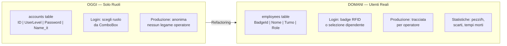

Il sistema proposto:
- **Tabella `employees`** con: `BadgeId` (PK), `FirstName`, `LastName`, `Shift` (Mattina/Pomeriggio/Notte), `Role` (FK → `roles`), `PinCode` (hashato), `IsActive`
- **Tabella `roles`** con permessi granulari: `CanEditParameters`, `CanResetMachine`, `CanAccessReports`, `CanManageUsers`, ecc.
- **Login** via badge RFID (lettore USB seriale) o PIN rapido (4-6 cifre) o selezione da lista
- **Log produzione** con `OperatorId` FK su ogni `Job`, `ProductionEvent`, `ScrapEvent`, `AlarmAck`, `ParameterChange`
- **Statistiche** in pagina dedicata: pezzi/ora per operatore, scarti %, tempi ciclo medi, confronto turni
- **Password hashate** con BCrypt/Argon2, niente plaintext
- **Parametri in appsettings.json**: `"AutoLogin": false`, `"RFIDReader": "COM3"`, `"PinMinLength": 4`

Questa modifica è **indipendente dagli stack macchina** — può essere realizzata in parallelo alle fasi 0-1 e non blocca la migrazione a stack verticali.

## 7. Rischi e Mitigazioni

| Rischio | Probabilità | Impatto | Mitigazione |
|---|---|---|---|
| **Regressione** durante refactoring | Alta | Alto | Test NUnit + Simulator prima del deploy. Fase pilota KUKA per validare |
| **Resistenza al cambiamento** | Media | Medio | Migrazione incrementale, non big-bang. Dimostrare valore con pilota |
| **Complessità iniziale DI** | Media | Basso | Iniziare con KUKA Stack come pilota (3-4 settimane) |
| **Code Generation non copre tutti i casi DUT** | Media | Medio | Generatore estensibile con override manuali |
| **Differenze reali LAG vs FAEL** troppo grandi | Bassa | Alto | L'analisi mostra che il 70%+ dell'architettura è identica |
| **Stack troppo granulosi** (5 layer × N stack) | Media | Basso | 5 layer è il massimo; stack semplici possono avere 2-3 layer |
| **Performance DI Container** | Molto Bassa | Basso | Overhead trascurabile in contesto HMI |

---

## 8. Il Gap: Layout Engine Configurabile

L'architettura a stack verticali risolve la frammentazione del codice macchina, ma **non basta per consegnare un nuovo impianto senza scrivere codice**. Il problema aperto è il **layout HMI**: la disposizione delle pagine, la posizione dei controlli, i collegamenti tra schermate cambiano per ogni commessa e attualmente richiedono pagine WinForms scritte a mano.

### 8.1 Obiettivo

```
Nuova commessa = cartella con:
├── manifest.json          ← Quali stack attivare, versione firmware
├── layout.json            ← Struttura pagine, zone, navigazione
├── config/                ← Parametri macchina (Kuka.ini, PLC.json, Safan.json)
├── tags/                  ← DUT generati da CODESYS
├── resources/             ← Immagini, icone, traduzioni
└── (nessun file .cs nuovo)
```

### 8.2 Architettura del Layout Engine

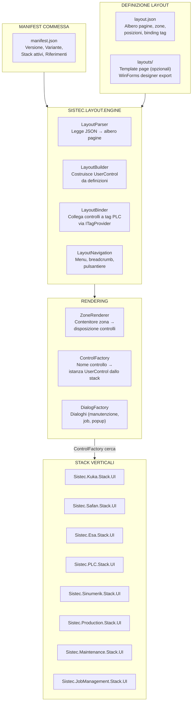

### 8.3 Formato `layout.json` (Proposta)

```json
{
  "$schema": "https://sistec.it/schemas/layout-v1.json",
  "version": "1.0",
  "plant": "LAG-5315",
  "variant": "LAG",

  "screens": [
    {
      "id": "home",
      "title": "Home",
      "type": "grid",
      "rows": 2, "cols": 3,
      "cells": [
        { "row": 0, "col": 0, "rowSpan": 2,
          "control": "Kuka.Views.ucKukaInfo",
          "binding": { "robot": "Kuka_0" }
        },
        { "row": 0, "col": 1,
          "control": "Safan.Views.SafanStatusView",
          "binding": { "press": "Safan_0" }
        },
        { "row": 0, "col": 2,
          "control": "PLC.Views.PlcStatusControl",
          "binding": { "plc": "PLC_0" }
        },
        { "row": 1, "col": 1,
          "control": "JobManagement.Views.JobSummary",
          "binding": {}
        },
        { "row": 1, "col": 2,
          "control": "Alarms.Views.AlarmBanner",
          "binding": { "limit": 5 }
        }
      ]
    },
    {
      "id": "production",
      "title": "Produzione",
      "type": "tabbed",
      "tabs": [
        { "title": "Job",   "control": "Production.Views.JobView" },
        { "title": "CutPlan", "control": "Production.Views.CutPlanView" },
        { "title": "Pannelli", "control": "Production.Views.PanelTrackingView" }
      ]
    },
    {
      "id": "maintenance",
      "title": "Manutenzione",
      "type": "page",
      "control": "Maintenance.Views.MaintenanceView",
      "binding": {}
    }
  ],

  "navigation": {
    "type": "sidebar",
    "items": [
      { "label": "Home",         "icon": "home.png",      "screen": "home" },
      { "label": "Produzione",   "icon": "production.png","screen": "production" },
      { "label": "Manutenzione", "icon": "wrench.png",    "screen": "maintenance" }
    ]
  },

  "dialogs": [
    {
      "id": "job-create",
      "control": "JobManagement.Views.CreateJobDialog",
      "size": { "width": 800, "height": 600 }
    },
    {
      "id": "alarm-history",
      "control": "Alarms.Views.AlarmHistoryDialog",
      "size": { "width": 1024, "height": 768 }
    }
  ]
}
```

### 8.4 ControlFactory: Come i controlli UI arrivano a runtime

**Pattern: Factory Method** — la creazione del controllo è delegata a una factory registrata da ogni stack, senza che il Layout Engine conosca il tipo concreto.

Ogni stack verticale registra i propri controlli in un dizionario globale al momento della registrazione nel DI container:

```csharp
// In Sistec.Kuka.Stack.UI/ModuleRegistration.cs
public static void RegisterControls(ControlRegistry registry)
{
    registry.Register("Kuka.Views.ucKukaInfo",     () => new ucKukaInfo());
    registry.Register("Kuka.Views.KukaOverride",    () => new KukaOverrideControl());
    registry.Register("Kuka.Views.RobotDropOffset", () => new RobotDropOffsetView());
}

// In Sistec.PLC.Stack.UI/ModuleRegistration.cs
public static void RegisterControls(ControlRegistry registry)
{
    registry.Register("PLC.Views.PlcStatusControl", () => new PlcStatusControl());
    registry.Register("PLC.Views.WatchdogIndicator",() => new WatchdogIndicator());
}
```

Il `ControlFactory` nel LayoutEngine cerca il nome dal JSON, istanzia il controllo e applica i binding:

```csharp
public class ControlFactory
{
    private readonly Dictionary<string, Func<UserControl>> _registry = new();

    public UserControl Create(string controlName, Dictionary<string, object> binding)
    {
        if (!_registry.TryGetValue(controlName, out var factory))
            throw new UnknownControlException(controlName);

        var control = factory();
        ApplyBinding(control, binding); // setta proprietà via reflection / ITagProvider
        return control;
    }
}
```

### 8.5 Ciclo di Vita di una Nuova Commessa

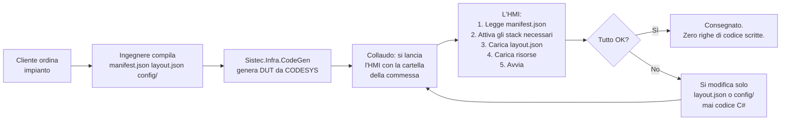

### 8.6 Quando Serve Ancora Codice

| Scenario | Cosa fare | Frequenza |
|---|---|---|
| **Nuovo macchinario** mai visto | Scrivere il nuovo `Sistec.<Nuovo>.Stack` completo | Rara (1-2 volte/anno) |
| **Layout pagina completamente nuovo** | Scrivere template page WinForms e registrarlo | Poco frequente |
| **Flusso produttivo inedito** | Nuovo `ProductionOrchestrator` o estensione | Occasionale |
| **Stesso macchinario, layout diverso** | Solo `layout.json` | **Ogni commessa** |
| **Parametri diversi** | Solo `config/*.json` | **Ogni commessa** |
| **Immagini / icone diverse** | Solo `resources/` | **Ogni commessa** |
| **Traduzioni** | Solo file JSON | **Ogni commessa** |

### 8.7 Impatto sulla Roadmap

Il Layout Engine è una **Fase 6** che si aggiunge dopo la Fase 5:

```mermaid
gantt
    title Roadmap con Layout Engine
    dateFormat  YYYY-MM-DD
    axisFormat  %d/%m

    section Fase 6 — Layout Engine (3-4 settimane)
    Progettare formato layout.json + schema JSON         :f6a, 2026-09-01, 3d
    Implementare LayoutParser                            :f6b, after f6a, 3d
    Implementare ControlFactory + ControlRegistry         :f6c, after f6b, 4d
    Implementare LayoutBuilder + ZoneRenderer             :f6d, after f6c, 4d
    Implementare LayoutNavigation (menu, breadcrumb)      :f6e, after f6d, 3d
    Integrare con manifest.json + startup sequence        :f6f, after f6e, 3d
    Creare validatore schema JSON per layout              :f6g, after f6f, 2d
    Strumento designer (anteprima layout)                 :f6h, optional, 5d
```

**Importante:** Il Layout Engine ha senso SOLO dopo che gli stack verticali esistono. Senza stack verticali, i controlli UI sono sparsi in 5 progetti e il `ControlFactory` non saprebbe dove cercarli. Le fasi 0-5 sono **prerequisito obbligatorio**.

### 8.8 Translation Strategy: Cloud-First, Chiavi Parlanti

#### Problema attuale

Nelle codebase legacy (LAG/FAEL), le chiavi di traduzione sono accoppiate ai nomi dei controlli WinForms:

```
uc2_ThicknessCheck_grpCalibrations  →  "Calibrations"
uc2_Sistec_grpAutoOverRide          →  "Auto Override"
btnCancel                           →  "Cancel"
Cancel                              →  "Cancel"  (chiave diversa, stessa parola)
#Cancel                             →  "Cancel"  (ancora diversa)
```

Stessa parola "Cancel" appare con **3 chiavi diverse** a seconda del contesto. Ogni impianto ha una **copia locale** della tabella `translations` nel suo MySQL — manutenzione N volte, rischio divergenza.

#### Soluzione

Quando l'impianto è connesso a Internet, la tabella delle traduzioni è **online e unica** per tutti gli impianti. Le chiavi sono **parlanti** e seguono la convenzione `{dominio}.{entità}.{proprietà}`.

**Regole fondamentali:**

1. **Stessa parola = stessa chiave** — `ui.btn.cancel` ovunque, non 10 chiavi diverse
2. **Prefisso impianto** per override specifici — `plant5315.robot.customAlarmMessage`
3. **Nessun accoppiamento con componenti UI** — la chiave descrive il *significato*, non il controllo
4. **Fallback offline** — cache locale delle chiavi più usate (UI base, allarmi critici)

**Schema tabella `translations` centralizzata:**

| Key (PK) | It | En | Other | Scope |
|---|---|---|---|---|
| `ui.btn.cancel` | Annulla | Cancel | ... | Shared |
| `ui.btn.ok` | OK | OK | ... | Shared |
| `robot.status.running` | In esecuzione | Running | ... | Shared |
| `press.alarms.active` | Allarme attivo | Alarm active | ... | Shared |
| `plant5315.robot.customAlarm` | Messaggio specifico 5315 | ... | ... | Plant |

**Gerarchia chiavi proposta:**

```
ui.               ← Controlli generici (btn, dialog, menu)
robot.            ← Robot KUKA, stato, comandi
press.            ← Pressa, allarmi, parametri
production.       ← Job, ricette, tracking
maintenance.      ← Manutenzione, diagnostica
alarm.            ← Allarmi generici
plant{ID}.        ← Override specifici impianto
```

**Esempio codice — confronto legacy vs greenfield:**

```csharp
// PRIMA (legacy): 10 chiavi diverse per "Cancel"
btnCancel.Text = t.GetOrDefault("btnCancel", "#Cancel");
btn2.Text = t.GetOrDefault("Cancel", "#Cancel");
btn1.Text = t.GetOrDefault("btnCancel", "#Cancel");

// DOPO (greenfield): chiave unica parlante
btnCancel.Text = t.Get("ui.btn.cancel");
```

```csharp
// PRIMA (legacy): chiave accoppiata al componente
grpCalibrations.Text = t.GetOrDefault("uc2_ThicknessCheck_grpCalibrations", "#Calibrations");

// DOPO (greenfield): chiave basata sul significato
grpCalibrations.Text = t.Get("press.calibrations.title");
```

**Deployment e sincronizzazione:**

| Componente | Ruolo |
|---|---|
| **DB cloud** | MySQL/MariaDB centralizzato, accessibile via internet da tutti gli impianti |
| **Cache locale** | SQLite con chiavi `ui.*`, `alarm.*`, `robot.*` (critiche per operabilità) |
| **Sync periodico** |ogni X minuti quando online; offline lavora con cache |
| **Aggiornamento** | UPDATE sulla tabella cloud → tutti gli impianti vedono il cambiamento al prossimo sync |
| **Logging mancanti** | `ITranslationsLogger` registra chiavi non trovate → dashboard cloud per identificare chiavi da aggiungere |

**Vantaggi:**

- **Manutenzione 1×** invece di N — una traduzione corretta su tutti gli impianti
- **Consistenza** — stesso testo = stessa chiave in ogni pagina, ogni impianto
- **Aggiornamenti instantanei** — correggere un refuso = un UPDATE, non N deploy
- **Plant-specific** — override con prefisso `plant{ID}` per esigenze locali senza inquinare le chiavi condivise
- **Offline resilience** — cache locale garantisce operabilità anche senza rete

---

## 9. Logica di Dominio Configurabile: Recipe Engine e Pallet State Machine

Stesso problema del layout, ma sulla logica applicativa: ricette, pallet, flussi di produzione sono attualmente **hardcoded in `CellLogic`/`ProductionOrchestrator`** con if/else su variante impianto. LAG ha una logica, FAEL un'altra. La soluzione è identica: **estrarre la logica in dati configurabili**.

### 9.1 Recipe Engine: Esecuzione Workflow da JSON

Oggi: `BendingProgramService`, `CutPlanService`, `PressRobotTeamService` contengono sequenze hardcoded con if/else su `CellType.AB` vs `CellType.C`.

```csharp
// OGGI — logica hardcoded in CellLogic
public async Task ExecuteProductionStep(StepType step)
{
    if (_cellType == CellType.LAG)
    {
        await _kuka.LoadPanel("vacuum_a");
        await _safan.Bend("P123", 90);
        await _kuka.Unload("pallet_1");
    }
    else if (_cellType == CellType.FAEL)
    {
        await _kuka.LoadPanel("gripper_b");
        await _esa.Press("PROG_456");
        await _kuka.Unload("pallet_2");
        await _conveyor.Advance(); // FAEL ha un nastro in più
    }
}
```

Proposta: **Recipe = workflow configurabile in JSON**, eseguito da un `RecipeEngine` generico che non conosce la variante impianto.

```json
{
  "recipeId": "BEND_PANEL_LAG_001",
  "displayName": "Piegatura pannello standard LAG",
  "plantVariant": "LAG",
  "steps": [
    {
      "id": "load_panel",
      "machine": "Kuka_0",
      "action": "LOAD_PANEL",
      "params": { "gripper": "vacuum_a", "pickFrom": "infeed" },
      "timeout": 30,
      "retry": 2
    },
    {
      "id": "bend",
      "machine": "Safan_0",
      "action": "BEND",
      "params": { "program": "P123", "angle": 90, "speed": "fast" },
      "timeout": 60,
      "dependsOn": ["load_panel"]
    },
    {
      "id": "unload",
      "machine": "Kuka_0",
      "action": "UNLOAD",
      "params": { "destination": "pallet_1", "orientation": "stacked" },
      "dependsOn": ["bend"]
    }
  ],
  "rules": {
    "retryOnError": true,
    "maxRetries": 3,
    "requireApproval": false,
    "abortOnFailure": true,
    "logEachStep": true
  }
}
```

Il `RecipeEngine` esegue la sequenza senza sapere cosa fa ogni macchina — chiama i metodi sullo stack appropriato **via interfacce**:

```csharp
// Sistec.RecipeEngine.Stack — generico, zero if/else su variante
public class RecipeEngine : IRecipeEngine
{
    private readonly IMachineRegistry _machines;
    private readonly ILogger<RecipeEngine> _logger;

    public async Task<RecipeResult> ExecuteAsync(Recipe recipe, CancellationToken ct)
    {
        var context = new RecipeContext(recipe);
        foreach (var step in recipe.Steps.OrderBy(s => s.Order))
        {
            await WaitForDependencies(step, context, ct);
            var machine = _machines.Resolve(step.Machine); // interfaccia IMachineAction
            var result = await machine.ExecuteActionAsync(step.Action, step.Params, ct);
            context.SetStepResult(step.Id, result);
            if (!result.Success && recipe.Rules.AbortOnFailure)
                return RecipeResult.Failed(step, result.Error);
        }
        return RecipeResult.Completed(context);
    }
}
```

Ogni stack macchina registra le azioni che sa eseguire:

```csharp
// In Sistec.Kuka.Stack.Services
public class KukaRobotActionProvider : IMachineActionProvider
{
    public string MachineName => "Kuka_0";
    public Dictionary<string, Func<StepParams, Task<ActionResult>>> Actions => new()
    {
        ["LOAD_PANEL"] = async p => { await _robot.LoadPanel(p.Get<string>("gripper")); return ActionResult.Ok(); },
        ["UNLOAD"]     = async p => { await _robot.Unload(p.Get<string>("destination")); return ActionResult.Ok(); },
    };
}
```

#### Ricette diverse per impianto

```
📁 Sistec.5315.LAG/
   ├── config/
   │   └── recipes/
   │       ├── bend_panel_lag.json      ← LAG: Kuka + Safan
   │       └── punch_program.json       ← LAG: con Sinumerik

📁 Sistec.5309.FAEL.AB/
   ├── config/
   │   └── recipes/
   │       ├── bend_panel_fael.json     ← FAEL: Kuka + Esa + conveyor
   │       └── cut_plan.json            ← FAEL: senza Sinumerik
```

Stesso `RecipeEngine`, stessi stack macchina, **ricette diverse in JSON**. Zero codice toccato.

### 9.2 Pallet State Machine: Macchina a Stati Configurabile

Oggi: `PalletLogic` in FAEL (100 righe) vs assente in LAG (o implementato diversamente in `ProductionOrchestrator`). If/else su numero pallet, tipi, stati, transizioni.

Proposta: **macchina a stati finita configurabile in JSON**, ogni impianto definisce stati, transizioni, vincoli.

```json
{
  "palletConfig": {
    "count": 9,
    "types": [
      { "id": "standard", "label": "Standard", "capacity": 50, "maxWeight": 500 },
      { "id": "oversize", "label": "Oversize",  "capacity": 10, "maxWeight": 1000 }
    ],
    "layout": "3x3",
    "initialState": "EMPTY"
  },
  "states": [
    { "id": "EMPTY",         "label": "Vuoto" },
    { "id": "LOADING",       "label": "In carico" },
    { "id": "FULL",          "label": "Pieno" },
    { "id": "QUALITY_CHECK", "label": "Controllo qualità" },
    { "id": "SHIPPED",       "label": "Spedito" },
    { "id": "REWORK",        "label": "Da rilavorare" }
  ],
  "transitions": [
    { "from": "EMPTY",         "to": "LOADING",       "trigger": "panel_placed" },
    { "from": "LOADING",       "to": "FULL",          "trigger": "capacity_reached" },
    { "from": "LOADING",       "to": "LOADING",       "trigger": "panel_placed" },
    { "from": "FULL",          "to": "QUALITY_CHECK", "trigger": "request_qc" },
    { "from": "FULL",          "to": "REWORK",        "trigger": "qc_failed" },
    { "from": "QUALITY_CHECK", "to": "SHIPPED",       "trigger": "qc_passed" },
    { "from": "QUALITY_CHECK", "to": "REWORK",        "trigger": "qc_failed" },
    { "from": "REWORK",        "to": "LOADING",       "trigger": "rework_done" },
    { "from": "SHIPPED",       "to": "EMPTY",         "trigger": "pallet_cleared" }
  ],
  "rules": {
    "maxPalletsPerType": { "standard": 6, "oversize": 3 },
    "requireQcForType": ["oversize"],
    "autoAdvanceOnFull": true,
    "notifyOnStateChange": ["FULL", "QUALITY_CHECK"]
  }
}
```

```csharp
// Sistec.PalletTracking.Stack — generico, zero if/else
public class PalletStateMachine
{
    private readonly PalletConfig _config;
    private readonly Dictionary<string, Pallet> _pallets = new();

    public bool TryTransition(string palletId, string trigger, out string error)
    {
        var pallet = _pallets[palletId];
        var transition = FindValidTransition(pallet.State, trigger);
        if (transition == null)
        {
            error = $"Transition '{trigger}' not allowed from state '{pallet.State}'";
            return false;
        }
        pallet.State = transition.To;
        OnStateChanged?.Invoke(pallet);
        error = null;
        return true;
    }
}
```

#### Differenze per impianto in configurazione

| Aspetto | LAG | FAEL AB | FAEL C |
|---|---|---|---|
| **Numero pallet** | 9 | 9 | 3 |
| **Tipi pallet** | standard + oversize | standard | standard |
| **QC obbligatorio** | solo oversize | mai | mai |
| **Stati extra** | QUALITY_CHECK, REWORK | — | — |
| **Transizioni custom** | pallet_cleared → EMPTY | — | — |

**Tutto in JSON. Zero if/else su `CellType`.**

### 9.3 Nuovi Stack

| Stack | Sempre presente? | Layer | Dipende da |
|---|---|---|---|
| **`Sistec.RecipeEngine.Stack`** | ✅ Sempre | Services + UI | Tutti gli stack macchina (via `IMachineActionProvider`) |
| **`Sistec.PalletTracking.Stack`** | ✅ Sempre | Services + UI | `Sistec.JobManagement.Stack` |

Seguono lo stesso pattern: `Client? → Driver? → Services → UI → Simulator`. Services è il cuore (RecipeEngine, PalletStateMachine). UI fornisce viste di监控/controllo. Simulator permette test offline.

### 9.4 Ciclo di Vita: Nuova Variante di Impianto

```
1. Cliente ordina impianto con 4 pallet, controllo qualità obbligatorio
2. Ingegnere copia template cartella commessa
3. Modifica:
   - config/pallets/config.json: count: 4, requireQcForType: ["standard", "oversize"]
   - config/recipes/*.json: sequenze specifiche
4. Collauda con RecipeEngineSimulator + PalletSimulator
5. Consegna. Zero codice.
```

### 9.5 Impatto sulla Roadmap

```
Fase 3 (aggiornata): Stack applicativi (3 settimane)
  ├── Sistec.Production.Stack
  ├── Sistec.RecipeEngine.Stack  ← NUOVO
  ├── Sistec.PalletTracking.Stack ← NUOVO
  └── Sistec.JobManagement.Stack, Maintenance, Alarms
```

### 9.6 Predictive Maintenance: ML al Posto del Timer

La manutenzione attuale è **time-based** ("cambia olio ogni 1000 ore", "sostituisci cinghia ogni 6 mesi") — non riflette l'usura reale. Un macchinario fermo 3 mesi si ritrova una manutenzione schedulata inutilmente, mentre uno stressato può rompersi prima del previsto.

La proposta: **predictive maintenance basata su modello ML on-device**, dove ogni stack macchina pubblica features operative (cicli, torque, temperature, vibrazioni) e il Maintenance.Stack le consuma per stimare la **Remaining Useful Life** (RUL) di ogni componente.

#### Architettura

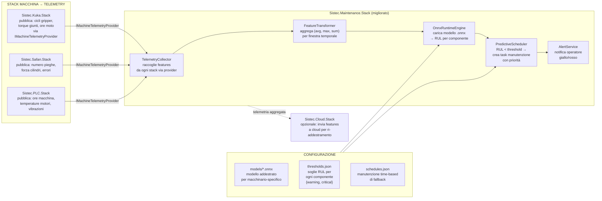

#### Configurazione

```json
{
  "components": [
    {
      "id": "kuka_joint_1",
      "displayName": "Giunto KUKA 1",
      "machine": "Kuka_0",
      "modelFile": "models/kuka_joint_rul.onnx",
      "features": [
        { "source": "Kuka_0", "tag": "Joint1.Torque",       "aggregate": "avg_last_hour" },
        { "source": "Kuka_0", "tag": "Joint1.Temperature",  "aggregate": "max_last_hour" },
        { "source": "Kuka_0", "tag": "Joint1.Cycles",       "aggregate": "sum_since_last_maint" }
      ],
      "thresholds": {
        "warning":  { "rul": 100, "level": "yellow" },
        "critical": { "rul": 20,  "level": "red" }
      },
      "fallbackSchedule": { "everyHours": 2000 }
    },
    {
      "id": "safan_cylinder",
      "displayName": "Cilindro pressa Safan",
      "machine": "Safan_0",
      "modelFile": "models/safan_cylinder_rul.onnx",
      "features": [
        { "source": "Safan_0", "tag": "Cylinder.Force",  "aggregate": "avg" },
        { "source": "Safan_0", "tag": "Cylinder.Cycles", "aggregate": "sum" }
      ],
      "thresholds": {
        "warning":  { "rul": 500,  "level": "yellow" },
        "critical": { "rul": 100,  "level": "red" }
      }
    }
  ]
}
```

#### Provider di Telemetria

Ogni stack macchina espone un'interfaccia che il Maintenance.Stack consuma:

```csharp
// Sistec.Core.Interfaces — contratto condiviso
public interface IMachineTelemetryProvider
{
    string MachineId { get; }
    Task<Dictionary<string, double>> CollectFeaturesAsync(
        IEnumerable<string> tagNames, TimeSpan window, CancellationToken ct);
}

// Sistec.Kuka.Stack.Services — implementazione
public class KukaTelemetryProvider : IMachineTelemetryProvider
{
    public string MachineId => "Kuka_0";
    public async Task<Dictionary<string, double>> CollectFeaturesAsync(
        IEnumerable<string> tagNames, TimeSpan window, CancellationToken ct)
    {
        // Legge dai tag OPC UA / KRC, calcola medie, massimi, somme
        return new Dictionary<string, double>
        {
            ["Joint1.Torque"] = await _kukaClient.ReadAverageAsync("Joint1.Torque", window),
            ["Joint1.Temperature"] = await _kukaClient.ReadMaxAsync("Joint1.Temp", window),
            ["Joint1.Cycles"] = await _cycleCounter.GetSinceLastMaintenanceAsync(),
        };
    }
}
```

#### Ciclo di vita del modello ML

```
1. Addestramento (cloud o PC dev)
   ├── Raccogliere dati storici: features + timestamp rottura/sostituzione
   ├── Addestrare modello (scikit-learn, PyTorch, LightGBM)
   └── Esportare in ONNX → modello.onnx

2. Deploy
   ├── Il file .onnx va in config/models/ della commessa
   └── OnnxRuntimeEngine lo carica all'avvio

3. Inferenza (sull'HMI, ogni ora)
   ├── TelemetryCollector raccoglie features da tutti gli stack
   ├── FeatureTransformer normalizza
   ├── OnnxRuntimeEngine esegui → RUL per ogni componente
   └── PredictiveScheduler: RUL < soglia → crea task manutenzione

4. Miglioramento continuo
   ├── Le features + l'esito effettivo della manutenzione
   │   (rotto/sostituito/sano) tornano indietro via Cloud.Stack
   └── Modello ri-addestrato periodicamente con nuovi dati
```

#### Soglie e notifiche

| Livello | RUL residua | Azione |
|---|---|---|
| **Verde** | > soglia warning | Normale monitoraggio |
| **Giallo** | < warning | Notifica operatore, pianificare manutenzione |
| **Rosso** | < critical | Allarme, fermata programmata |
| **Fallback** | tempo scaduto | Manutenzione forzata (se ML non disponibile) |

#### Vantaggi

| Aspetto | Oggi (time-based) | Domani (predictive ML) |
|---|---|---|
| **Cambio olio KUKA** | Ogni 2000 ore → anche se fermo 3 mesi | Quando il modello vede degradazione lubrificante |
| **Cilindro pressa** | Ogni 6 mesi → anche se ha fatto 100 cicli | Quando cicli + forza indicano usura reale |
| **Manutenzione inutile** | Fatta comunque (spreco ricambi + ore) | Solo quando serve |
| **Rottura imprevista** | Frequente (il timer non basta) | Rara (RUL avvisa con 100+ ore di anticipo) |
| **Dati per migliorare** | Nessuno | Storico features + esiti → modello sempre migliore |

#### Impatto sull'architettura

- **`Sistec.Maintenance.Stack`** si arricchisce: aggiunge `PredictiveEngine`, `OnnxRuntimeEngine`, `TelemetryCollector`. Resta un pacchetto NuGet sempre presente.
- **Ogni stack macchina** (Kuka, Safan, PLC, ...) deve implementare `IMachineTelemetryProvider` — zero cambiamenti alla logica esistente, si aggiunge solo un provider.
- **I file `.onnx`** sono dati di configurazione, non codice. Vanno in `config/models/` della commessa.
- **ONNX Runtime** è una dipendenza NuGet del Maintenance.Stack. Funziona su Windows e Linux (Avalonia).

### 9.6.1 Digital Twin — Replica 3D Real-Time dello Stato Macchina

Il **Digital Twin** è il trend #1 dell'HMI industriale 2026: una replica 3D real-time della macchina che mostra stato, movimenti e anomalie in tempo reale. Non è un render decorativo — è uno strumento operativo che riduce i tempi di diagnostica del 40-60%.

#### Cosa Mostra

```
Vista Digital Twin nell'HMI:
┌─────────────────────────────────────────────┐
│  [3D Viewport — KUKA Robot + Pressa]         │
│                                              │
│    ╔══╗                                      │
│    ║K1║───🤖 KUKA KR210                      │
│    ║  ║    ● Online | Programma: P123        │
│    ║  ║    🔴 Joint 3 overload (allarme)     │
│    ║S ║                                      │
│    ║a ║───🏭 Pressa Safan                     │
│    ║f ║    ● Running | Ciclo: 38/120         │
│    ║a ║                                      │
│    ║n║───📦 Pallet 1: EMPTY                  │
│    ╚══╝    Pallet 2: FULL (QC pending)       │
│                                              │
│  [Stati] 🟢 Running  ⚠️ Warning  🔴 Fault     │
└─────────────────────────────────────────────┘
```

#### Livelli di Fedeltà

| Livello | Descrizione | Tecnologia | Sforzo |
|---|---|---|---|
| **L1 — Schematico 2.5D** | Vista dall'alto con icone 3D semplici. Ogni macchina è un rettangolo con stato colore. | Avalonia Canvas + SVG | 2-3 giorni |
| **L2 — Low-poly 3D** | Modello 3D semplificato (200-500 poligoni) con colori di stato. Movimenti animati (robot che ruota, pressa che scende). | SkiaSharp 3D / Avalonia 3D | 1-2 settimane |
| **L3 — Photorealistic** | Modello 3D dettagliato dal CAD OEM con texture reali. Richiede GPU. | Unity Embedded / Unreal Engine | ❌ Troppo pesante per PC industriale |

**Target:** Livello 1 (minimo) + Livello 2 (obiettivo) per prima commessa greenfield.

#### Integrazione con Predictive Maintenance

Il Digital Twin non è solo estetico — è il **cruscotto visivo** della predictive maintenance (§9.6):

```csharp
// Maintenance.Stack → DigitalTwinService
public class DigitalTwinService
{
    // Colora componenti in base alla RUL predetta
    public RulColor GetComponentColor(string componentId)
    {
        var rul = _predictiveEngine.GetRul(componentId);
        return rul switch
        {
            > 500  => RulColor.Green,   // Normale
            > 100  => RulColor.Yellow,  // Attenzione
            > 20   => RulColor.Orange,  // Pianificare manutenzione
            _      => RulColor.Red      // Sostituire immediatamente
        };
    }
}
```

#### Architettura

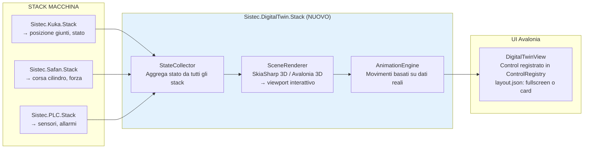

#### Dettaglio Stack

| Layer | Progetto | Contenuto |
|---|---|---|
| **Services** | `Sistec.DigitalTwin.Stack.Services` | `StateCollector` (polling ogni 100ms), `SceneGraph` (albero gerarchico macchina), `AnimationEngine` |
| **UI** | `Sistec.DigitalTwin.Stack.UI` | `DigitalTwinView` (Avalonia control), `CameraController` (pan/zoom/rotate) |
| **Model** | `Sistec.DigitalTwin.Stack.Models` | `MachineModel`, `JointState`, `ComponentColor`, `AnimationKeyframe` |

#### layout.json

```json
{
  "id": "digital-twin",
  "title": "Digital Twin",
  "type": "page",
  "control": "DigitalTwin.Views.DigitalTwinView",
  "binding": {
    "machines": ["Kuka_0", "Safan_0", "PLC_0"],
    "refreshMs": 200,
    "camera": { "initialZoom": 1.0, "allowRotate": true }
  }
}
```

#### Impatto sulla Roadmap

```
Fase 3 (nuova): Stack applicativi (4-5 settimane)
  ├── Sistec.Production.Stack
  ├── Sistec.RecipeEngine.Stack
  ├── Sistec.PalletTracking.Stack
  ├── Sistec.Maintenance.Stack (predictive ML)
  ├── Sistec.DigitalTwin.Stack (Livello 1-2)  ← NUOVO
  └── Sistec.JobManagement.Stack, Alarms
```

Il Digital Twin è un **differenziatore competitivo** — nessun competitor Sistec (PMI italiana) lo offre. Per la prima commessa greenfield, il Livello 1 (schematico 2.5D) è sufficiente per dimostrare il concept.

```
Fase 3 (aggiornata): Stack applicativi (3-4 settimane)
  ├── Sistec.Production.Stack
  ├── Sistec.RecipeEngine.Stack
  ├── Sistec.PalletTracking.Stack
  ├── Sistec.Maintenance.Stack (predictive ML + Digital Twin)  ← MIGLIORATO
  └── Sistec.JobManagement.Stack, Alarms
```

### 9.7 Logging Strutturato con DI, non Statico

Il logger statico `Utilities.Logger` è esattamente lo stesso anti-pattern di `Configuration.PlcConfig[...]` — service locator globale, impossibile da mockare, sostituire o configurare per contesto.

#### Oggi: statico + plain text

```csharp
// ANTI-PATTERN: service locator statico
Utilities.Logger?.Debug($"{log.Context}: {log.Message}");
// → plain text file, zero struttura, zero ricercabilità
// → impossibile testare (mockare un campo statico è un incubo)
// → thread safety? affidato a Serilog internamente, ma zero controllo

// Tre astrazioni diverse per la stessa cosa:
Utilities.Logger?.Debug("...");          // Serilog diretto
ISistecLogger<LogItem>.Log("...");       // custom wrapper
Globals_Standard.Log("...");             // delegazione UI
```

#### Domani: ILogger<T> via DI + JSON strutturato

```csharp
// Nel Composition Root (Program.cs)
builder.Host.UseSerilog((ctx, cfg) =>
    cfg.ReadFrom.Configuration(ctx.Configuration)
       .Enrich.WithMachineName()
       .Enrich.WithProperty("Application", "Sistec.5315.LAG")
       .WriteTo.Console()
       .WriteTo.File(
            path: "Logs/sistec-.json",
            rollingInterval: RollingInterval.Day,
            formatter: new Serilog.Formatting.Json.JsonFormatter())  // JSON!
       .WriteTo.Debug());

// In ogni classe: costruttore, non statico
public class KukaRobotLogic : IKukaRobotLogic
{
    private readonly ILogger<KukaRobotLogic> _logger;

    public KukaRobotLogic(..., ILogger<KukaRobotLogic> logger)
    {
        _logger = logger; // ← iniettato dal container DI
    }

    public async Task LoadPanelAsync(string gripper)
    {
        _logger.LogInformation("Loading panel with {Gripper}", gripper);
        //                     ^ named placeholder, non $"..."!
    }
}
```

Output JSON:

```json
{
  "@t": "2026-07-02T14:30:00.123Z",
  "@l": "Information",
  "@mt": "Loading panel with {Gripper}",
  "Gripper": "vacuum_a",
  "MachineName": "SPV-LAG-01",
  "Application": "Sistec.5315.LAG"
}
```

Vantaggi del JSON strutturato:
- **Ricercabile**: `jq 'select(.Gripper == "vacuum_a")'` o Elastic/Kibana
- **Filtrável per campo**: tutti i log del KUKA, tutte le temperature > 80°C
- **Aggregabile tra impianti**: stesso formato per LAG e FAEL, stesso Elastic index
- **Alerting automatico**: `{Gripper} = "vacuum_a" && {Temperature} > 80 → Slack/PagerDuty`

#### Cosa cambia in pratica

| Aspetto | Oggi | Domani |
|---|---|---|
| **Accesso logger** | `Utilities.Logger?.Debug(...)` statico | `ILogger<T>` via costruttore DI |
| **Formato output** | Plain text `SPV_5315_20260702.log` | JSON `sistec-20260702.json` |
| **Placeholder** | `$"{ctx}: {msg}"` (persi in plain text) | `"{Context}: {Message}"` (estratti in JSON) |
| **Tre astrazioni** | Utilities.Logger + ISistecLogger + Globals_Standard | Una sola: `Microsoft.Extensions.Logging.ILogger<T>` |
| **log4net (Sistec.Bus)** | Framework diverso | Migrato a Serilog come tutto il resto |
| **Debug.Print (~150x)** | Zero in Release build | Convertito in `LogTrace()` / `LogDebug()` |
| **Mockabilità** | Impossibile (statico) | `Mock.Of<ILogger<KukaRobotLogic>>()` |
| **Config** | Hardcoded in `Utilities.CreateLogger(path)` | `appsettings.json` + `IOptions<LoggerFilterOptions>` |
| **Testabilità** | I log restano nei file di produzione | Il DI container inietta logger diversi per test |

#### Impatto sulla roadmap

Non serve uno stack separato. Si risolve in Fase 0b (Fondazione):

```
Fase 0b (aggiornata): Fondazione (3-4 settimane)
  ├── DI Container + Configuration
  ├── Sostituire Utilities.Logger con ILogger<T> via DI
  ├── Eliminare ISistecLogger<LogItem> e Globals_Standard.Log()
  ├── Migrare log4net (Sistec.Bus) a Serilog
  ├── Convertire Debug.Print() in ILogger.LogTrace()
  ├── Configurare output JSON + rolling file
  ├── Persistence multi-progetto
  └── CodeGen prototipo
```

**La migrazione non è blocante**: si può fare gradualmente. Un nuovo stack (es. Kuka.Stack) nasce già con `ILogger<T>` via DI. I vecchi file continuano a usare lo statico finché non vengono refactorati.

---

## 10. Modello di Distribuzione: NuGet Packages

Ogni stack verticale diventa un **pacchetto NuGet** pubblicato su un feed interno (NuGet.Server / GitHub Packages / Azure Artifacts). La commessa diventa un progetto CSProj minimale che referenzia solo i pacchetti necessari.

### 10.1 Pacchetti Proposti

I pacchetti si dividono in due categorie: **sempre presenti** (platform) e **per commessa** (macchinario).

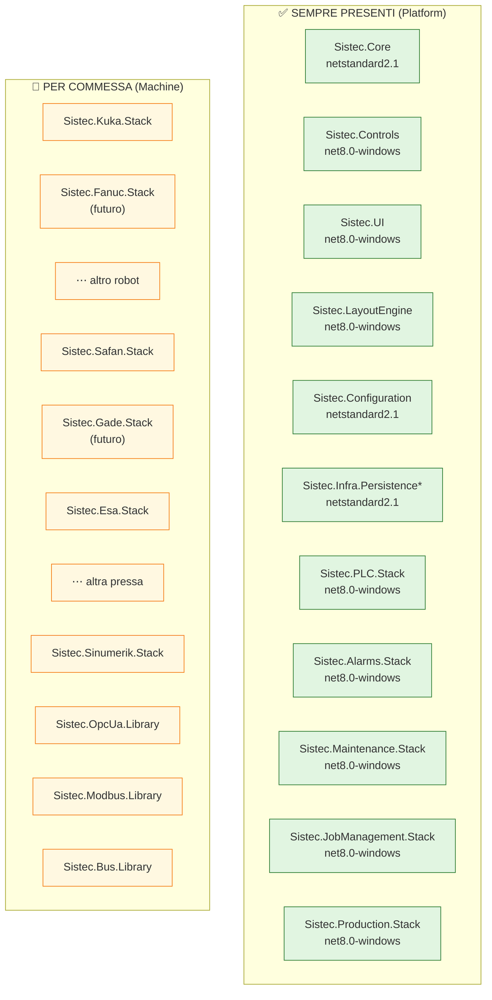

| Categoria | Pacchetto | Sempre presente? | Note |
|---|---|---|---|
| **Platform** | `Sistec.Core` | ✅ Sempre | Fondamenta di tutto |
| | `Sistec.Controls` | ✅ Sempre | Controlli WinForms generici |
| | `Sistec.UI` | ✅ Sempre | Layout menu, pagine base |
| | `Sistec.LayoutEngine` | ✅ Sempre | Motore layout da JSON |
| | `Sistec.Configuration` | ✅ Sempre | Options pattern |
| | `Sistec.Infra.Persistence.*` | ✅ Sempre | DB access |
| | **`Sistec.PLC.Stack`** | ✅ **Sempre** | Ogni impianto ha un PLC |
| | **`Sistec.Alarms.Stack`** | ✅ **Sempre** | Allarmi e notifiche |
| | **`Sistec.Maintenance.Stack`** | ✅ **Sempre** | Manutenzione |
| | **`Sistec.JobManagement.Stack`** | ✅ **Sempre** | Job lifecycle, ricette |
| | **`Sistec.Production.Stack`** | ✅ **Sempre** | Orchestrazione produzione |
| **Machine** | `Sistec.Kuka.Stack` | ❌ Se robot KUKA | TCP KRC |
| | `Sistec.Fanuc.Stack` | ❌ Se robot Fanuc | Futuro |
| | `Sistec.Safan.Stack` | ❌ Se pressa Safan | TCP |
| | `Sistec.Gade.Stack` | ❌ Se pressa Gade | Futuro |
| | `Sistec.Esa.Stack` | ❌ Se pressa ESA | Modbus |
| | `Sistec.Sinumerik.Stack` | ❌ Se CNC Siemens | OPC UA |
| **Lib** | `Sistec.OpcUa.Library` | ❌ Solo se serve OPC UA | Dipende dai macchinari |
| | `Sistec.Modbus.Library` | ❌ Solo se serve Modbus | Dipende dai macchinari |
| | `Sistec.Bus.Library` | ❌ Solo se serve Zebus | Dipende dall'impianto |

### 10.2 Progetto Commessa: Prima e Dopo

#### Oggi (LAG)

```xml
<Project Sdk="Microsoft.NET.Sdk">
  <PropertyGroup>
    <OutputType>WinExe</OutputType>
    <TargetFramework>net8.0-windows</TargetFramework>
  </PropertyGroup>
  <ItemGroup>
    <!-- 7 riferimenti a progetto, non pacchetti -->
    <ProjectReference Include="..\Sistec.Core\Sistec.Core.csproj" />
    <ProjectReference Include="..\Sistec.Controls\Sistec.Controls.csproj" />
    <ProjectReference Include="..\Sistec.UI\Sistec.UI.csproj" />
    <ProjectReference Include="..\Sistec.Opc.Ua\Sistec.Opc.Ua.csproj" />
    <ProjectReference Include="..\Sistec.Safan\Source\Sistec.Safan.csproj" />
    <ProjectReference Include="..\Sistec.Sinumerik\Sistec.Sinumerik.csproj" />
    <ProjectReference Include="..\..\Common\Sistec.Common.csproj" />
  </ItemGroup>
</Project>
```

#### Domani — Template `dotnet new sistec-hmi`

```xml
<!-- Template base: sempre gli stessi, ogni commessa li ha -->
<Project Sdk="Microsoft.NET.Sdk">
  <PropertyGroup>
    <OutputType>WinExe</OutputType>
    <TargetFramework>net8.0-windows</TargetFramework>
    <AssemblyName>Sistec.$(Commessa)</AssemblyName>
  </PropertyGroup>
  <ItemGroup>
    <!-- Platform — sempre presenti -->
    <PackageReference Include="Sistec.Core" Version="4.3.*" />
    <PackageReference Include="Sistec.Controls" Version="4.3.*" />
    <PackageReference Include="Sistec.UI" Version="4.3.*" />
    <PackageReference Include="Sistec.LayoutEngine" Version="1.0.*" />
    <PackageReference Include="Sistec.Configuration" Version="1.0.*" />
    <PackageReference Include="Sistec.Infra.Persistence" Version="1.0.*" />
    <PackageReference Include="Sistec.PLC.Stack" Version="2.1.*" />
    <PackageReference Include="Sistec.Alarms.Stack" Version="2.1.*" />
    <PackageReference Include="Sistec.Maintenance.Stack" Version="2.1.*" />
    <PackageReference Include="Sistec.JobManagement.Stack" Version="2.1.*" />
    <PackageReference Include="Sistec.Production.Stack" Version="2.1.*" />
    <!-- 🔧 Qui l'ingegnere aggiunge i pacchetti macchinario -->
  </ItemGroup>
</Project>
```

#### Domani — Commessa LAG (con macchinari)

```xml
<Project Sdk="Microsoft.NET.Sdk">
  <PropertyGroup>
    <OutputType>WinExe</OutputType>
    <TargetFramework>net8.0-windows</TargetFramework>
    <AssemblyName>Sistec.5315.LAG</AssemblyName>
  </PropertyGroup>
  <ItemGroup>
    <!-- Platform (sempre, dal template) -->
    <PackageReference Include="Sistec.Core" Version="4.3.*" />
    <PackageReference Include="Sistec.Controls" Version="4.3.*" />
    <PackageReference Include="Sistec.UI" Version="4.3.*" />
    <PackageReference Include="Sistec.LayoutEngine" Version="1.0.*" />
    <PackageReference Include="Sistec.Configuration" Version="1.0.*" />
    <PackageReference Include="Sistec.Infra.Persistence" Version="1.0.*" />
    <PackageReference Include="Sistec.PLC.Stack" Version="2.1.*" />
    <PackageReference Include="Sistec.Alarms.Stack" Version="2.1.*" />
    <PackageReference Include="Sistec.Maintenance.Stack" Version="2.1.*" />
    <PackageReference Include="Sistec.JobManagement.Stack" Version="2.1.*" />
    <PackageReference Include="Sistec.Production.Stack" Version="2.1.*" />

    <!-- Machine (aggiunti per LAG) -->
    <PackageReference Include="Sistec.Kuka.Stack" Version="2.1.*" />
    <PackageReference Include="Sistec.Safan.Stack" Version="2.1.*" />
    <PackageReference Include="Sistec.Sinumerik.Stack" Version="2.1.*" />
    <PackageReference Include="Sistec.OpcUa.Library" Version="2.1.*" />
  </ItemGroup>

  <ItemGroup>
    <!-- Soli file di configurazione e risorse -->
    <Content Include="manifest.json" CopyToOutputDirectory="Always" />
    <Content Include="layout.json" CopyToOutputDirectory="Always" />
    <Content Include="config\**\*.json" CopyToOutputDirectory="Always" />
    <Content Include="resources\**\*" CopyToOutputDirectory="Always" />
  </ItemGroup>
</Project>
```

#### Domani — Commessa FAEL C (senza pressa, senza CNC)

```xml
<Project Sdk="Microsoft.NET.Sdk">
  <PropertyGroup>
    <OutputType>WinExe</OutputType>
    <TargetFramework>net8.0-windows</TargetFramework>
    <AssemblyName>Sistec.5309.C</AssemblyName>
  </PropertyGroup>
  <ItemGroup>
    <!-- Platform (sempre, dal template) -->
    <!-- ... identico al template ... -->

    <!-- Machine (aggiunti per FAEL C) -->
    <PackageReference Include="Sistec.Kuka.Stack" Version="2.1.*" />
    <PackageReference Include="Sistec.OpcUa.Library" Version="2.1.*" />
    <!-- Nota: senza Safan.Stack, senza Esa.Stack, senza Sinumerik.Stack -->
    <!-- Non serve Modbus.Library (nessuna pressa) -->
  </ItemGroup>
</Project>
```

### 10.3 Consistenza Versioning

Tutti i pacchetti di uno stack verticale condividono la **stessa versione** (es. `Sistec.Kuka.Stack.Client` 2.1.0, `Sistec.Kuka.Stack.Driver` 2.1.0, `Sistec.Kuka.Stack.Services` 2.1.0, ecc.). Questo garantisce che i layer siano compatibili.

```xml
<!-- Directory.Build.props nel repo dello stack -->
<Project>
  <PropertyGroup>
    <VersionPrefix>2.1.0</VersionPrefix>
    <VersionSuffix>$(VersionSuffix)</VersionSuffix>
    <Authors>Sistec AM</Authors>
    <PackageProjectUrl>https://sistec.it</PackageProjectUrl>
    <RepositoryType>git</RepositoryType>
    <ContinuousIntegrationBuild>true</ContinuousIntegrationBuild>
  </PropertyGroup>
</Project>
```

### 10.4 Ciclo di Vita Commessa con NuGet

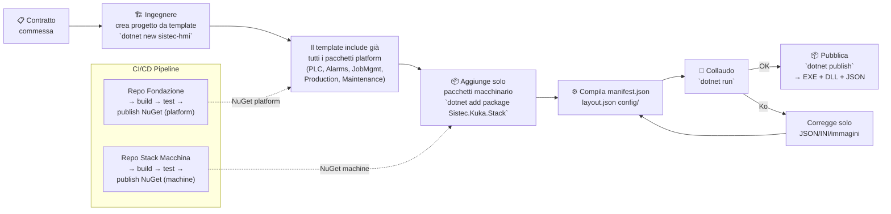

### 10.5 Impatto su Sviluppo e Consegna

| Ruolo | Oggi | Domani |
|---|---|---|---|
| **Sviluppatore di stack** (es. Kuka) | Scrive codice frammentato in 5 progetti, impact analysis su tutto | Scrive codice dentro un unico repo stack, test NUnit, publish NuGet |
| **Ingegnere di commessa** | Fork di soluzione, copia file, modifica codice C#, rischi regressione | `dotnet new sistec-hmi` (ha già tutto il platform), aggiunge 2-3 pacchetti macchina, scrive JSON |
| **Messa in servizio** | Build da sorgente, dipende dal dev che ha scritto quella commessa | `dotnet publish` con pacchetti già testati, rollback = cambiare versione NuGet |
| **Bug fixing** | Apri soluzione commessa, cerca in 5 progetti, fix, rebuild tutto | Fix nel repo dello stack, nuova versione NuGet, commessa aggiorna versione |
| **Nuovo macchinario** | Scrittura codice sparsa, difficile da standardizzare | Nuovo repo stack verticale, primo pacchetto NuGet, poi configurabile |
| **Allineamento versioni** | Ogni commessa ha versioni diverse degli stessi file | Platform versionato centralmente, tutte le commesse sulla stessa base |

### 10.6 Strategia di Adozione

Non serve convertire tutto in una volta. Si procede per fasi, partendo da ciò che è sempre uguale:

```
Fase 1: Platform NuGet (sempre presenti)
  ├── Estrarre in repo separati: Sistec.Core, Sistec.Controls, Sistec.UI
  ├── Estrarre: Sistec.PLC.Stack, Sistec.Alarms.Stack, Sistec.Maintenance.Stack
  ├── Estrarre: Sistec.JobManagement.Stack, Sistec.Production.Stack
  ├── CI/CD per ognuno: build → test NUnit → publish NuGet
  ├── Template `dotnet new sistec-hmi` con TUTTI questi pacchetti già inclusi
  └── LAG e FAEL iniziano a referenziarli via NuGet

Fase 2: Machine NuGet (per commessa)
  ├── Sistec.Kuka.Stack come pilota
  ├── Estrarre dal monolite in repo separato
  ├── LAG e FAEL aggiungono solo Kuka.Stack → primo stack condiviso
  ├── Poi Safan.Stack, Esa.Stack, Sinumerik.Stack...
  └── Nuovi macchinari (Fanuc, Gade, ...) nascono già come NuGet

Fase 3: Smantellamento Common
  ├── Tutti gli stack sono NuGet
  ├── Common non contiene più nulla di vivo
  ├── Eliminare progetto Common
  └── Correggere namespace

Fase 4: Layout Engine
  ├── Sistec.LayoutEngine come NuGet platform
  ├── layout.json sostituisce le pagine WinForms custom
  └── Nuova commessa = solo JSON + immagini
```

**Vantaggio chiave**: già dalla Fase 1 tutte le commesse condividono la stessa base platform via NuGet. Non si aspetta la fine del refactoring per vedere benefici.

### 10.7 Il Problema del Diverging Branches (LAG `milestons/4.5` vs FAEL `mileston/v3.25`)

Oggi il versioning è di fatto assente: lo stesso `Sistec.Core` esiste in due branch divergenti e incompatibili. È il sintomo più evidente dell'assenza di un modello di distribuzione.

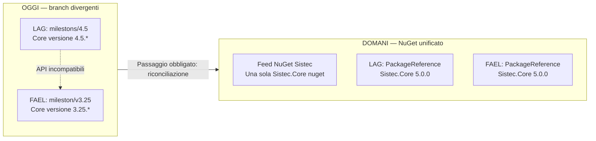

Il modello NuGet **risolve il problema a regime** (una volta pubblicato, non si può più divergere), ma richiede un passaggio intermedio di **riconciliazione** dei due branch.

#### Passaggio Obbligato: Riconciliazione dei Branch

Prima di pubblicare qualsiasi pacchetto NuGet, i due branch devono essere riconciliati in un unico `main`. Non esistono scorciatoie.

| Opzione | Sforzo | Rischio | Descrizione |
|---|---|---|---|
| **Merge manuale** | Alto (2-4 settimane) | Medio | Prendere i due branch, fare diff file per file, scegliere la versione più recente o fondere |
| **Adapter/Shim** | Medio (1-2 settimane) | Basso | Mantenere entrambe le API, una che wrappa l'altra. Utile se le differenze sono poche |
| **Big-Bang su Kuka.Stack pilota** | Basso (1 settimana) | Alto | Ignorare il problema, estrarre Kuka.Stack da LAG (il più recente) e forzare FAEL ad adattarsi |
| **Standardizzare su LAG** | Medio | Medio | LAG è più recente (v4.5 vs v3.25) e ha già test NUnit. FAEL si adatta |
| **Standardizzare su FAEL** | Medio-Alto | Alto | FAEL ha 3 varianti e più progetti, ma Core è più vecchio |

**Raccomandazione:** Combinare le opzioni — **standardizzare su LAG** (più recente, già con NUnit su net10.0, architettura più pulita) e usare una **finestra di compatibilità** dove FAEL wrappa le differenze minori con adapter temporanei.

#### Cosa Cambia con NuGet

| Aspetto | Oggi (branch divergenti) | Domani (NuGet) |
|---|---|---|
| **Quante versioni di Core esistono?** | 2+ (milestons/4.5, mileston/v3.25) | 1 (feed NuGet, versioni semantiche) |
| **Una commessa nuova che versione usa?** | Dipende da quale branch forkare | L'ultima stabile sul feed |
| **Bug fix in Core** | Applicato a un solo branch, l'altro resta indietro | Pubblicato su feed, tutte le commesse aggiornano quando vogliono |
| **API breaking change** | Silenzioso, ogni branch evolve da sé | `major version bump` semantico, tutte le commesse vedono la breaking change |
| **Rollback** | Impossibile (git revert caotico) | `dotnet add package Sistec.Core --version 4.3.5` |
| **Chi decide la versione?** | Nessuno (ogni repo fa da sé) | CI/CD pipeline → NuGet feed → tutte le commesse |

#### Impatto sulla Roadmap

La riconciliazione dei branch è un **prerequisito della Fase 1**. Senza, non si può pubblicare nulla su NuGet:

```
Fase 0: Riconciliazione (2-4 settimane) ← NUOVA
  ├── Analizzare diff tra milestons/4.5 (LAG) e mileston/v3.25 (FAEL)
  ├── Scegliere base comune (raccomandato: LAG, più recente)
  ├── Creare adapter temporanei per API divergenti in FAEL
  ├── Verificare che entrambe le commesse compilino sulla stessa base
  └── Git: unificare in unico main/master

Fase 1: Platform NuGet (dopo riconciliazione)
  ├── Ora ha senso: si parte da un'unica base condivisa
  └── Template `dotnet new sistec-hmi` usa la base riconciliata
```

**In sintesi:** sì, il modello NuGet risolve il problema del versioning divergente **a regime**. Ma prima va fatto un lavoro di riconciliazione tra i due branch, altrimenti si pubblicherebbe su NuGet una delle due versioni (e l'altra diventerebbe inutilizzabile). La buona notizia: LAG è più recente (v4.5 vs v3.25) e il divario è colmabile con adapter temporanei.

---

## 11. Modernizzazione UI: Avalonia e Cross-Platform

WinForms è una tecnologia di **22 anni** (.NET Framework 1.0, 2003). Anche WPF ha 18 anni. L'architettura a stack verticali proposta separa già la UI (`Sistec.<Nome>.Stack.UI`), per cui il passo successivo naturale è sostituire WinForms con un framework moderno — senza dover riscrivere i layer Client, Driver e Services.

### 11.1 Perché non WinForms

| Problema | Impatto |
|---|---|
| **DPI scaling** | Gestione manuale, problemi su schermi 4K/industriali |
| **Touch input** | Nessun supporto nativo a gesture, multitouch |
| **Theming/stili** | Assente, ogni controllo va dipinto a mano |
| **Data binding** | Legacy, no `{Binding}` dichiarativo, tutto in code-behind |
| **Threading** | `InvokeRequired` / `SafeInvoke` pattern anti-ergonomico |
| **Linux** | **Non supportato** |
| **Sviluppo attivo Microsoft** | Solo bug fix, nessuna nuova feature dal 2020 |

### 11.2 Opzioni Modern UI

| Framework | Windows | Linux | macOS | Maturità industriale | Note |
|---|---|---|---|---|---|
| **WinUI 3** | ✅ Nativo | ❌ | ❌ | Media (stabile da WinAppSDK 1.5) | Moderno, ma ancora Windows-only |
| **Avalonia UI** | ✅ | ✅ | ✅ | Alta (v11, usato in ambito industriale) | **Raccomandato per cross-platform** |
| **.NET MAUI** | ✅ | ⚠️ Community | ✅ | Media (v8, ma Linux acerbo) | Nato per mobile, Linux non ufficiale |
| **Uno Platform** | ✅ (WinUI) | ✅ | ✅ | Media | WinUI API identica su tutti i target |

**Raccomandazione: Avalonia UI** — è il framework .NET cross-platform più maturo per applicazioni desktop industriali:
- XAML moderno con binding dichiarativo, compiled bindings
- DPI scaling automatico
- Touch/gesture nativo
- Theming completo (Fluent, Material, custom)
- SVG e font icon nativi
- Funziona su Linux embedded (ARM) — tipico dei pannelli industriali
- Nessuna dipendenza da Windows-specific API

### 11.3 Impatto sull'Architettura a Stack

La separazione UI (layer `Stack.UI` WinForms) già prevista nell'architettura a stack verticali rende la migrazione **incrementale e isolata**:

```mermaid
flowchart LR
    subgraph Oggi["OGGI — WinForms"]
        UI_WF["Sistec.Kuka.Stack.UI<br/>(UserControl WinForms)"]
        SVC["Sistec.Kuka.Stack.Services<br/>(logica pura)"]
        DRV["Sistec.Kuka.Stack.Driver<br/>(tag provider)"]
        CLI["Sistec.Kuka.Stack.Client<br/>(TCP KRC)"]
    end

    subgraph Transizione["TRANSIZIONE — side-by-side"]
        UI_WF2["Sistec.Kuka.Stack.UI.WinForms<br/>(vecchio, legacy)"]
        UI_AV["Sistec.Kuka.Stack.UI.Avalonia<br/>(nuovo, moderno)"]
        SVC2["Sistec.Kuka.Stack.Services<br/>(identico, nessuna modifica)"]
    end

    subgraph Domani["DOMANI — Avalonia"]
        UI_AV2["Sistec.Kuka.Stack.UI<br/>(solo Avalonia, WinForms rimosso)"]
        SVC3["Sistec.Kuka.Stack.Services<br/>(identico)"]
    end

    Oggi --> Transizione
    Transizione --> Domani
```

**Punti chiave:**

1. **I layer sottostanti (Client, Driver, Services) NON cambiano** — sono già puri .NET, senza dipendenze UI
2. **Ogni stack può migrare individualmente** — non serve un big-bang
3. **Side-by-side possibile** — durante la transizione, uno stack può avere UI WinForms e un altro UI Avalonia
4. **Il `LayoutEngine` (sezione 8) diventa ancora più potente** — i controlli registrati nel `ControlRegistry` vengono da Avalonia invece che da WinForms

### 11.4 Cosa Cambia per Ogni Stack

```csharp
// OGGI — WinForms
public class ucKukaInfo : UserControl
{
    private Label _statusLabel;
    public ucKukaInfo()
    {
        _statusLabel = new Label { Location = new Point(10, 10) };
        Controls.Add(_statusLabel);
    }
    public void UpdateStatus(string status)
    {
        if (InvokeRequired) { Invoke(() => _statusLabel.Text = status); return; }
        _statusLabel.Text = status;
    }
}

// DOMANI — Avalonia
public class KukaInfoView : UserControl
{
    // Binding dichiarativo, niente code-behind
    // Niente InvokeRequired (Avalonia gestisce il thread)
}
```

```xml
<!-- DOMANI — Avalonia XAML -->
<UserControl xmlns="https://github.com/avaloniaui"
             xmlns:vm="clr-namespace:Sistec.Kuka.Stack.ViewModels">
    <StackPanel>
        <TextBlock Text="{Binding RobotName}" FontSize="18" />
        <TextBlock Text="{Binding Status}" 
                   Foreground="{Binding StatusColor}" />
        <Button Command="{Binding StartProgramCommand}"
                Content="Avvia Programma" />
    </StackPanel>
</UserControl>
```

### 11.5 Strategia di Migrazione UI

```
Fase 0: Setup (1 settimana)
  ├── Aggiungere Avalonia al solution (progetti esistenti non toccati)
  ├── Creare Sistec.Core.UI.Abstraction — interfacce UI neutre
  │     (es. IViewProvider, IDialogService, INavigationService)
  └── Template progetto Avalonia + WinForms side-by-side

Fase 1: Kuka.Stack.UI pilota (2-3 settimane)
  ├── Riscrivere ucKukaInfo, KukaOverride in Avalonia
  ├── ViewModel per ogni view (logica UI, non di dominio)
  ├── Testare side-by-side con WinForms
  └── Rilasciare Sistec.Kuka.Stack.UI.Avalonia come pacchetto NuGet

Fase 2: Altri stack (2-3 settimane per stack)
  ├── Safan.Stack.UI → Avalonia
  ├── PLC.Stack.UI → Avalonia
  ├── Sinumerik.Stack.UI → Avalonia
  └── Production.Stack.UI → Avalonia

Fase 3: LayoutEngine su Avalonia (1-2 settimane)
  ├── ControlRegistry ora emette controlli Avalonia
  ├── layout.json funziona identico (cambia solo il renderer)
  └── layout.json può includere binding Avalonia-style

Fase 4: Rimozione WinForms (1 settimana)
  ├── Verificare che tutti gli stack siano migrati
  ├── Eliminare i progetti Stack.UI.WinForms
  ├── Eliminare Sistec.Controls (sostituito da controlli Avalonia nativi)
  └── Eliminare dipendenza da System.Windows.Forms
```

### 11.6 Rischi e Mitigazioni

| Rischio | Probabilità | Mitigazione |
|---|---|---|
| **Performance Avalonia su Linux embedded** | Bassa | Test su HW target prima della migrazione. Avalonia ha rendering GPU via Skia. |
| **Binding complessi (OPC UA in tempo reale)** | Media | ViewModel con `INotifyPropertyChanged` standard, ReactiveUI per stream asincroni |
| **Terze parti WinForms non migrabili** | Media | WebView + HTML per controlli legacy, oppure wrapper interop finestra |
| **Resistenza del team ("tanto funziona")** | Alta | Dimostrazione con Kuka.Stack pilota: stesso codice sottostante, UI moderna, touch funzionante |
| **Avalonia EOL / abbandono** | Bassa | Open source, community attiva. In caso estremo, migrazione a Uno Platform (stessa sintassi XAML) |

### 11.7 Roadmap UI — Impatto sulla Timeline

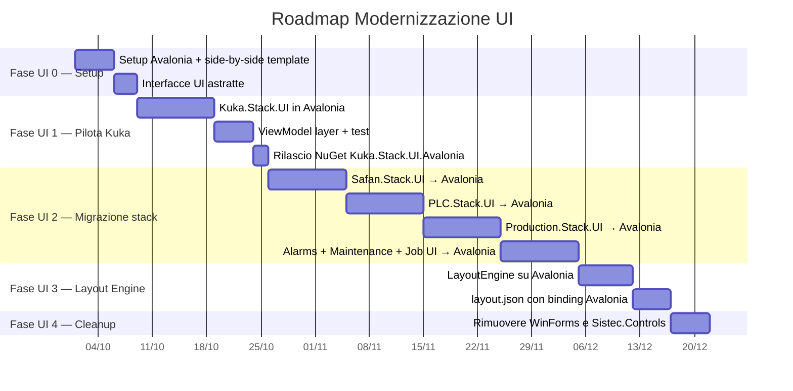

### 11.8 WebAssembly (WASM): HMI nel Browser

Avalonia UI può compilare il target **WebAssembly** (WASM), consentendo all'HMI di girare in un browser senza installazione. Questo abilita scenari che l'EXE nativo non copre.

#### Scenario d'Uso

```mermaid
flowchart LR
    subgraph Native["EXE NATIVO (Pannello Industriale)"]
        EXE["Sistec.HMI.exe<br/>Avalonia su Windows/Linux<br/>→ Controllo macchine"]
    end

    subgraph Browser["WEBASSEMBLY (Browser)"]
        WASM1["PC Ufficio Tecnico<br/>sistec-hmi.local:5000<br/>→ Monitoraggio + parametri"]
        WASM2["Tablet Capoturno<br/>→ Stato produzione"]
        WASM3["TV Reparto<br/>→ KPI fullscreen"]
    end

    EXE -->|REST API localhost| WASM1
    EXE -->|REST API localhost| WASM2
    EXE -->|REST API localhost| WASM3
```

| Scenario | Nativo (EXE) | WASM (Browser) |
|---|---|---|
| **Pannello industriale** | ✅ Macchine, robot, PLC | ❌ Troppo lento per real-time |
| **Ufficio tecnico** | ❌ Deve installare | ✅ Apre browser, monitora parametri |
| **Capoturno con tablet** | ❌ Solo Windows | ✅ Funziona su iPad/Android |
| **TV reparto con KPI** | ❌ PC dedicato | ✅ Schermo HDMI + browser fullscreen |
| **Cliente remoto** | ❌ VPN + installazione | ✅ Link HTTPS, zero installazione |

#### Vincolo Architetturale

La versione WASM è **read-only** e **non sostituisce l'EXE nativo**:

```
EXE nativo:
  ├── Controlla macchine (KUKA, PLC, pressa)
  ├── Scrive tag OPC UA
  ├── Esegue produzione
  └── Gestisce aggiornamenti automatici

WASM browser:
  ├── Legge stato da API REST
  ├── Mostra KPI, trend, allarmi
  ├── Modifica parametri non critici (con autorizzazione)
  └── Mai comandi diretti alle macchine
```

#### Implementazione

```xml
<!-- Sistec.HMI.Shell — target multiplo -->
<Project Sdk="Microsoft.NET.Sdk">
  <PropertyGroup>
    <TargetFrameworks>net10.0-windows;net10.0-browserwasm</TargetFrameworks>
  </PropertyGroup>
</Project>
```

La compilazione WASM produce file statici (`.wasm`, `.js`, `.html`) servibili da Nginx o dalla REST API dell'HMI nativo su `localhost:5000/wasm/`.

#### Vantaggi

| Vantaggio | Dettaglio |
|---|---|
| **Zero installazione** | Apri browser, carica HMI |
| **Cross-device** | PC, tablet, smartphone — qualsiasi OS |
| **Stesso codice** | Stessa UI Avalonia, stessi ViewModel, binding identici |
| **Update istantaneo** | Ricarica browser = nuova versione (nessun UpdateAgent) |
| **Integrazione dashboard §19.12** | La dashboard React e l'HMI WASM condividono le stesse API REST |

#### Rischi

| Rischio | Mitigazione |
|---|---|
| **Performance** | WASM più lento di nativo (Skia su canvas). Non adatto per animazioni real-time o polling OPC UA frequente |
| **Accesso hardware** | No seriale, no badge RFID, no OPC UA client nativo. Solo HTTP/WebSocket |
| **Dimensione download** | WASM + .NET runtime = ~5MB iniziali. Accettabile su LAN industriale |

#### Roadmap

```
Fase UI 5 — WebAssembly (2-3 settimane, dopo Fase UI 3)
  ├── Configurare target net10.0-browserwasm
  ├── Estrarre API REST comune (riusa §19.2)
  ├── Adattare UI per schermo touch browser (da §21.6)
  ├── Deploy WASM come file statici serviti dall'HMI nativo
  └── Test su tablet + TV reparto
```

---

## 12. Gestione Utenti e Tracciamento Produzione

L'attuale sistema utenti è **rudimentale**: solo 4 livelli gerarchici (Operator < Maintenance < Expert < Sistec) memorizzati in una tabella `accounts` con password in chiaro, nessun legame con dipendenti reali, nessuna statistica di produzione per operatore. Per i clienti moderni serve un sistema che tracci **chi produce cosa** e permetta report di produttività per dipendente.

### 12.1 Architettura Proposta

```mermaid
flowchart LR
    subgraph AUTH["Autenticazione"]
        RFID["Badge RFID<br/>Lettore USB seriale"]
        PIN["PIN rapido<br/>4-6 cifre"]
        SEL["Selezione da lista<br/>touch screen"]
    end

    subgraph DB["Database"]
        EMP["employees<br/>BadgeId | Nome | Turno | RoleId | PinHash"]
        ROL["roles<br/>Permission flags"]
        LOG["production_log<br/>OperatorId | JobId | Timestamp | EventType"]
    end

    subgraph UI["UI"]
        LOGIN["LoginPage<br/>Pick operatore + PIN"]
        DASH["DashboardStat<br/>Pezzi/h, scarti %, tempi ciclo"]
        ADMIN["AdminPage<br/>Gestione dipendenti e ruoli"]
    end

    AUTH --> LOGIN
    LOGIN --> EMP
    ROL -->|"CanEditParameters"| UI
    EMP -->|"FK"| LOG
    LOG --> DASH
```

### 12.2 Modello Dati

```sql
-- Ruoli con permessi granulari (bit flags)
CREATE TABLE roles (
    Id          INT PRIMARY KEY AUTO_INCREMENT,
    Name        VARCHAR(50) NOT NULL,          -- "Supervisore", "Operatore", "Manutenzione"
    Permissions BIGINT NOT NULL DEFAULT 0,     -- Bitmask: 1=CanEditParams, 2=CanReset, 4=CanManageUsers, ...
    IsActive    BOOLEAN NOT NULL DEFAULT TRUE
);

-- Dipendenti reali
CREATE TABLE employees (
    BadgeId     INT PRIMARY KEY AUTO_INCREMENT, -- 4-6 cifre, leggibile su badge RFID
    FirstName   VARCHAR(50) NOT NULL,
    LastName    VARCHAR(50) NOT NULL,
    Shift       TINYINT NOT NULL DEFAULT 1,     -- 1=Mattina, 2=Pomeriggio, 3=Notte
    RoleId      INT NOT NULL,
    PinHash     VARCHAR(256) NOT NULL,           -- BCrypt/Argon2 hash
    PinSalt     VARCHAR(128) NOT NULL,
    IsActive    BOOLEAN NOT NULL DEFAULT TRUE,
    CreatedAt   DATETIME NOT NULL DEFAULT NOW(),
    LastLogin   DATETIME NULL,
    FOREIGN KEY (RoleId) REFERENCES roles(Id)
);

-- Log produzione (esempi)
CREATE TABLE production_log (
    Id          BIGINT PRIMARY KEY AUTO_INCREMENT,
    OperatorId  INT NOT NULL,
    JobId       INT NULL,
    EventType   VARCHAR(50) NOT NULL,           -- "JobStarted", "JobCompleted", "Scrap", "ParamChange", "AlarmAck"
    Timestamp   DATETIME NOT NULL DEFAULT NOW(),
    Details     JSON NULL,                      -- Dettagli evento (es. {parameter: "pressure", old: 10, new: 12})
    FOREIGN KEY (OperatorId) REFERENCES employees(BadgeId)
);
```

### 12.3 Modello C#

```csharp
[Flags]
public enum Permission : long
{
    None            = 0,
    ViewProduction  = 1 << 0,
    EditParameters  = 1 << 1,
    ResetMachine    = 1 << 2,
    ManageJobs      = 1 << 3,
    ManageUsers     = 1 << 4,
    ViewReports     = 1 << 5,
    Admin           = 1 << 6,
    All             = ~0L
}

public record Role(int Id, string Name, Permission Permissions, bool IsActive);

public record Employee(
    int BadgeId,
    string FirstName,
    string LastName,
    Shift Shift,
    Role Role,
    bool IsActive,
    DateTime? LastLogin
);

public enum Shift { Morning = 1, Afternoon = 2, Night = 3 }
```

### 12.4 Servizi

| Servizio | Responsabilità | Metodi chiave |
|---|---|---|
| `IAuthenticationService` | Login/Logout, validazione PIN | `LoginAsync(badgeId, pin)`, `LoginAsync(rfidToken)`, `LogoutAsync()`, `GetCurrentUser()` |
| `IEmployeeRepository` | CRUD dipendenti | `GetByIdAsync()`, `GetByShiftAsync()`, `GetActiveAsync()`, `CreateAsync()`, `UpdatePinAsync()` |
| `IRoleRepository` | CRUD ruoli + permessi | `GetAllAsync()`, `GetWithPermissionsAsync()`, `UpdatePermissionsAsync()` |
| `IProductionAnalyticsService` | Statistiche per operatore | `GetPiecesPerHourAsync(operatorId, range)`, `GetScrapRateAsync(operatorId, range)`, `GetShiftComparisonAsync(range)` |
| `IAuditService` | Log eventi operatore | `LogEventAsync(operatorId, eventType, details)`, `GetEventsAsync(filters)` |

### 12.5 PIN e Sicurezza

- **PIN 4-6 cifre** (non password lunghe) — pensato per uso industriale con guanti, touch screen, badge RFID
- **Hashing**: BCrypt (costo 10) o Argon2id — niente plaintext
- **Niente auto-login backdoor**: il file `loginSistec.ls` viene eliminato
- **Account Sistec integrato**: creato come un normale `Employee` con ruolo Admin nel seed del database — stessa sicurezza degli altri utenti
- **Configurabile via appsettings.json**:
  ```json
  {
    "Authentication": {
      "Provider": "Pin",          // "Pin" | "Rfid" | "Both"
      "RfidReaderPort": "COM3",
      "RfidReaderBaudRate": 9600,
      "PinMinLength": 4,
      "PinMaxLength": 6,
      "BcryptCostFactor": 10,
      "AutoLogoutMinutes": 30,
      "BruteForceLockout": { "MaxAttempts": 5, "LockoutMinutes": 15 }
    }
  }
  ```

### 12.6 Statistiche Produzione per Operatore

La dashboard `EmployeeStatsPage` mostra:

| Metrica | Fonte Dati | Aggiornamento |
|---|---|---|
| **Pezzi prodotti (oggi/settimana/mese)** | `production_log WHERE EventType='JobCompleted'` | Real-time |
| **Scarti (oggi/settimana/mese)** | `production_log WHERE EventType='Scrap'` | Real-time |
| **Tempo ciclo medio** | `JobCompleted - JobStarted` per operatore | Per job |
| **Produttività %** | Tempo produttivo / tempo totale turno | Ogni ora |
| **Confronto turni** | Mattina vs Pomeriggio vs Notte | Giornaliero |
| **Eventi principali** | Alarm Ack, Param Changes, Reset | Real-time |

### 12.7 Integrazione con CI/CD

La gestione utenti è **indipendente dagli stack macchina** — può essere sviluppata e versionata come pacchetto `Sistec.Infra.Authentication` NuGet, consumato da tutti gli stack UI.

```
Sistec.Infra.Authentication          ← NuGet
├── IAuthenticationService.cs        ← Interfaccia
├── IEmployeeRepository.cs
├── IRoleRepository.cs
├── IProductionAnalyticsService.cs
├── Models/
│   ├── Employee.cs
│   ├── Role.cs
│   └── Permission.cs
├── Services/
│   ├── AuthenticationService.cs     ← BCrypt verify + session
│   ├── ProductionAnalyticsService.cs
│   └── AuditService.cs
└── Data/
    ├── EmployeeRepository.cs        ← Dapper
    └── RoleRepository.cs
```

### 12.8 Roadmap

```
Fase A: Foundation (1 settimana)
    Modello dati + migration DB
    Repository + servizi DI
    Password hashing con BCrypt
Fase B: Login UI (1-2 settimane)
    LoginPage Avalonia (PIN + badge)
    Session management + auto-logout
    Role-based authorization nei view-model
Fase C: Admin (1 settimana)
    CRUD dipendenti + ruoli
    Reset PIN
Fase D: Statistiche (2-3 settimane)
    ProductionAnalyticsService
    EmployeeStatsPage + grafici
    Esportazione CSV/PDF
```

### 12.9 Vantaggi per il Cliente

| Prima | Dopo |
|---|---|
| "Mario Rossi preme un bottone e produce" | "Mario Rossi badgea, l'HMI sa chi è, statistiche real-time sulla sua produttività" |
| "Non sappiamo chi ha causato lo scarto" | "Scarto tracciato con operatore, data, ora e dettagli" |
| "Il cliente chiede report di produttività — risposta: non li abbiamo" | "Il cliente apre la dashboard e vede pezzi/h per operatore, confronto turni, scarti %" |
| "Password in chiaro su MySQL" | "PIN hashato con BCrypt, niente segreti nel codice" |
| "CRUD utenti rotto (query commentate)" | "AdminPage funzionante con permessi granulari" |

---

## 13. Microservizi: Perché No

Con stack verticali, NuGet e Avalonia la domanda sorge spontanea. La risposta è: **per un HMI industriale, i microservizi risolverebbero problemi che non hai, creandone di nuovi.**

### 13.1 Cosa Comprano i Microservizi (e perché non servono)

| Beneficio microservizi | Utile in HMI? | Perché |
|---|---|---|
| **Scalabilità orizzontale** | ❌ No | L'HMI serve 1 operatore. Non hai 10.000 utenti simultanei. |
| **Deploy indipendente** | ⚠️ Già risolto | Lo hai già con NuGet + DI Container. Un EXE unico, versioni diverse per ogni stack package. |
| **Isolamento guasti** | ❌ Controproducente | Se Kuka.Stack crasha in un processo separato, l'HMI mostra "KUKA offline". Se crasha in-process, riavvi lo stack. Il risultato è identico, ma in-process è più semplice da gestire. |
| **Team autonomy** | ⚠️ Già risolto | Stack separati in repo NuGet diversi. Team A fa Kuka, Team B fa Safan, si incontrano sulle interfacce di Sistec.Core. |
| **Polyglot tech** | ❌ No | Sei già .NET. Mischiare linguaggi in un HMI industriale è pura complessità. |

### 13.2 Cosa Costano i Microservizi (e perché pesa)

| Costo | Impatto su HMI |
|---|---|
| **Latenza di rete** | Robot KUKA, pressa Safan, PLC: già comunicano via TCP/OPC UA. Metti un hop applicativo in mezzo e每 comandi che devono arrivare in <10ms iniziano a soffrire. |
| **Fallimento rete = macchina ferma** | Con un EXE unico, se tutto va in crash riavvi. Con 5 microservizi, uno dei 5 potrebbe morire silenziosamente e la pressa parte lo stesso senza il robot che la serve — **danni fisici**. |
| **Container su pannello industriale** | Un pannello industriale ha un Celeron o un ARM. Docker + orchestrator su quella roba è follia. |
| **Complessità operativa** | Service discovery, health check, distributed tracing, message broker — per un HMI che deve solo partire e funzionare quando dai corrente. |
| **Stato in-memory** | I tag OPC UA hanno valore istantaneo. Se li distribuisci su più processi, ogni servizio deve riconnettersi al PLC o avere un cache distribuito — pura complessità senza beneficio. |

### 13.3 Confronto: Modular Monolith vs Microservices

```mermaid
flowchart TB
    subgraph ModularMonolith["✅ MODULAR MONOLITH (proposto)"]
        MM_PROC["1 processo<br/>Sistec.HMI.exe"]
        MM_KUKA["Sistec.Kuka.Stack<br/>(DLL in-process)"]
        MM_SAFAN["Sistec.Safan.Stack<br/>(DLL in-process)"]
        MM_PLC["Sistec.PLC.Stack<br/>(DLL in-process)"]
        MM_PRODUCTION["Sistec.Production.Stack<br/>(DLL in-process)"]
        MM_LAYOUT["LayoutEngine + Avalonia UI"]

        MM_KUKA -.->|chiamate dirette, interfacce| MM_PRODUCTION
        MM_SAFAN -.->|stesso processo| MM_PRODUCTION
        MM_PLC -.->|stessa memoria| MM_KUKA
    end

    subgraph Microservices["❌ MICROSERVIZI"]
        MS_KUKA["Kuka.Service<br/>(processo separato)"]
        MS_SAFAN["Safan.Service<br/>(processo separato)"]
        MS_PLC["Plc.Service<br/>(processo separato)"]
        MS_PRODUCTION["Production.Service<br/>(processo separato)"]
        MS_HMI["HMI (Avalonia)<br/>(processo separato)"]
        MS_BROKER["Message Broker<br/>(RabbitMQ/gRPC)"]

        MS_KUKA -.->|REST/gRPC| MS_BROKER
        MS_SAFAN -.->|REST/gRPC| MS_BROKER
        MS_PLC -.->|REST/gRPC| MS_BROKER
        MS_PRODUCTION -.->|REST/gRPC| MS_BROKER
        MS_HMI -.->|REST/gRPC| MS_BROKER
    end

    subgraph Comparison["CONFRONTO"]
        C1["Monolith: 1 EXE, 1 cartella, doppio click"]
        C2["Microservizi: 5+ servizi, container, docker-compose, orchestrazione"]
        C3["Monolith: chiamate dirette, zero serializzazione, zero latenza"]
        C4["Microservizi: gRPC/JSON, serializzazione, latenza di rete"]
        C5["Monolith: crash = riavvio. Microservizi: crash parziale = stato incoerente"]
    end
```

### 13.4 La Via Giusta: Modular Monolith + NuGet

L'architettura proposta in questo documento è un **Modular Monolith**:

```
Un unico EXE, composto da pacchetti NuGet, con confini netti tra stack.
```

| Caratteristica | Modular Monolith | Microservizi |
|---|---|---|
| **Deploy** | 1 EXE + DLL | 5+ container |
| **Latenza inter-stack** | Zero (in-process) | RPC/gRPC + serializzazione |
| **Isolamento** | Assembly (non processo) | Processo + rete |
| **Versioning** | NuGet (stessa risoluzione) | API versioning + compatibilità |
| **Debuggabilità** | Visual Studio, F5 | Docker compose, distributed tracing |
| **Boot time** | 1-2 secondi | Minuti (container startup) |
| **HW requirements** | Pannello industriale standard | Server / cluster |
| **Stato condiviso** | Memoria condivisa, lock | Cache distribuita, eventual consistency |

**La regola pratica:** se non hai un team di 5+ persone **per servizio** e traffico da gestire, i microservizi sono over-engineering. Il Modular Monolith ti dà il 90% dei benefici di isolamento con il 10% della complessità.

### 13.5 Quando Riconsiderare

Microservizi avrebbero senso solo se tra 3-5 anni:

1. **Central Control Room**: l'HMI non è più su un pannello locale, ma c'è un server centrale che gestisce 20 celle di produzione contemporaneamente
2. **Multi-tenant**: lo stesso software serve 10 impianti diversi da un unico server
3. **Team >15 sviluppatori**: servono team indipendenti che deployano in autonomia su un cluster

Fino ad allora, **Modular Monolith + NuGet + Avalonia** è la scelta giusta.

### 13.6 Eccezione: Cloud Connector per Industry 4.0

Un discorso diverso vale per la **raccolta dati verso cloud** — che ha senso ed è ortogonale all'architettura principale.

#### Non è un microservizio, è uno stack verticale come gli altri

```mermaid
flowchart LR
    subgraph HMI["HMI (1 processo, Modular Monolith)"]
        Kuka["Sistec.Kuka.Stack"]
        Safan["Sistec.Safan.Stack"]
        PLC["Sistec.PLC.Stack"]
        Prod["Sistec.Production.Stack"]
        Alarms["Sistec.Alarms.Stack"]
        Jobs["Sistec.JobManagement.Stack"]

        subgraph Cloud["Sistec.Cloud.Stack (NUOVO)"]
            Collector["CloudDataCollector<br/>Si sottoscrive a eventi<br/>degli altri stack"]
            MQTT["MqttPublisher<br/>Invia a broker MQTT<br/>o HTTP API"]
            Buffer["OfflineBuffer<br/>Coda locale se cloud<br/>non disponibile"]
        end
    end

    Cloud -->|MQTT / HTTPS| CloudBroker["Cloud Broker<br/>(Azure / AWS / on-prem)"]
    CloudBroker --> Dashboard["Dashboard centrale<br/>KPI, OEE, trend"]
    CloudBroker --> Analytics["Analytics / ML"]
    CloudBroker --> ERP["ERP / MES"]

    Kuka -.->|eventi| Cloud
    Safan -.->|eventi| Cloud
    PLC -.->|eventi| Cloud
    Prod -.->|eventi| Cloud
    Alarms -.->|eventi| Cloud
    Jobs -.->|eventi| Cloud
```

| Aspetto | Dettaglio |
|---|---|
| **Cos'è** | `Sistec.Cloud.Stack` — un pacchetto NuGet come tutti gli altri |
| **Cosa fa** | Ascolta eventi dagli altri stack e li invia a un broker cloud |
| **Cosa NON fa** | Non comanda l'impianto. Se il cloud è giù, la produzione continua |
| **Protocollo** | MQTT (standard IIoT), OPC UA PubSub, o HTTP REST |
| **Dati tipici** | Conteggio pezzi, allarmi, job completati, stato macchine, OEE |
| **Buffer** | Coda su disco locale (SQLite) se cloud non raggiungibile — svuota quando torna online |
| **Configurazione** | `cloud.json`: endpoint, topic, credenziali, intervallo pubblicazione |
| **Opzionale** | Se non includi il pacchetto NuGet, l'HMI funziona identico — senza cloud |

#### Perché questo NON rompe l'architettura

- È uno **stack verticale come tutti gli altri** — stesso pattern (Client? → Driver? → Services → UI? → Simulator)
- È **opzionale** — non incluso nel template base, si aggiunge via `dotnet add package Sistec.Cloud.Stack`
- È **non invasivo** — non tocca gli altri stack, si aggancia ai loro eventi
- È **testabile** con un `CloudSimulator` (broker MQTT finto) come qualsiasi altro stack

#### Esempio

```csharp
// Sistec.Cloud.Stack/CloudDataCollector.cs
public class CloudDataCollector : ICloudDataCollector
{
    private readonly MqttPublisher _mqtt;
    private readonly OfflineBuffer _buffer;

    public CloudDataCollector(
        IAlarmService alarms,       // da Sistec.Alarms.Stack
        IJobTracker jobs,           // da Sistec.JobManagement.Stack
        IProductionTracker prod,    // da Sistec.Production.Stack
        MqttPublisher mqtt,
        IOptions<CloudOptions> options)
    {
        alarms.OnAlarmRaised += (alarm) =>
            PublishAsync("alarms/raised", alarm);
        jobs.OnJobCompleted += (job) =>
            PublishAsync("jobs/completed", job);
        prod.OnPartProduced += (part) =>
            PublishAsync("production/part", part);
    }

    private async Task PublishAsync(string topic, object data)
    {
        if (_mqtt.IsConnected)
            await _mqtt.PublishAsync(topic, data);
        else
            await _buffer.EnqueueAsync(topic, data); // salva in SQLite locale
    }
}
```

#### Quando ha senso

| Scenario | Cloud Stack |
|---|---|
| Cliente vuole dashboard centrale con OEE di 10 impianti | ✅ Aggiungi `Sistec.Cloud.Stack` |
| Manutenzione predittiva su cloud | ✅ Idem |
| Integrazione con ERP/MES | ✅ Idem |
| Necessario per la produzione (cloud comanda l'impianto) | ❌ **Non farlo**. Il cloud non deve comandare un HMI industriale in real-time |
| Raccolta dati per analytics | ✅ Perfetto |

#### Standard IIoT: Sparkplug B v3.1

Il Cloud.Stack pubblica eventi in formato **MQTT Sparkplug B v3.1** (febbraio 2026), lo standard Eclipse Foundation per IIoT. Sparkplug B definisce:

| Elemento | Ruolo |
|---|---|
| **Topic Namespace** | `spBv1.0/{group_id}/{edge_node}/{type}` — struttura standardizzata |
| **Birth/Death Certificate** | Ogni edge node pubblica stato completo all'avvio (`BIRTH`) e alla disconnessione (`DEATH`) |
| **Payload Protobuf** | Dati serializzati in formato binario efficiente, con metadati (timestamp, data type, qualità) |
| **Seq Number** | Numerazione sequenziale dei messaggi per rilevamento perdite |

**Vantaggi rispetto a MQTT "piano":**

| MQTT generico | MQTT Sparkplug B |
|---|---|
| Topic arbitrari, nessuna convenzione | Topic namespace standardizzato |
| Nessun discovery — configurazione manuale | Auto-discovery via BIRTH message |
| Nessuna notifica di disconnessione | DEATH message automatico su disconnessione |
| Payload JSON/XML non strutturato | Payload Protobuf con schema tipizzato |

#### Pattern Ibrido: OPC UA al Edge, Sparkplug B Northbound

Lo standard de facto 2026 per l'architettura IIoT è il **modello ibrido**:

```mermaid
flowchart LR
    subgraph Edge["RETE MACCHINE (Edge)"]
        PLC["PLC<br/>OPC UA Server"]
        HMI["HMI<br/>OPC UA Client<br/>(real-time control)"]
        PLC -->|OPC UA Client/Server| HMI
    end

    subgraph Bridge["BRIDGE"]
        SM["Sistec.Cloud.Stack<br/>OPC UA PubSub Reader<br/>→ Sparkplug B Edge Node"]
    end

    subgraph Cloud["NORTHBOUND (IT/Cloud)"]
        MQTT["MQTT Broker<br/>(Mosquitto / EMQX)"]
        DASH["Dashboard<br/>Sparkplug Primary App"]
        ERP["ERP / MES<br/>Sparkplug Consumer"]
    end

    HMI -->|OPC UA| SM
    SM -->|Sparkplug B| MQTT
    MQTT --> DASH
    MQTT --> ERP
```

| Layer | Protocollo | Perché |
|---|---|---|
| **Edge (PLC ↔ HMI)** | OPC UA Client/Server | Real-time, information model ricco, sicurezza X.509 |
| **Bridge (HMI → Broker)** | Sparkplug B v3.1 | Standard IIoT, auto-discovery, birth/death, payload binario |
| **Northbound (Broker → Cloud)** | MQTT + Sparkplug B | Scalabilità, Unified Namespace, multi-consumer |

#### Unified Namespace (UNS) — Evoluzione Futura

Il **Unified Namespace** estende il pattern ibrido: **tutti** i dati di produzione (PLC, KUKA, Safan, HMI, Alarms, Job) vengono pubblicati in un unico namespace MQTT Sparkplug, accessibile da qualunque applicazione senza integrazioni point-to-point.

```
Tutti i dati in un unico namespace:
spBv1.0/sistec-lag-5315/
├── PLC/DATA       ← tag OPC UA in tempo reale
├── KUKA/DATA      ← stato robot, programma in esecuzione
├── Safan/DATA     ← stato pressa, ciclo corrente
├── Production/DATA← job attivo, pezzi prodotti, scarti
├── Alarms/DATA    ← allarmi attivi, storico
└── HMI/DATA       ← heartbeat, operatore loggato
```

**Vantaggio:** aggiungere una dashboard, un MES o un ERP = si sottoscrive al namespace. Zero nuove integrazioni.

**Impatto:** Nuovo componente `Sistec.Cloud.Stack.SparkplugNode` che implementa l'Edge Node Sparkplug con birth/death/data. Attivabile via configurazione.

**In sintesi:** il Cloud Connector è uno stack verticale come gli altri, non un microservizio. Si aggiunge con un NuGet package, è opzionale, e non cambia l'architettura di base.

---

## 14. CI/CD: Pipeline Unificata per Ogni Stack

Ogni repo stack ha una pipeline CI/CD identica nel pattern: build → unit test → integration test → quality control → publish NuGet. L'HMI Shell (commessa) ha una pipeline finale che produce l'EXE.

### 14.1 Architettura delle Pipeline

```mermaid
flowchart TB
    subgraph Repos["REPOS PER STACK"]
        CoreRepo["sistec-core<br/>Sistec.Core"]
        KukaRepo["sistec-kuka-stack<br/>Sistec.Kuka.Stack"]
        SafanRepo["sistec-safan-stack<br/>Sistec.Safan.Stack"]
        PLCRepo["sistec-plc-stack<br/>Sistec.PLC.Stack"]
        ProdRepo["sistec-production-stack<br/>Sistec.Production.Stack"]
        CloudRepo["sistec-cloud-stack<br/>Sistec.Cloud.Stack"]
    end

    subgraph Pipelines["PIPELINE TIPO per ogni stack"]
        direction TB
        P1["① Build + Restore"]
        P2["② Unit Test (NUnit)"]
        P3["③ Integration Test (Simulator)"]
        P4["④ SonarQube Analysis"]
        P5["⑤ NuGet Pack + Publish"]
        P1 --> P2 --> P3 --> P4 --> P5
    end

    subgraph Feed["NuGet Feed"]
        CorePkg["Sistec.Core 5.1.0"]
        KukaPkg["Sistec.Kuka.Stack 2.3.0"]
        SafanPkg["Sistec.Safan.Stack 2.3.0"]
        PLCPkg["Sistec.PLC.Stack 2.3.0"]
        CloudPkg["Sistec.Cloud.Stack 1.0.0"]
    end

    subgraph HMI_Release["PIPELINE HMI COMMESSA"]
        HR1["Restore NuGet packages"]
        HR2["Build + Avalonia UI"]
        HR3["Integration Test HMI"]
        HR4["SonarQube"]
        HR5["Publish EXE + DLL"]
        HR1 --> HR2 --> HR3 --> HR4 --> HR5
    end

    CoreRepo --> Pipelines
    KukaRepo --> Pipelines
    SafanRepo --> Pipelines
    PLCRepo --> Pipelines
    ProdRepo --> Pipelines
    CloudRepo --> Pipelines

    Pipelines -->|pubblica| Feed
    Feed -->|referenziato da| HMI_Release
```

### 14.2 Pipeline Tipo (YAML)

```yaml
# azure-pipelines.yml — template condiviso per tutti gli stack Sistec
name: $(MajorMinor).$(DayOfYear)$(Rev:r)

trigger:
  branches:
    include:
      - main
      - develop
      - release/*
  paths:
    exclude:
      - 'docs/*'
      - '*.md'

pool:
  vmImage: 'windows-latest'

variables:
  - group: Sistec-NuGet-Auth
  - name: MajorMinor
    value: '5.1'      # aggiornato a ogni major/minor release
  - name: ProjectName
    value: 'Sistec.Kuka.Stack'

stages:
  - stage: Build
    displayName: '🔨 Build'
    jobs:
      - job: Build
        steps:
          - task: NuGetToolInstaller@1
          - task: NuGetCommand@2
            inputs:
              restoreSolution: 'src/**/*.csproj'
          - task: DotNetCoreCLI@2
            inputs:
              command: 'build'
              projects: 'src/**/*.csproj'
              arguments: '--configuration Release --no-restore'
            displayName: 'Build'

  - stage: UnitTests
    displayName: '🧪 Unit Test'
    dependsOn: Build
    condition: succeeded()
    jobs:
      - job: UnitTests
        steps:
          - task: DotNetCoreCLI@2
            inputs:
              command: 'test'
              projects: 'tests/**/*.UnitTests.csproj'
              arguments: '--configuration Release --no-restore
                          --filter "Category=Unit"
                          --collect:"XPlat Code Coverage"
                          --results-directory $(Build.ArtifactStagingDirectory)/coverage'
            displayName: 'Run NUnit Unit Tests'
          - task: PublishCodeCoverageResults@2
            inputs:
              summaryFileLocation: '$(Build.ArtifactStagingDirectory)/coverage/**/coverage.cobertura.xml'
              failIfCoverageEmpty: true

  - stage: IntegrationTests
    displayName: '🔌 Integration Test'
    dependsOn: Build
    condition: succeeded()
    jobs:
      - job: IntegrationTests
        steps:
          - task: DotNetCoreCLI@2
            inputs:
              command: 'test'
              projects: 'tests/**/*.IntegrationTests.csproj'
              arguments: '--configuration Release --no-restore
                          --filter "Category=Integration"
                          --collect:"XPlat Code Coverage"'
            displayName: 'Run Integration Tests (with Simulator)'

  - stage: QualityGate
    displayName: '🔍 SonarQube'
    dependsOn: [UnitTests, IntegrationTests]
    condition: succeeded()
    jobs:
      - job: SonarQube
        steps:
          - task: SonarQubePrepare@7
            inputs:
              SonarQube: 'SistecSonarQube'
              scannerMode: 'dotnet'
              projectKey: 'sistec-$(ProjectName)'
              projectName: '$(ProjectName)'
              extraProperties: |
                sonar.coverage.exclusions=**/tests/**
                sonar.cs.opencover.reportsPaths=$(Build.ArtifactStagingDirectory)/coverage/**/coverage.opencover.xml
                sonar.qualitygate.wait=true
          - task: SonarQubeAnalyze@7
          - task: SonarQubePublish@7
            inputs:
              pollingTimeoutSec: '300'

  - stage: Publish
    displayName: '📦 NuGet Publish'
    dependsOn: QualityGate
    condition: and(succeeded(), eq(variables['Build.SourceBranch'], 'refs/heads/main'))
    jobs:
      - job: Publish
        steps:
          - task: DotNetCoreCLI@2
            inputs:
              command: 'pack'
              projects: 'src/$(ProjectName)/$(ProjectName).csproj'
              arguments: '--configuration Release --no-build
                          -p:PackageVersion=$(MajorMinor).$(Build.BuildNumber)
                          -p:RepositoryUrl=$(Build.Repository.Uri)
                          -p:PackageReleaseNotes=$(Build.SourceVersionMessage)'
            displayName: 'NuGet Pack'
          - task: NuGetCommand@2
            inputs:
              command: 'push'
              packagesToPush: '$(Build.ArtifactStagingDirectory)/**/*.nupkg'
              publishFeedCredentials: 'SistecNuGetFeed'
              allowPackageConflicts: false
            displayName: 'NuGet Push'
```

### 14.3 Quality Gates (SonarQube)

Gates applicati a ogni build su `main`:

| Gate | Soglia | Azione se fallisce |
|---|---|---|
| **Code Coverage** | ≥ 70% (unit) + ≥ 50% (integration) | Blocca pubblicazione NuGet |
| **Duplicated Lines** | ≤ 3% | Blocca |
| **Code Smells** | 0 nuovi | Blocca |
| **Security Hotspots** | 0 nuovi | Blocca |
| **Vulnerabilities** | 0 | Blocca |
| **Maintainability Rating** | A | Blocca |
| **Reliability Rating** | A | Blocca |
| **Security Rating** | A | Blocca |

### 14.4 Versionamento Automatico

```yaml
# Version scheme: Major.Minor.DayOfYear.Revision
# Esempio: Sistec.Kuka.Stack 2.3.215.1 (build 215 del 2026, revisione 1)
#
# Major.Minor:
#   - Si aggiorna manualmente nel file azure-pipelines.yml
#   - Major: breaking change nelle interfacce pubbliche
#   - Minor: nuova feature, backward compatible
#
# DayOfYear.Revision:
#   - Automatico: giorno dell'anno (001-366) + revisione build del giorno
#   - Garantisce versioni sempre crescenti e ordinabili
```

Tutti i layer di uno stack (Client, Driver, Services, UI, Simulator) condividono la **stessa versione**:

```xml
<!-- Directory.Build.props — stesso valore per tutti i progetti dello stack -->
<Project>
  <PropertyGroup>
    <VersionPrefix>2.3.0</VersionPrefix>
    <VersionSuffix>$(VersionSuffix)</VersionSuffix>
    <Authors>Sistec AM</Authors>
    <Company>Sistec AM</Company>
    <RepositoryType>git</RepositoryType>
    <ContinuousIntegrationBuild>true</ContinuousIntegrationBuild>
    <EmbedUntrackedSources>true</EmbedUntrackedSources>
    <DebugType>embedded</DebugType>
    <!-- Source Link per debugging NuGet -->
    <PublishRepositoryUrl>true</PublishRepositoryUrl>
    <IncludeSymbols>true</IncludeSymbols>
    <SymbolPackageFormat>snupkg</SymbolPackageFormat>
  </PropertyGroup>
</Project>
```

### 14.5 Struttura Repository per Stack

```
sistec-kuka-stack/
├── azure-pipelines.yml           ← Pipeline CI/CD
├── Directory.Build.props          ← Versioning condiviso
├── src/
│   ├── Sistec.Kuka.Stack.Client/     ← .csproj -> Sistec.Kuka.Stack.Client.nupkg
│   ├── Sistec.Kuka.Stack.Driver/     ← .csproj -> Sistec.Kuka.Stack.Driver.nupkg
│   ├── Sistec.Kuka.Stack.Services/   ← .csproj -> Sistec.Kuka.Stack.Services.nupkg
│   ├── Sistec.Kuka.Stack.UI/         ← .csproj -> Sistec.Kuka.Stack.UI.nupkg
│   └── Sistec.Kuka.Stack.Simulator/  ← .csproj -> Sistec.Kuka.Stack.Simulator.nupkg
├── tests/
│   ├── Sistec.Kuka.Stack.UnitTests/   ← NUnit, Category=Unit
│   ├── Sistec.Kuka.Stack.IntegrationTests/ ← NUnit, Category=Integration
│   └── Sistec.Kuka.Stack.SimulatorTests/   ← Test contro il Simulator
├── docs/
├── README.md
└── CHANGELOG.md
```

### 14.6 Pipeline HMI Commessa

Diversa dagli stack: non produce NuGet, produce l'**EXE finale**. Le versioni dei pacchetti NuGet sono fissate nel csproj.

```yaml
# azure-pipelines-hmi.yml — per ogni commessa (es. Sistec.5315.LAG)
name: $(Build.SourceBranchName).$(DayOfYear)$(Rev:r)

trigger:
  branches:
    include:
      - main
  paths:
    include:
      - 'Sistec.5315.LAG/*'

variables:
  - group: Sistec-NuGet-Auth
  - name: HmiProject
    value: 'Sistec.5315.LAG'

stages:
  - stage: NuGetRestore
    displayName: '📦 Restore NuGet'
    jobs:
      - job: Restore
        steps:
          - task: NuGetCommand@2
            inputs:
              restoreSolution: '$(HmiProject)/$(HmiProject).csproj'
              feedsToUse: 'config'
              nugetConfigPath: '$(HmiProject)/nuget.config'

  - stage: Build
    displayName: '🔨 Build HMI'
    dependsOn: NuGetRestore
    jobs:
      - job: Build
        steps:
          - task: DotNetCoreCLI@2
            inputs:
              command: 'build'
              projects: '$(HmiProject)/$(HmiProject).csproj'
              arguments: '--configuration Release
                          -p:Version=$(Build.BuildNumber)'

  - stage: IntegrationTest
    displayName: '🔌 HMI Integration Test'
    dependsOn: Build
    jobs:
      - job: IntegrationTest
        steps:
          - script: |
              # Avvia simulatori, testa binding layout.json
              dotnet test $(HmiProject)/tests/*.IntegrationTests.csproj
            displayName: 'Run HMI Integration Tests'

  - stage: SonarQube
    displayName: '🔍 SonarQube'
    dependsOn: IntegrationTest
    jobs:
      - job: SonarQube
        steps:
          - task: SonarQubePrepare@7
            inputs:
              SonarQube: 'SistecSonarQube'
              projectKey: 'sistec-$(HmiProject)'
              projectName: '$(HmiProject)'
          - task: SonarQubeAnalyze@7
          - task: SonarQubePublish@7

  - stage: Publish
    displayName: '🚀 Deploy HMI'
    dependsOn: SonarQube
    condition: succeeded()
    jobs:
      - job: Publish
        steps:
          - task: DotNetCoreCLI@2
            inputs:
              command: 'publish'
              projects: '$(HmiProject)/$(HmiProject).csproj'
              arguments: '--configuration Release
                          --output $(Build.ArtifactStagingDirectory)/hmi-release
                          -p:Version=$(Build.BuildNumber)'
          - task: CopyFiles@2
            inputs:
              contents: |
                $(HmiProject)/manifest.json
                $(HmiProject)/layout.json
                $(HmiProject)/config/**/*
                $(HmiProject)/resources/**/*
              targetFolder: '$(Build.ArtifactStagingDirectory)/hmi-release'
          - task: PublishBuildArtifacts@1
            inputs:
              pathToPublish: '$(Build.ArtifactStagingDirectory)/hmi-release'
              artifactName: 'HMI-Release'
```

### 14.7 NuGet Feed: Organizzazione

```
Feed: Sistec-NuGet-Feed
├── Sistec.Core                                   5.1.0, 5.1.1, 5.2.0
├── Sistec.Controls                               4.3.0, 4.3.1
├── Sistec.UI                                     4.3.0
├── Sistec.LayoutEngine                           1.0.0, 1.1.0
├── Sistec.Configuration                          2.0.0
├── Sistec.Infra.Persistence                      2.0.0
├── Sistec.Infra.Persistence.Dapper                2.0.0
├── Sistec.Infra.Persistence.MySql                2.0.0
├── Sistec.Infra.Persistence.SqlServer            2.0.0
├── Sistec.Infra.CodeGen                          1.0.0 (dotnet tool)
├── Sistec.OpcUa.Library                          3.2.0
├── Sistec.Modbus.Library                         2.1.0
├── Sistec.Bus.Library                            1.5.0
│
├── Sistec.Kuka.Stack.Client                      2.3.0
├── Sistec.Kuka.Stack.Driver                      2.3.0       ← stessa versione
├── Sistec.Kuka.Stack.Services                    2.3.0       ← stessa versione
├── Sistec.Kuka.Stack.UI                          2.3.0       ← stessa versione
├── Sistec.Kuka.Stack.Simulator                   2.3.0       ← stessa versione
│
├── Sistec.Safan.Stack.*                          2.1.0
├── Sistec.Esa.Stack.*                            1.0.0
├── Sistec.PLC.Stack.*                            3.0.0
├── Sistec.Sinumerik.Stack.*                      2.0.0
├── Sistec.Production.Stack.*                     1.2.0
├── Sistec.JobManagement.Stack.*                  2.0.0
├── Sistec.Maintenance.Stack.*                    1.1.0
├── Sistec.Alarms.Stack.*                         2.0.0
└── Sistec.Cloud.Stack.*                          1.0.0 (optional)
```

### 14.8 Trigger e Automazione

| Evento | Cosa succede |
|---|---|
| **Push su main** (stack) | Build → Test → SonarQube → NuGet publish automatico |
| **Push su develop** (stack) | Build → Test → SonarQube (analisi, nessun publish) |
| **Pull Request** (stack) | Build → Test → SonarQube (quality gate bloccante) |
| **Push su main** (HMI commessa) | Build → Test → SonarQube → EXE pubblicato come artifact |
| **Nuovo tag** `v*` (stack) | Build → Test → NuGet publish con versione dal tag (override) |
| **Notte** (tutti) | Build programmata di tutti gli stack su main, report dashboard |

### 14.9 Strumentazione Consigliata

| Strumento | Ruolo | Alternativa |
|---|---|---|
| **Azure DevOps** / **GitHub Actions** | CI/CD orchestrator | GitLab CI, Jenkins |
| **SonarQube** | Quality gate, code analysis | SonarCloud (SaaS) |
| **NuGet Server** / **Azure Artifacts** | Feed pacchetti | GitHub Packages, ProGet |
| **NUnit 4.x** | Unit + Integration test | xUnit |
| **coverlet** | Code coverage | dotCover, OpenCover |
| **Moq / NSubstitute** | Mocking (unit test) | FakeItEasy |
| **Testcontainers** | Integration test con DB reali | — |

### 14.10 Pipeline Best Practices

#### Fail Fast

I controlli più veloci vanno **primi** nella pipeline, per dare feedback immediato:

```
Stage 1: Lint + Code Style Analysis    ← 30 secondi
Stage 2: Build                          ← 1-2 minuti
Stage 3: Unit Tests                     ← 2-3 minuti
Stage 4: Quality Gate (SonarQube)       ← 3-4 minuti
Stage 5: Integration Tests              ← 5-10 minuti
Stage 6: NuGet Publish / Deploy         ← (solo su main)
```

Un controllo di stile bloccante va scoperto in **30 secondi**, non dopo 15 minuti di integrazione. La pipeline è configurata con `condition: failed()` per fermarsi al primo stage che fallisce.

#### Caching Aggressivo

```yaml
# Evita di scaricare NuGet a ogni build
- task: Cache@2
  inputs:
    key: 'nuget | "$(Agent.OS)" | **/packages.lock.json'
    path: '$(NUGET_PACKAGES)'
  displayName: 'NuGet Cache'
```

Il restore passa da 2-3 minuti a **5-10 secondi** con la cache calda.

#### Target Performance Pipeline

| Metrica | Target | Se superato |
|---|---|---|
| **Tempo totale (commit→feedback)** | < 15 minuti | Ottimizzare stage lenti |
| **Unit test** | < 3 minuti | Parallelizzare per progetto |
| **Integration test** | < 5 minuti | Ridurre container superflui |
| **SonarQube** | < 4 minuti | Pre-caricare analysis cache |
| **NuGet pack + push** | < 1 minuto | — |

Oltre i 20 minuti gli sviluppatori smettono di aspettare il feedback — la pipeline perde efficacia.

#### Quality Gate Pratico

```
Gate applicato automaticamente a ogni PR su main:
├── Coverage ≥ 70% su codice nuovo (unit)
├── Coverage ≥ 50% su codice nuovo (integration)
├── 0 nuovi bug critici / blocker
├── 0 vulnerabilità critiche
├── Duplicazione < 3%
└── Maintainability Rating = A
```

Nessun gate bypassabile manualmente. Se il gate fallisce, la PR non si merge.

### 14.11 Impatto sulla Roadmap

La pipeline CI/CD non è una fase separata: si costruisce **insieme a ogni stack**.

```
Fase 1: Kuka.Stack pilota
  ├── Codice: Sistec.Kuka.Stack.*
  ├── Test: NUnit UnitTests + IntegrationTests + SimulatorTests
  ├── Pipeline: azure-pipelines.yml (build → test → SQ → NuGet)
  └── SonarQube: quality gate attivo

Fase 2: Ogni nuovo stack
  ├── Template pipeline già pronto (si copia/incolla dal pilota)
  ├── Test specifici dello stack
  └── SonarQube: progetto separato per stack

Fase 6: HMI Commessa
  ├── Pipeline HMI già costruita (usa i pacchetti NuGet)
  ├── Solo Integration Test HMI (layout.json, simulatori)
  └── SonarQube: analisi del codice HMI (minimo, è solo config)
```

---

## 15. Testing e Qualità del Codice

La strategia di test per la nuova commessa greenfield deve garantire **feedback rapido**, **copertura mirata** e **test che durano nel tempo**, evitando gli errori visti nelle codebase legacy (13 copie di FakeOpcUa, pochissimi test automatici, nessun quality gate strutturato).

### 15.1 Test Pyramid per HMI Industriale

```
                  ┌──────┐
                  │ E2E  │    ← 1-2 per flusso critico (login, job completo)
                 ┌┴──────┴┐
                 │Integr. │    ← Con Simulator (Kuka, Safan, PLC)
                ┌┴────────┴┐
                │  Unit    │    ← Logica pura: Services, Driver parsing
               ┌┴──────────┴┐
               │  Static    │    ← Lint, code style, SonarQube analysis
               └────────────┘
```

| Livello | Cosa testa | Tecnologia | Quantità indicativa |
|---|---|---|---|
| **Static Analysis** | Code style, security hotspots, duplicazione | SonarQube, Roslyn analyzers | Sempre |
| **Unit Test** | Logica pura: algoritmi, parsing, validazione, state machine | NUnit + Moq/NSubstitute | ~70% del totale |
| **Integration Test** | Stack completo con Simulator (es. Kuka.Client → KukaSimulator) | NUnit + Testcontainers | ~20% del totale |
| **E2E / System Test** | Flusso HMI reale (login → produzione → logout) | Playwright (Avalonia) | ~10% del totale |

**Regola d'oro:** 50-100 unit test : 5-10 integration test : 1 E2E test.

### 15.2 FIRST Principles per Ogni Test

| Principio | Significato | Applicazione in HMI |
|---|---|---|
| **Fast** | Un test in millisecondi | Se un unit test supera 100ms, non è un unit test puro |
| **Independent** | Nessun test dipende dallo stato di un altro | Ogni test crea il proprio contesto: `setUp` + `tearDown` |
| **Repeatable** | Stesso risultato su qualunque macchina | Niente dipendenze da sistema operativo, ora, path assoluti |
| **Self-Validating** | PASS/FAIL con assertion, mai `print()` | Assert su result, eccezione, o interazione mock |
| **Timely** | Scritto prima o insieme al codice, non dopo | Il test guida il design, non viceversa |

#### AAA Pattern

```csharp
[Test]
public void CalculateBendAngle_WhenValidInput_ReturnsCorrectAngle()
{
    // Arrange
    var service = new BendingCalculator();
    double thickness = 2.5;
    double radius = 8.0;

    // Act
    double result = service.CalculateBendAngle(thickness, radius);

    // Assert
    Assert.That(result, Is.EqualTo(88.3).Within(0.1));   // ← messaggio implicito
}
```

- **Arrange**: setup dello scenario (max 10 righe — altrimenti tropẹ dipendenze → refactoring)
- **Act**: una sola chiamata, una riga
- **Assert**: una asserzione logica per test, con messaggio descrittivo

#### Naming

```
method_scenario_expectedResult
oppure
should_result_when_scenario
```

Esempi:
- `ParseKukaPayload_WhenChecksumInvalid_ThrowsChecksumException()`
- `ShouldReturnNull_WhenJobListIsEmpty()`

### 15.3 Mocking Strategy

#### Golden Rules

| Regola | Perché |
|---|---|
| **Mock solo ciò che possiedi** | Mockare `HttpClient` (Microsoft) direttamente lega il test all'implementazione. Wrappalo in `IKrcClient` e mocka quello. |
| **Un test, un comportamento** | Non verificare 5 interazioni in un solo test — dividi. |
| **Il mock verifica interazioni, non implementazioni** | Non controllare l'ordine interno delle chiamate |
| **Setup > 20 righe = problema di design** | Refactoring prima di aggiungere altri mock |
| **Aggiungi sempre test con eccezione** | `side_effect=Exception` per verificare la gestione errori |

#### Scelta del Test Double Giusto

| Double | Quando usarlo |
|---|---|
| **Stub** | Serve un dato di input controllato (es. `IKrcClient` che restituisce una risposta fissa) |
| **Fake** | La logica interna conta (es. `InMemoryJobRepository`, `FakeOpcUa`) |
| **Mock** | Si vuole verificare un'interazione (es. `mock.Verify(x => x.SaveAsync(...))`) |
| **Spy** | Legacy code senza DI — non serve nella nuova commessa greenfield |

#### Nella Nuova Commessa

```csharp
// ✅ CORRETTO: mocko l'interfaccia che possiedo
var krcClientMock = new Mock<IKrcClient>();
krcClientMock
    .Setup(x => x.SendCommandAsync(It.IsAny<KrcCommand>(), It.IsAny<CancellationToken>()))
    .ReturnsAsync(new KrcResponse(Success: true, Payload: "OK"));

// ❌ SBAGLIATO: mocko TcpClient di System.Net.Sockets (non lo possiedo)
var tcpMock = new Mock<TcpClient>();   // fragile, legato all'implementazione
```

### 15.4 TDD: Quando Usarlo

Il ciclo **RED → GREEN → REFACTOR** è ideale per la **logica pura** (Services, Driver, algoritmi di parsing, validazione):

| Adatto a TDD | NON adatto a TDD |
|---|---|
| Parsing protocollo Kuka | UI Layout (Avalonia) |
| State machine pallet | Configurazione layout.json |
| Calcoli pressa (angolo, forza) | Prototipi esplorativi |
| Validazione input | Simulator (spike tecnico) |
| Recipe Engine | Script usa-e-getta |

**Ciclo baby steps:**
1. **RED**: scrivi test che fallisce (definisce il comportamento)
2. **GREEN**: scrivi il minimo indispensabile per farlo passare
3. **REFACTOR**: migliora la struttura senza cambiare comportamento — non è opzionale

**YAGNI (You Ain't Gonna Need It)**: scrivi solo il codice necessario a far passare il test. Niente "tanto lo aggiungo già che ci sono".

### 15.5 Code Quality

#### Metriche Target

| Metrica | Target | Strumento |
|---|---|---|
| **Complessità ciclomatica** | ≤ 10 per metodo | SonarQube |
| **Duplicazione** | < 3% | SonarQube |
| **Code Coverage (unit)** | ≥ 70% su codice nuovo | coverlet |
| **Code Coverage (integration)** | ≥ 50% su codice nuovo | coverlet |
| **Bug / Vulnerabilità** | 0 critici o blocker | SonarQube |
| **Maintainability Rating** | A | SonarQube |

**Attenzione: coverage ≠ qualità.** Il 100% di coverage non garantisce codice corretto — misura solo che ogni riga sia stata eseguita almeno una volta. Meglio 70% di test significativi che 100% di "assert al ribasso".

#### Anti-Pattern da Evitare

| Anti-Pattern | Problema | Soluzione |
|---|---|---|
| **Metodi statici ovunque** | Non mockabili, dipendenze nascoste | DI + interfacce |
| **Singleton globali** | Test accoppiati tra loro (stato condiviso) | DI con lifetime Scoped |
| **God Class** | Violazione SRP | Dividere per responsabilità |
| **Magic numbers/strings** | Intento opaco, refactoring pericoloso | Costanti nominate |
| **Over-mocking** | Mock inutili (se senza mock il test non cambia) | Usare Fake/Stub quando basta |
| **Test fragili** | Test che si rompono a ogni refactoring anche senza cambio comportamento | Testare API pubblica, non implementazione |

### 15.6 Testing Culture

#### Maturity Model

| Livello | Comportamento |
|---|---|
| **1 — Iniziale** | Test scritti dopo il codice, pochi, spesso rotti |
| **2 — Consapevole** | Test parte della Definition of Done, revisionati in code review |
| **3 — Proattivo** | TDD per logica pura, mutation testing, property-based testing valutato |
| **4 — Data-Driven** | SLO / Error Budget guidano gli investimenti in test, synthetic monitoring |

La nuova commessa parte dal **livello 2**, tendendo al 3 entro la prima release.

#### Definition of Done

Una feature è completa SOLO quando:
- [ ] Codice implementato
- [ ] Test unitari scritti e passano (coverage ≥ 70% sulla nuova logica)
- [ ] Test di integrazione scritti e passano
- [ ] Pipeline CI/CD verde su PR
- [ ] SonarQube quality gate superato
- [ ] Code review fatta (test inclusi nella review!)

#### Zero Tolleranza per Test Flaky

Un test flaky (a volte passa, a volte no):
1. Si disabilita SUBITO (non si lascia nella pipeline)
2. Si apre un bug per sistemarlo
3. Si riabilita solo quando è stabile

### 15.7 Contract Testing tra Stack

I layer `Services` degli stack verticali consumano interfacce definite in `Sistec.Core` e da altri stack. Quando uno stack evolve, può rompere i consumatori.

**Soluzione:** Contract Testing (Pact) per le interfacce pubbliche:

```csharp
// Consumer (Sistec.Production.Stack) definisce il contratto
[Test]
public void Production_Expects_KukaService_Contract()
{
    var contract = new MessagePactBuilder()
        .Given("Kuka robot is online")
        .UponReceiving("a request to load panel")
        .With(Request("POST", "/kuka/load-panel", body: new { gripper = "vacuum_a" }))
        .WillRespondWith(Response(200, body: new { status = "loading" }));
    
    // Il contract viene pubblicato — Kuka.Stack deve verificarlo in CI
}
```

Questo evita rotture silenziose: se Kuka.Stack cambia la firma di `ILoadPanelService`, la pipeline di Production.Stack fallisce prima del deploy.

### 15.8 Testing in Contesto Safety-Critical

L'HMI comanda macchinari industriali. Alcuni principi aggiuntivi:

- **Ogni bug corretto porta con sé un test di regressione** — non si chiude mai un bug fix senza test
- **Testare sempre i casi di errore**: timeout connessione, checksum errato, risposta vuota, macchina offline
- **Validazione input obbligatoria** in ogni punto di ingresso (parsing protocollo, comandi utente, tag OPC UA)
- **Rollback testato**: se un job fallisce a metà, lo stato deve essere consistente

---

## 16. Logging e Osservabilità

La sezione 9.7 ha già descritto la migrazione dal logger statico a `ILogger<T>` via DI con output JSON. Questa sezione completa il quadro con le best practice di osservabilità a livello di sistema.

### 16.1 Le Tre Pillar dell'Osservabilità

```
          ┌──────────────┐
          │ OSSERVABILITÀ │
     ┌────┴──┬────┬───┴────┐
     │       │    │        │
  LOGS   METRICS  TRACES
  (cosa   (quanto  (percorso
  è       sta      della
  succes- succ-   richiesta)
  so)     edendo)

Nessuna sostituisce le altre — sono complementari.
```

| Pillar | HMI Sistec | Strumento |
|---|---|---|
| **Logs** | Eventi: comando inviato, allarme, job completato, errore | Serilog (JSON) → Elasticsearch o file locale |
| **Metrics** | Conteggio pezzi, tempo ciclo, connettività, uptime | App.Metrics / Prometheus (opzionale) |
| **Traces** | Tracciamento richiesta: UI → Service → Driver → Client → PLC | OpenTelemetry (futuro) |

### 16.2 Structured Logging (Riepilogo)

Già coperto in §9.7. Punti chiave:
- Output **JSON**, non plain text
- `ILogger<T>` via DI, non statico
- Named placeholders `{Gripper}` non interpolazione `$"..."`
- Configurabile via `appsettings.json`
- Tre astrazioni unite in una sola

### 16.3 Correlation ID per Sessione

Ogni sessione operatore (dalla login alla logout) ha un **Trace ID** che segue tutte le operazioni:

```csharp
// Middleware DI: ogni operatore ha un correlation ID
public class OperatorSessionMiddleware
{
    private readonly IHttpContextAccessor? _httpContext; // solo se web
    private readonly ILogger _logger;

    public void BeginSession(Employee employee)
    {
        var correlationId = Guid.NewGuid().ToString("N");
        _logger.LogInformation("Session started: {OperatorId} {BadgeId} {CorrelationId}",
            employee.BadgeId, employee.BadgeId, correlationId);
        
        // Il correlationId viene passato a ogni log nell'arco della sessione
        using var _ = _logger.BeginScope(new { CorrelationId = correlationId });
    }
}
```

Output:
```json
{
  "@t": "2026-07-02T14:30:00.123Z",
  "@l": "Information",
  "@mt": "Loading panel with {Gripper}",
  "Gripper": "vacuum_a",
  "CorrelationId": "a1b2c3d4e5f6789012345678abcdef90",
  "OperatorId": 42,
  "MachineName": "SPV-LAG-01"
}
```

Vantaggio: si può tracciare esattamente cosa ha fatto un operatore durante il suo turno — "quale comando ha causato l'allarme?", "quanto tempo tra login e primo job?".

### 16.4 Livelli di Log

| Livello | Uso | In produzione |
|---|---|---|
| **TRACE** | Dettaglio fine: ogni singolo pacchetto TCP, polling OPC UA | ❌ Disabilitato (solo debug locale) |
| **DEBUG** | Dettaglio sviluppo: chiamate interne, valori intermedi | ❌ Disabilitato (si attiva su richiesta) |
| **INFORMATION** | Eventi di business: login, job completato, comando inviato | ✅ Default |
| **WARNING** | Situazioni anomale ma recuperabili: riconnessione, buffer quasi pieno | ✅ Default |
| **ERROR** | Operazione fallita: comando non eseguito, DB non raggiungibile | ✅ Default |
| **CRITICAL** | Sistema inutilizzabile: crash, OPC UA down, HMI deve riavviare | ✅ Sempre, anche se logging è down |

**Regola:** passare a DEBUG solo durante la risoluzione incidenti, mai permanentemente.

### 16.5 Cosa NON Loggare

| MAI loggare | Perché |
|---|---|
| **Password o PIN** | Anche hashate — non devono mai apparire in output log |
| **Badge RFID completo** | Solo ultime 4 cifre se serve audit |
| **Token di sessione** | Equivalente alla password |
| **Dati personali (PII)** | Nome completo, email, matricola interna |
| **Chiavi crittografiche** | Mai, in nessun formato |

### 16.6 Retention Policy

I log su disco locale (PC industriale) si accumulano velocemente. Policy proposta:

| Criterio | Valore |
|---|---|
| **Retention hot** | 30 giorni (accesso rapido per diagnostica) |
| **Retention cold** | 1 anno (compresso, su NAS/cloud) |
| **Rotazione** | Giornaliera (`rollingInterval: Day`) |
| **Dimensione massima** | 500 MB per file |
| **Pulizia automatica** | Cancella log più vecchi di 30 giorni |
| **Cloud (opzionale)** | Se Cloud.Stack presente, invia log critici a Elasticsearch |

### 16.7 8 Best Practice del Monitoring

Basate sulle checklist delle lezioni, adattate per HMI industriale:

1. **Partire dall'esperienza utente** — Monitorare prima cosa vede l'operatore (latenza comandi, errori UI, risposta KUKA), poi l'infrastruttura
2. **Allertamento a strati** — Critical (sveglia turnista): HMI offline, KUKA disconnesso. Warning (Slack): riconnessione, buffer in crescita. Info (dashboard): uptime, pezzi/h
3. **Allertare sui sintomi, non sulle cause** — CPU al 95% non è un problema se l'HMI risponde bene. Tasso errori in crescita (sintomo) sveglia sempre
4. **Soglie significative** — Basare allarmi su dati storici, non su valori arbitrari. Se il tempo ciclo medio è 12s, allarmare a 18s (50% sopra), non a 30s
5. **Correlazione con i deploy** — Annotare ogni deploy sulla dashboard. La maggior parte degli incidenti è causata da modifiche al sistema
6. **Monitorare il monitoring** — Dead man's switch: se l'agente di logging non invia heartbeat per 5 minuti, allarme
7. **Pianificare i costi** — Retention policy, compressione, archiviazionè. Non pagare per log inutili
8. **Dashboard per ruolo** — Operatore: produzione, scarti. Manutenzione: allarmi, RUL. Manager: OEE, trend

---

## 17. Automazione Deploy PC Industriali con Ansible

### 17.1 Scenario Attuale

```
PC Industriale (Windows 10/11 IoT)
├── WSL2 (Debian)
│   ├── Docker Engine
│   │   ├── Container CODESYS (Next, vPLC1, vPLC2, ...)
│   │   └── Container KUKA / Sinumerik / edge
│   └── codesys.sh (script gestione)
├── HMI C# (servizio Windows / applicazione)
├── MySQL (database locale)
├── Firewall (regole manuali)
└── Utenti (configurazione manuale)
```

**Criticità**: setup manuale (2-4 ore), documentazione assente, variabilità tra PC, nessun rollback.

### 17.2 Architettura Ansible

```mermaid
flowchart LR
    subgraph Tech["Tecnico / CI/CD"]
        A1["Lancia playbook<br/>`ansible-playbook site.yml`"]
    end

    subgraph Repo["Repository Ansible<br/>(versionato su git)"]
        R1["inventory/hosts.ini<br/>IP, credenziali vault"]
        R2["roles/common/<br/>hostname, utenti, firewall"]
        R3["roles/wsl_docker/<br/>WSL2 + Docker + CODESYS"]
        R4["roles/mysql/<br/>MySQL install + DB + utenti"]
        R5["roles/hmi_app/<br/>Deploy HMI + servizio Windows"]
        R6["roles/monitoring/<br/>Heartbeat, log forwarding"]
    end

    subgraph PC["PC Industriale (WinRM)"]
        P1["Hostname + IP statico"]
        P2["Firewall + Utenti"]
        P3["WSL2 + Docker + containers"]
        P4["MySQL + database + dump"]
        P5["HMI .exe + appsettings.json + servizio"]
        P6["Certificati + monitoring"]
    end

    A1 --> Repo
    Repo -->|WinRM| PC
```

### 17.3 Componenti Automabili

| Componente | Modulo Ansible | Stato |
|---|---|---|
| **Hostname, IP, DNS** | `win_hostname`, `win_ip_address` | ✅ Automabile |
| **Firewall** | `win_firewall_rule` | ✅ Automabile |
| **Utenti Windows** | `win_user`, `win_group` | ✅ Automabile |
| **MySQL install DB utenti dump** | `win_chocolatey` + `mysql_db` + `mysql_user` | ✅ Automabile |
| **.NET Runtime** | `win_chocolatey` | ✅ Automabile |
| **Deploy HMI + servizio** | `win_copy` + `win_template` + `win_service` | ✅ Automabile |
| **appsettings.json** | `win_template` (parametrizzato) | ✅ Automabile |
| **WSL2** | `win_dism` + `win_shell` | ✅ Automabile (con reboot) |
| **Container CODESYS** | `win_template` (compose) + `win_shell` | ✅ Automabile |
| **Certificati TLS** | `win_certificate` | ✅ Automabile |
| **Attivazione licenza CODESYS** | — | ❌ Manuale (License Manager GUI) |
| **Deploy progetto PLC** | — | ❌ Manuale (CODESYS IDE) |
| **BIOS/UEFI** | — | ❌ Manuale |

### 17.4 Struttura Repository

```
ansible-industrial-pc/
├── inventory/
│   ├── production/
│   │   ├── hosts.ini
│   │   └── group_vars/
│   │       ├── industrial_pcs.yml   # vars comuni
│   │       └── secrets.yml          # vault-crittografato
│   └── staging/
│       └── hosts.ini
├── roles/
│   ├── common/          # hostname, IP, utenti, firewall
│   ├── wsl_docker/      # WSL2 + Docker + CODESYS containers
│   ├── mysql/           # MySQL install + DB + utenti
│   ├── hmi_app/         # deploy HMI C# + servizio
│   └── monitoring/      # heartbeat, log forwarding
├── playbooks/
│   ├── site.yml         # playbook principale
│   ├── reset-demo-timer.yml
│   └── healthcheck.yml
├── ansible.cfg
├── requirements.yml
└── vault-password       # (escluso da git)
```

### 17.5 Inventory e Config

```ini
# inventory/production/hosts.ini
[industrial_pcs]
pc-linea-01 ansible_host=192.168.1.101 ansible_connection=winrm
pc-linea-02 ansible_host=192.168.1.102 ansible_connection=winrm

[industrial_pcs:vars]
ansible_user=Administrator
ansible_password=!vault |
ansible_winrm_transport=ntlm
ansible_winrm_server_cert_validation=ignore
```

```yaml
# inventory/production/group_vars/industrial_pcs.yml
# --- Rete ---
dns_servers:
  - 192.168.1.10
# --- Firewall ---
firewall_rules:
  - { name: CODESYS OPC-UA,  port: 4840, protocol: tcp }
  - { name: MySQL,            port: 3306, protocol: tcp }
  - { name: HMI API,          port: 5000, protocol: tcp }
# --- CODESYS ---
codesys_containers:
  - { name: vPLC1, ip: 172.40.0.3, port: 4851 }
  - { name: vPLC2, ip: 172.40.0.4, port: 4852 }
  - { name: Next,  ip: 172.40.0.9, port: 4857 }
# --- HMI per commessa ---
hmi_app_name: Sistec.5315.LAG
hmi_app_path: C:\Program Files\Sistec\5315.LAG
hmi_port: 5000
hmi_nuget_version: 4.3.*
```

### 17.6 Playbook Principale

```yaml
# playbooks/site.yml
- name: Configurazione completa PC industriale
  hosts: industrial_pcs
  gather_facts: yes
  roles:
    - role: common
      tags: [common, always]
    - role: mysql
      tags: [mysql]
      when: install_mysql | default(true)
    - role: hmi_app
      tags: [hmi]
      when: install_hmi | default(true)
    - role: wsl_docker
      tags: [wsl, docker, codesys]
      when: install_codesys | default(true)
    - role: monitoring
      tags: [monitoring]
```

### 17.7 Esempi Ruolo

#### `hmi_app` — Deploy HMI

```yaml
- name: Installa .NET Runtime 8.0
  community.windows.win_chocolatey:
    name: dotnet-8.0-runtime
    state: present

- name: Deploy applicazione HMI
  ansible.windows.win_copy:
    src: "files/{{ hmi_app_name }}/"
    dest: "{{ hmi_app_path }}\\"
    force: yes

- name: Template appsettings.json
  ansible.windows.win_template:
    src: appsettings.json.j2
    dest: "{{ hmi_app_path }}\\appsettings.json"

- name: Installa servizio Windows
  ansible.windows.win_shell: |
    sc create {{ hmi_app_name }} binPath="{{ hmi_app_path }}\{{ hmi_app_name }}.exe --serve"
    sc failure {{ hmi_app_name }} reset=86400 actions=restart/5000/restart/10000/restart/30000

- name: Avvia servizio
  ansible.windows.win_service:
    name: "{{ hmi_app_name }}"
    state: started
    start_mode: auto
```

#### `wsl_docker` — CODESYS Containers

```yaml
- name: Abilita WSL
  ansible.windows.win_dism:
    features:
      - VirtualMachinePlatform
      - Microsoft-Windows-Subsystem-Linux
    state: present

- name: Deploy docker-compose files
  ansible.windows.win_template:
    src: "compose.{{ item.name }}.j2"
    dest: "C:\\ProgramData\\Sistec\\codesys\\{{ item.name }}.yaml"
  loop: "{{ codesys_containers }}"

- name: Avvia container CODESYS
  ansible.windows.win_shell: |
    wsl -d Debian docker compose -f /mnt/c/ProgramData/Sistec/codesys/{{ item.name }}.yaml up -d
  loop: "{{ codesys_containers }}"
```

#### `common` — Hostname + Utenti + Firewall

```yaml
- name: Imposta hostname
  ansible.windows.win_hostname:
    name: "{{ inventory_hostname | upper }}"

- name: Crea utenti locali
  ansible.windows.win_user:
    name: "{{ item.name }}"
    password: "{{ item.password }}"
    groups: "{{ item.groups }}"
    password_never_expires: yes
  loop: "{{ local_users }}"

- name: Regole firewall
  ansible.windows.win_firewall_rule:
    name: "{{ item.name }}"
    localport: "{{ item.port }}"
    protocol: tcp
    action: allow
  loop: "{{ firewall_rules }}"
```

### 17.8 Integrazione con CI/CD

La pipeline HMI commessa (sezione 13.6) si conclude con la pubblicazione dell'artifact. Ansible può prelevare quell'artifact e deployarlo:

```mermaid
flowchart LR
    CI["CI/CD: build HMI"] -->|publish artifact| Artifact["Release EXE + DLL + JSON"]
    Artifact -->|Ansible win_copy| PC1["PC Industriale 1"]
    Artifact -->|Ansible win_copy| PC2["PC Industriale 2"]
    Artifact -->|Ansible win_copy| PC3["PC Industriale 3"]
```

```yaml
# In pipeline CI/CD (stage finale)
- task: Ansible@1
  inputs:
    playbook: 'deploy-hmi.yml'
    inventory: 'inventory/production/hosts.ini'
    args: |
      --extra-vars "hmi_version=$(Build.BuildNumber)"
      --vault-password-file vault-password
```

### 17.9 Vantaggi

| Aspetto | Manuale | Ansible |
|---|---|---|
| Tempo setup PC | 2-4 ore | 10-15 minuti |
| Ripetibilità | ~70% | 100% |
| Documentazione | Wiki/email sparse | Playbook versionato su git |
| Rollback | Reinstallare tutto | `git checkout` + esecuzione |
| Onboarding tecnico | Settimane | 1-2 giorni |
| Errori umani | Frequenti | Quasi zero |

### 17.10 Limiti

- **Licenza CODESYS**: attivazione manuale via License Manager (GUI, no API)
- **Deploy progetto PLC**: richiede CODESYS IDE
- **Primo WSL**: `wsl --install` va fatto almeno una volta a mano
- **BIOS/UEFI**: real-time, virtualization, wake-on-LAN manuali

---

## 18. Installer e Aggiornamenti Automatici

L'HMI deve supportare **aggiornamenti automatici** sul campo: il tecnico Sistec pubblica un rilascio, i PC industriali in fabbrica si aggiornano da soli. **Nessun rilascio deve mai rompere API pubbliche** — ogni stack NuGet pubblicato con `major` uguale è 100% compatibile all'indietro.

### 18.1 Architettura dell'Aggiornamento

```
CI/CD ──► NuGet Feed ──► Release Pipeline ──► Installer ──► Update Server
              │                                              │
              │                                              ▼
              │                                       PC Industriale
              │                                       ├── HMI.exe (running)
              │                                       ├── Sistec.*.Stack.dll
              │                                       └── UpdateAgent.exe
              │
              └── NuGet versionato (SemVer) ──────────► App castiga versione
```

| Componente | Ruolo | Tecnologia |
|---|---|---|
| **Installer** | Prima installazione + registrazione servizio/aggiornamenti | WiX Toolset / Inno Setup |
| **UpdateAgent** | Servizio Windows che controlla, scarica e applica aggiornamenti | Squirrel.Windows o custom |
| **Update Server** | Serve il manifest delle versioni (appcast.xml) | Static file HTTP / CDN |
| **Rollback** | Backup dell'installazione precedente | Cartella `previous/` + restore point |

### 18.2 Vincolo: Nessuna Breaking Change sulle API Pubbliche

Regola **assoluta**: ogni pacchetto NuGet con stesso `Major.Minor` è backward-compatible.

| Scenario | Versione | Compatibilità |
|---|---|---|
| Bug fix | `2.3.0` → `2.3.1` | 100% — solo internals |
| Nuova feature | `2.3.0` → `2.4.0` | 100% — aggiunte, mai rimosse |
| Breaking change | `2.3.0` → `3.0.0` | Solo con major bump esplicito |

#### Cosa NON si può mai fare in uno stesso major

```
❌ Rimuovere un metodo pubblico
❌ Cambiare firma di un metodo pubblico
❌ Rimuovere o rinominare una classe pubblica
❌ Cambiare tipo di una proprietà pubblica
❌ Aggiungere un parametro obbligatorio a un'interfaccia
❌ Cambiare default di un comportamento esistente

✅ Aggiungere nuovi metodi (con default implementation se interfaccia)
✅ Aggiungere nuove classi/enum/interfacce
✅ Deprecare (ma non rimuovere) con [Obsolete]
✅ Cambiare implementazione interna (se il comportamento esterno è identico)
✅ Aggiungere parametri opzionali
```

#### Enforcement in CI/CD

```yaml
# Stage: ApiCompat — blocca la build se rileva breaking changes
- stage: ApiCompat
  displayName: '🔒 API Compatibility Check'
  jobs:
    - job: CheckCompat
      steps:
        - task: DotNetCoreCLI@2
          inputs:
            command: 'custom'
            custom: 'package'
            arguments: 'src/$(ProjectName)/$(ProjectName).csproj
                        -o $(Build.ArtifactStagingDirectory)/pkg'
        - script: |
            # Confronta API pubbliche con l'ultima versione pubblicata
            dotnet tool install -g Microsoft.DotNet.ApiCompat.Tool
            dotnet api-compat check --base-nuget $(ProjectName) --base-version $(LastMajor).$(LastMinor).0
          displayName: 'Check API Compatibility'
```

Se `ApiCompat` fallisce e `Major` non è stato incrementato → **build bloccata**.

### 18.3 Ciclo di Rilascio

```
┌─────────────────────────────────────────────────────────┐
│                    RILASCIO                              │
│                                                          │
│  1. Commit su main → build pipeline                      │
│  2. Test unitari + integrazione + SonarQube              │
│  3. API Compat Check (contro ultima versione NuGet)      │
│  4. Quality Gate superato? → NuGet publish               │
│     │                                                     │
│     ├── Se Major invariato → pacchetto backward-compat.  │
│     └── Se Major incrementato → breaking change          │
│         esplicito (richiede approval manuale)             │
│                                                          │
│  5. Release Pipeline:                                    │
│     ├── Aggiorna appcast.xml (versione + download URL)   │
│     ├── Crea installer .msi/.exe                         │
│     └── Pubblica su Update Server                        │
│                                                          │
│  6. PC Industriali (UpdateAgent):                        │
│     ├── Ogni ora: GET appcast.xml                        │
│     ├── Versione locale < versione remota? → download    │
│     └── Applica aggiornamento (HMI si riavvia)           │
└─────────────────────────────────────────────────────────┘
```

### 18.4 UpdateAgent — Comportamento

```csharp
// UpdateAgent.exe — servizio Windows
public class UpdateAgent : BackgroundService
{
    private readonly HttpClient _http;
    private readonly IConfiguration _config;

    protected override async Task ExecuteAsync(CancellationToken ct)
    {
        while (!ct.IsCancellationRequested)
        {
            var manifest = await FetchManifestAsync(ct);
            if (manifest.Version > CurrentVersion)
            {
                _logger.LogInformation("Update found: {Old} → {New}",
                    CurrentVersion, manifest.Version);

                // Scarica nuovo installer
                var pkgPath = await DownloadAsync(manifest.DownloadUrl, ct);

                // Backup installazione corrente
                Directory.Move(InstallDir, BackupDir);

                // Esegui nuovo installer (silent)
                using var proc = Process.Start(new ProcessStartInfo
                {
                    FileName = pkgPath,
                    Arguments = "/verysilent /dir=" + InstallDir,
                    Wait = true
                });

                // Se successo → riavvia HMI
                // Se fallito → restore da backup
                if (proc.ExitCode == 0)
                {
                    RestartHmi();
                }
                else
                {
                    Rollback(BackupDir, InstallDir);
                }
            }

            await Task.Delay(CheckInterval, ct);  // default: 1 ora
        }
    }
}
```

### 18.5 Installer

| Aspetto | Scelta | Perché |
|---|---|---|
| **Tecnologia** | WiX Toolset 5 (o Inno Setup 6) | Maturo, silent install, integrazione CI/CD |
| **Cosa installa** | HMI.exe + DLL + config + servizio UpdateAgent | Un unico pacchetto `.msi` |
| **Registro di sistema** | `HKLM\Software\Sistec\HMI\InstallDir`, `HKLM\Software\Sistec\HMI\Version` | L'UpdateAgent legge la versione dal registro |
| **Servizio Windows** | UpdateAgent.exe installato come servizio | Parte all'avvio del PC, controlla aggiornamenti |
| **Shortcut** | Start Menu + Desktop (opzionale) | Per avvio manuale |
| **Firewall** | Regola in ingresso/uscita per UpdateAgent | Comunicazione HTTP(S) con Update Server |
| **Silent install** | `msiexec /i Sistec.HMI.msi /qn` | Deploy automatizzato via Ansible |

### 18.6 Update Server

Minimal setup: un file `appcast.xml` su un server HTTP statico (NAS aziendale, bucket S3, o anche una share di rete).

```xml
<?xml version="1.0" encoding="utf-8"?>
<appcast>
  <item>
    <title>Sistec HMI 2.4.1</title>
    <version>2.4.1</version>
    <pubDate>2026-07-15</pubDate>
    <enclosure url="https://updates.sistec.it/hmi/Sistec.HMI.2.4.1.msi"
               length="42873621" type="application/octet-stream" />
    <releaseNotes>Bug fix reconnect KUKA, nuove statistiche operatore</releaseNotes>
    <critical>false</critical>     <!-- Se true, aggiornamento forzato -->
  </item>
</appcast>
```

| Deployment | Pro | Contro |
|---|---|---|
| **NAS aziendale** | Zero costi cloud, LAN veloce | Non accessibile da remoto |
| **S3 / CDN** | Accessibile ovunque, versioning, logging | Costo mensile |
| **Share di rete** | Semplice, nessun server | Richiede VPN per remoto |

### 18.7 Canali di Rilascio

| Canale | Versione | UpdateAgent controlla | Uso |
|---|---|---|---|
| **Stable** | Major.minor.patch | Ogni ora | Produzione |
| **Beta** | Major.minor.patch-betaN | Solo se flag `beta=true` in config | Collaudo in fabbrica |
| **Nightly** | Build del giorno | Mai (solo sviluppo) | Test interni |

```json
// appsettings.json dell'UpdateAgent
{
  "UpdateAgent": {
    "CheckIntervalMinutes": 60,
    "UpdateServerUrl": "https://updates.sistec.it/hmi/appcast.xml",
    "Channel": "stable",             // "stable" | "beta" | "nightly"
    "AutoRestart": true,
    "AutoRestartWindow": "02:00-04:00",  // Riavvio solo in finestra notturna
    "RollbackRetention": 2               // Tiene ultime 2 versioni per rollback
  }
}
```

### 18.8 Rollback

Se un aggiornamento fallisce o viene rilevato come instabile:

```yaml
Scenario:
  1. UpdateAgent scarica v2.4.1, backup v2.4.0 in C:\Sistec\HMI\previous\v2.4.0
  2. Installa v2.4.1
  3. HMI si riavvia
  4. Se HMI crasha entro 5 minuti → UpdateAgent ripristina v2.4.0 automaticamente
  5. Se HMI funziona → previous\v2.4.0 viene rimosso dopo 7 giorni
```

Rollback manuale (da remoto, tramite Ansible):

```yaml
- name: Rollback HMI to previous version
  win_shell: |
    $backup = Get-ChildItem "C:\Sistec\HMI\previous" | Sort-Object LastWriteTime -Descending | Select-Object -First 1
    if ($backup) {
      Stop-Service SistecHmi
      Stop-Service UpdateAgent
      Remove-Item "C:\Sistec\HMI\current" -Recurse -Force
      Copy-Item $backup.FullName "C:\Sistec\HMI\current" -Recurse
      Start-Service SistecHmi
      Start-Service UpdateAgent
    }
```

### 18.9 Integrazione con CI/CD

```yaml
# Aggiunto alla pipeline HMI Commessa (sezione 14.6)
  - stage: CreateInstaller
    displayName: '📦 Create Installer'
    dependsOn: Publish
    jobs:
      - job: BuildInstaller
        steps:
          - task: NuGetToolInstaller@1
          - script: |
              # Compila WiX project
              candle.exe installer/SistecHmi.wixproj
              light.exe installer/SistecHmi.wixobj -out $(Build.ArtifactStagingDirectory)/Sistec.HMI.$(Version).msi
            displayName: 'Build MSI Installer'

  - stage: UpdateAppcast
    displayName: '📰 Update Appcast'
    dependsOn: CreateInstaller
    condition: and(succeeded(), eq(variables['Build.SourceBranch'], 'refs/heads/main'))
    jobs:
      - job: UpdateAppcast
        steps:
          - script: |
              # Aggiorna appcast.xml con nuova versione + upload a S3
              $appcast = Join-Path $(Build.ArtifactStagingDirectory) "appcast.xml"
              @"
              <?xml version="1.0" encoding="utf-8"?>
              <appcast>
                <item>
                  <version>$(Version)</version>
                  <enclosure url="https://updates.sistec.it/hmi/Sistec.HMI.$(Version).msi"
                             length="$(InstallerSize)" type="application/octet-stream" />
                  <releaseNotes>$(Build.SourceVersionMessage)</releaseNotes>
                </item>
              </appcast>
              "@ | Set-Content $appcast
              aws s3 cp $appcast s3://sistec-updates/hmi/appcast.xml
              aws s3 cp "$(Build.ArtifactStagingDirectory)/Sistec.HMI.$(Version).msi" s3://sistec-updates/hmi/
            displayName: 'Publish to Update Server'

  - stage: Deploy
    displayName: '🚀 Ansible Deploy'
    dependsOn: UpdateAppcast
    jobs:
      - job: TriggerAnsible
        steps:
          - script: |
              # Ansible legge appcast.xml → deploya la nuova versione
              ansible-playbook -i inventory/hosts.ini playbooks/deploy-hmi.yml
            displayName: 'Trigger Ansible Deploy'
```

### 18.10 Roadmap

```
Fase 5 — Installer + Update System (3-4 settimane)
├── Setup WiX / Inno Setup project
├── UpdateAgent servizio Windows
├── appcast.xml + Update Server
├── API Compat Check nella pipeline
├── Rollback automatico e manuale
└── Canali stable/beta/nightly
```
Tempo stimato: **3-4 settimane**, da eseguire in parallelo agli stack applicativi (Fase 3). L'UpdateAgent può essere sviluppato e testato come progetto separato fin da Fase 1 (Fondazioni) perché non dipende da nessuno stack macchina.

---

## 19. Ulteriori Idee per la Modernizzazione

L'analisi approfondita delle codebase LAG e FAEL ha rivelato ulteriori aree di miglioramento non coperte nelle sezioni precedenti. Questa sezione raccoglie idee complementari all'architettura a stack verticali, verificate sul codice esistente.

### 19.1 Health Checks + Circuit Breaker (Resilienza)

Oggi: `ReconnectAgent.cs` (`Sistec.Core/Utils/ReconnectAgent.cs:24`) ha timeout 10.000ms hardcoded e retry lineare. **Nessun health check endpoint, nessun circuit breaker.** Le classi di rete (`TcpClient`, `KrcClient`, `ModbusConnector`) espongono solo `IsConnected` booleano sparso.

**Proposta:** Ogni stack implementa `IHealthCheck` (da `Microsoft.Extensions.Diagnostics.HealthChecks`). Il Composition Root aggrega tutti gli health check in un cruscotto unificato. `ReconnectAgent` viene sostituito da Polly con `CircuitBreakerPolicy` + `RetryPolicy` + `FallbackPolicy`:

```csharp
// Health check per Kuka.Stack
public class KukaHealthCheck : IHealthCheck
{
    public async Task<HealthCheckResult> CheckHealthAsync(
        HealthCheckContext context, CancellationToken ct)
    {
        bool connected = await _krcClient.PingAsync(ct);
        return connected
            ? HealthCheckResult.Healthy()
            : HealthCheckResult.Unhealthy("KUKA KRC not reachable");
    }
}
```

**Riferimento codebase:** `ReconnectAgent.cs`, `KrcClient.cs`, `ModbusConnector.cs`, `OpcUaClient.cs` — nessuno implementa health check standardizzato.

---

### 19.2 REST API per Integrazione MES/ERP

Oggi: l'HMI è un **sistema completamente chiuso**. Nessun `HttpClient`, nessun `Controller`, nessun `[Route]` in nessuna delle due codebase. Per integrarsi con un MES o ERP serve accedere direttamente al database MySQL — accoppiamento forte.

**Proposta:** Minimal API ASP.NET Core in-process su `localhost:5000`:

```csharp
// Sistec.Infra.Api — leggero, esposto solo su localhost
app.MapGet("/api/v1/production/active-job", async (IJobTracker jobs) =>
    await jobs.GetActiveAsync());

app.MapGet("/api/v1/machines/kuka/status", async (IKukaRobotLogic kuka) =>
    new { connected = await kuka.IsConnectedAsync(), program = await kuka.GetCurrentProgramAsync() });

app.MapGet("/api/v1/alarms", async (IAlarmService alarms) =>
    await alarms.GetActiveAlarmsAsync());
```

`Sistec.Bus` (FAEL, Zebus 3.14.1) può fare da bus interno tra stack e API, evitando accoppiamento diretto.

**Riferimento codebase:** Zero API esistenti. `Zebus` in `Sistec.Bus/` (FAEL) sarebbe il bus naturale.

---

### 19.3 Feature Flags per le Varianti HMI (Soluzione a §2.12)

Il problema aperto di §2.12 (gestione varianti AB/C/BS) è oggi risolto con **progetti .csproj separati e if/else** su `CellType`. FAEL ha `PalletLogic_AB.cs` vs `PalletLogic_C.cs` (in `Common/Logic/`), codici pressa diversi, logiche di produzione differenti.

**Proposta:** `Microsoft.FeatureManagement` o un `IFeatureFlagService` custom:

```json
{
  "features": {
    "HasEsaPress": false,
    "HasConveyor": false,
    "HasQualityCheck": true,
    "PalletCount": 9,
    "CellType": "LAG"
  }
}
```

```csharp
public async Task ExecuteProductionStep(StepType step)
{
    await _kuka.LoadPanel("vacuum_a");

    if (await _features.IsEnabledAsync("HasEsaPress"))
        await _esa.Press("PROG_456");
    else
        await _safan.Bend("P123", 90);

    if (await _features.IsEnabledAsync("HasConveyor"))
        await _conveyor.Advance();
}
```

**Vantaggio:** un unico progetto HMI, zero copie. Ogni commessa = file JSON, non un nuovo .csproj. Il `RecipeEngine` (§9.1) assorbe naturalmente questa logica.

**Riferimento codebase:** `Common/Logic/PalletLogic_AB.cs`, `PalletLogic_C.cs` (FAEL); if/else su `CellType` sparsi.

---

### 19.4 Configuration Hot-Reload

Oggi: la configurazione è letta **una volta all'avvio** da file INI/XML (`Config/Kuka.ini`, `PLC.ini`, `PressBrake.ini`). Per cambiare un parametro serve riavviare l'HMI → fermo produzione.

`Microsoft.Extensions.Configuration` è già referenziato da `Sistec.Core/Sistec.Core.csproj:22`, ma nessun codice usa `IOptionsMonitor<T>` o `.GetReloadToken()`.

**Proposta:** File JSON con `reloadOnChange: true`. `IOptionsMonitor<T>` propaga le modifiche a caldo:

```csharp
public class KukaOptions
{
    public int ReconnectTimeoutMs { get; set; } = 10000;
    public int CommandTimeoutMs { get; set; } = 5000;
}

// IOptionsMonitor notifica quando il file cambia su disco
public class KukaRobotLogic
{
    public KukaRobotLogic(IOptionsMonitor<KukaOptions> options)
    {
        options.OnChange(opt => _logger.LogInformation("Kuka options reloaded"));
    }
}
```

**Riferimento codebase:** `AB/Config/Kuka.ini`, `PLC.ini`, `PressBrake.ini` letti staticamente; nessun `IOptionsMonitor`.

---

### 19.5 Metrics e Distributed Tracing (Osservabilità)

La sezione §16 copre il logging strutturato (JSON, `ILogger<T>`, Correlation ID), ma **non copre metriche e tracing**. Le codebase hanno solo Serilog per logging, zero metriche `System.Diagnostics.Metrics`.

FAEL referenzia già `System.Diagnostics.DiagnosticSource 10.0.6` in `Directory.Packages.props:29` ma non lo usa in codice.

**Proposta:**

```csharp
// Metrics — conteggi produzione
private static readonly Meter SistecMeter = new("Sistec.Production", "1.0.0");
private static readonly Counter<int> PartsProduced = SistecMeter.CreateCounter<int>("parts.produced");

// Tracing — tracciamento richiesta UI → Services → Driver → Client → PLC
using var activity = SistecActivitySource.StartActivity("BendProgram");
activity?.SetTag("program.id", programId);
activity?.SetTag("press.type", "Safan");

await _safan.ExecuteProgram(programId);

activity?.SetStatus(ActivityStatusCode.Ok);
```

**Esportazione:** OpenTelemetry Protocol (OTLP) a un collector locale sul PC industriale. Opzionale, attivabile via config.

**Riferimento codebase:** `Directory.Packages.props:29` (FAEL, `DiagnosticSource` già presente); `Sistec.Core/Utils/PropertyNotifier.cs` già notifica cambi valore — punto di hook naturale per metriche.

---

### 19.6 Async Audit: Rimuovere .Result e .Wait

LAG ha **2 violazioni** in produzione che bloccano il thread pool:

- `Sistec.Core/Tags/TagValue.cs:234`: `Task.Run(async () => { ... }).Result;`
- `Sistec.Opc.Ua/OpcUaTagValue.cs:212`: `Task.Run(async () => { ... }).Result;`

FAEL ha risolto con `TagValueBase<T>` (coda asincrona con `SemaphoreSlim`), ma LAG no.

**Proposta:** Refactor del write path per essere `async` fino in fondo. Allineare LAG alla soluzione FAEL (`TagValueBase<T>`). Nella greenfield: vietare `.Result`/`.Wait()` con analizzatore Roslyn custom:

```xml
<Analyzer Include="$(NuGetPackageRoot)\Microsoft.CodeAnalysis.BannedApiAnalyzers\*\analyzers\*.dll">
  <BannedSymbols>Task.Result;Task.Wait;Task.GetAwaiter().GetResult</BannedSymbols>
</Analyzer>
```

**Riferimento codebase:** `TagValue.cs:234` (LAG), `OpcUaTagValue.cs:212` (LAG); `TagValueBase.cs:29-41` (FAEL, soluzione già pronta).

---

### 19.7 Test Helpers Condivisi (Eliminare 13 FakeOpcUa)

Il documento §6.1㉑ segnala 13 copie di `FakeOpcUa.cs` in FAEL. La verifica ha confermato esattamente **13 file** in:
- `Test/ResetSeq/`, `Test/ProgramManagement/`, `Test/Maintenance/DUT/`, `Test/LinkedRollerTest/DVars/`, `Test/PalletsState/`, `Test/CutPlan/`, `Test/BS_PLC/`, `Test/Test_Safety_AB/FakePlc/`, `Test/AnalogScaling/`, `Test/Test_Safety/`, `Test/Test_DialogTemplate/`, `Sistec.HMI/C/FakePlc/`, `Sistec.HMI/BS/`

**Proposta:** `Sistec.Infra.TestHelpers` (NuGet di test):

```csharp
// Unico FakeOpcUa, usato da tutti
public class FakeOpcUa : IUAClient
{
    public Dictionary<string, object> Tags { get; } = new();
    public Task<bool> ConnectAsync(string endpoint) => Task.FromResult(true);
    public Task<T> ReadTagAsync<T>(string tag) => Task.FromResult((T)Tags[tag]);
    public Task WriteTagAsync<T>(string tag, T value) { Tags[tag] = value; return Task.CompletedTask; }
}
```

Include anche: `FakeKrcClient`, `FakePlcClient`, `MockLogger<T>`, `FakeSynchronizationContext`. `[InternalsVisibleTo]` nei progetti stack per mock senza reflection.

**Riferimento codebase:** 13 file `FakeOpcUa.cs` sparsi; `Test/` (FAEL) ha 48 sottodirectory.

---

### 19.8 System.Threading.Channels per Scritture Tag

FAEL ha implementato una coda writes personalizzata in `TagValueBase.cs:29-41` con `SemaphoreSlim` + `_pendingWrite` + segnalazione manuale. Il commento al rigo 32 dice:

> *"Dependency-free (no System.Threading.Channels, which is a separately-versioned framework assembly and is not in-box for netstandard2.1)"*

Per **net8.0** (o **net10.0** per la greenfield), `System.Threading.Channels` è in-box. Sostituzione:

```csharp
// OGGI: SemaphoreSlim custom
private readonly SemaphoreSlim _writeSignal = new(0, 1);
private T? _pendingWrite;
private bool _hasPendingWrite;

// DOMANI: Channel<T> standard
private readonly Channel<T> _writeChannel = Channel.CreateBounded<T>(
    new BoundedChannelOptions(1) { FullMode = BoundedChannelFullMode.DropOldest });
```

Stessa semantica latest-wins, meno codice, API standard e testata.

**Riferimento codebase:** `TagValueBase.cs:29-41` (FAEL); note `app.config` binding redirects per `System.Threading.Channels` già presenti.

---

### 19.9 Sistec.Modbus: Eliminare Duplicazione Morta

Confermato: `D:\DEV\5309_FAEL\Sistec.Modbus\` duplica `D:\DEV\5309_FAEL\Esa.Client\` con varianti minori:
- `Sistec.Modbus/PressBrakes.cs` vs `Esa.Client/PressBrakeCollection.cs`
- `Sistec.Modbus/PressBrakeGade29.cs` vs `Esa.Client/PressLogicGade29.cs`
- `Sistec.Modbus` ha Serilog 4.2.0 (vecchio), `Esa.Client` non ha Serilog

Il progetto HMI AB referenzia solo `Esa.Client\Esa.Client.csproj`. **`Sistec.Modbus` è morto.**

**Proposta:** Verificare che nessun .csproj referenzi `Sistec.Modbus`, recuperare eventuali differenze utili (`PressBrakes.cs`), eliminare la directory.

**Riferimento codebase:** `5309_FAEL/Sistec.Modbus/` (9 file); `5309_FAEL/Esa.Client/` (implementazione attiva).

---

### 19.10 Standardizzazione: Target Framework, Serializzazione, Convenzioni

#### Target Framework: netstandard2.1 → net8.0+

Le librerie fondazione (`Sistec.Core`, `Sistec.Opc.Ua`, `Sistec.Safan`, `Sistec.Sinumerik`) dichiarano `netstandard2.1`, ma di fatto girano solo su .NET 8+ (i consumer sono `net8.0-windows`). `netstandard2.1` è un vincolo fittizio che:
- Impedisce l'uso di `System.Threading.Channels` nativo
- Impone binding redirect in `app.config`
- Blocca `required`, `record`, `primary constructors`

**Proposta:** Portare a `net8.0` (o `net10.0` per la greenfield).

#### Serializzazione: Tre Librerie → Una Sola

| Codice | Libreria | Uso |
|---|---|---|
| `Sistec.Common` (LAG) | `protobuf-net 3.2.56` | Protocollo Safan |
| `Sistec.Core` (entrambe) | `System.Text.Json 10.0.6` | Generico |
| FAEL | `Newtonsoft.Json 13.0.3` | Referenziato ma non importato nei .cs |

**Proposta:** `System.Text.Json` per tutto (config JSON, API, persistenza). `protobuf-net` solo per protocollo binario. Eliminare `Newtonsoft.Json`.

#### Semantic Conventions per Log

Oggi i log sono messaggi free-text non aggregabili. Con le **OpenTelemetry Semantic Conventions**:

```csharp
// Invece di: _logger.LogInformation("Kuka reconnect attempt {n}", n);
_logger.LogWarning("Machine connection lost, reconnecting");
_metrics.ConnectionLostCounter.Add(1, new TagList { { "sistec.machine.id", "Kuka_0" } });
```

Convenzioni proposte per Sistec: `sistec.machine.id`, `sistec.cell.job_id`, `sistec.operator.badge`, `sistec.alarm.severity`.

#### Quality Gates: .editorconfig + Directory.Build.props

Nessuna delle due codebase ha `.editorconfig`, `Directory.Build.props`, o `GlobalUsings.cs`. FAEL ha tracce di SonarQube (`.sonarqube/out/`) ma nessun quality gate integrato nel build.

**Proposta:**

```editorconfig
# .editorconfig — root del repo stack
root = true

[*.cs]
indent_style = space
indent_size = 4
csharp_style_var_for_built_in_types = true:warning
csharp_style_pattern_matching_over_is_with_cast_check = true:warning
dotnet_diagnostic.CA2007.severity = none    # ConfigureAwait non necessario per HMI
```

```xml
<!-- Directory.Build.props — versionamento + analizzatori -->
<Project>
  <PropertyGroup>
    <VersionPrefix>2.3.0</VersionPrefix>
    <LangVersion>latest</LangVersion>
    <Nullable>enable</Nullable>
    <ImplicitUsings>enable</ImplicitUsings>
    <AnalysisLevel>latest-all</AnalysisLevel>
    <TreatWarningsAsErrors>true</TreatWarningsAsErrors>
  </PropertyGroup>
  <ItemGroup>
    <PackageReference Include="SonarAnalyzer.CSharp" Version="*" PrivateAssets="all" />
  </ItemGroup>
</Project>
```

**Riferimento codebase:** Nessun `.editorconfig`, nessun `Directory.Build.props`; `.sonarqube/out/` (FAEL) come unica traccia di analisi.

---

### 19.11 Inter-Panel Communication: HTTP + Redis (Alternativa a Zebus)

Oggi in FAEL, AB e C sono **due pultipite distinti** nella stesso impianto. Comunicano via Zebus (`Sistec.Bus`, Zebus 3.14.1) per scambiarsi stato produzione, job, allarmi. Zebus funziona (è in produzione) ma è un framework poco conosciuto, difficile da manutenere e diagnosticare.

**Proposta:** Sostituire Zebus con **HTTP + Redis** per la comunicazione inter-pannello.

```mermaid
flowchart LR
    subgraph Oggi["OGGI — Zebus pub/sub"]
        AB1["Pulpito AB<br/>FrmHMI AB"] <-->|Zebus bus| C1["Pulpito C<br/>FrmHMI C"]
        BS1["Pulpito BS<br/>Form1 BS"] <-->|Zebus bus| AB1
    end

    subgraph Domani["DOMANI — HTTP + Redis"]
        AB2["Pulpito AB"] <-->|HTTP REST / SSE| Redis["REDIS<br/>(Stato condiviso<br/>Job, Allarmi,<br/>Produzione)"]
        C2["Pulpito C"] <-->|HTTP REST / SSE| Redis
        BS2["Pulpito BS"] <-->|HTTP REST / SSE| Redis
    end
```

#### Architettura

Redis funge da **stato condiviso in-memory** accessibile da tutti i pannelli via rete locale. Ogni pannello pubblica eventi (job completato, allarme, cambio stato) via HTTP e si sottoscrive a canali Redis Pub/Sub per aggiornamenti in tempo reale.

| Componente | Ruolo | Tecnologia |
|---|---|---|
| **Redis** | Cache distribuita + Pub/Sub per aggiornamenti real-time | `stackexchange.redis` (NuGet) |
| **HTTP API** | CRUD su stato condiviso (job, produzione, allarmi) | Minimal API ASP.NET Core su localhost (stesso processo HMI) |
| **SSE** (Server-Sent Events) | Notifiche push da Redis Pub/Sub al pannello | `Microsoft.AspNetCore.ResponseCompression` |
| **Health Check** | Verifica connettività tra pannelli | `GET /api/v1/health` su ogni pannello |

#### Schema Dati in Redis

```
Redis Key                              → Value
─────────────────────────────────────────────────────────────
sistec:{plant}:job:active              → { "jobId": 42, ... }
sistec:{plant}:job:history             → [ {jobId: 41}, {jobId: 40} ]
sistec:{plant}:alarms:active           → [ {alarmId: 7}, {alarmId: 8} ]
sistec:{plant}:production:counter      → 1547
sistec:{plant}:machines:kuka:status    → "running"   (da ogni pannello via HTTP)
sistec:{plant}:panels:ab:last-heartbeat → 2026-07-03T10:30:00Z
```

#### Esempio: Pannello AB completa un job, C lo vede in real-time

```csharp
// AB — dopo aver completato un job
public class JobCompletionPublisher(IConnectionMultiplexer redis)
{
    public async Task PublishJobCompletedAsync(JobData job)
    {
        var db = redis.GetDatabase();

        // 1. Salva job in Redis (stato condiviso)
        await db.StringSetAsync($"sistec:{_plant}:job:active", JsonSerializer.Serialize(job));

        // 2. Pubblica evento su canale Redis → tutti i pannelli ricevono notifica
        await db.PublishAsync("channel:job:completed", JsonSerializer.Serialize(new
        {
            job.Id, job.PartCount, CompletedAt = DateTime.UtcNow, CompletedBy = _currentOperator
        }));
    }
}

// C — sottoscrizione all'avvio
public class JobEventSubscriber(IConnectionMultiplexer redis)
{
    public void Subscribe()
    {
        var sub = redis.GetSubscriber();
        sub.Subscribe("channel:job:completed", (channel, message) =>
        {
            var evt = JsonSerializer.Deserialize<JobCompletedEvent>(message);
            _logger.LogInformation("C sees: Job {Id} completed by operator {Op}", evt.Id, evt.CompletedBy);
            _dispatcher.Invoke(() => _jobView.Refresh());
        });
    }
}
```

#### Gestione Heartbeat e Rilevamento Caduta Pannello

Ogni pannello scrive il proprio heartbeat ogni 5 secondi su Redis con TTL 15 secondi:

```csharp
// In un BackgroundService su ogni pannello
protected override async Task ExecuteAsync(CancellationToken ct)
{
    while (!ct.IsCancellationRequested)
    {
        await _db.StringSetAsync(
            $"sistec:{_plant}:panels:{_panelId}:last-heartbeat",
            DateTime.UtcNow.ToString("O"),
            expiry: TimeSpan.FromSeconds(15));  // TTL = 15s

        await Task.Delay(5000, ct);
    }
}
```

Se il heartbeat scade, gli altri pannelli sanno che il pannello è offline e possono mostrare un warning.

#### Vantaggi rispetto a Zebus

| Aspetto | Zebus (oggi) | HTTP + Redis (domani) |
|---|---|---|
| **Framework** | Zebus 3.14.1 (nicchia) | `stackexchange.redis` (standard industry, 900M+ download) |
| **Logging** | log4net (#1597) | Serilog (unificato con tutto il resto) |
| **Diagnostica** | "dov'è il bug?" | `redis-cli MONITOR`, `redis-cli PUBSUB CHANNELS` |
| **Persistenza** | Solo in-memory | RDB/AOF opzionale per recovery |
| **Integrazione** | Solo .NET | Client Redis in qualsiasi linguaggio |
| **Velocità** | 1-5ms (serializzazione Zebus) | <1ms (Redis in-memory, protocollo binario RESP) |
| **Debug** | Source non disponibile | Open source, tooling maturo (RedisInsight, redis-cli) |
| **Operazioni** | Zero visibilità | `redis-cli INFO`, `redis-cli SLOWLOG`, metriche esportabili |

#### Migrazione graduale

```
Fase 1: Redis side-by-side   — Zebus continua, Redis si aggiunge in lettura
Fase 2: Doppia scrittura    — Ogni evento va sia a Zebus che a Redis
Fase 3: Lettura da Redis    — I pannelli leggono da Redis, Zebus solo come fallback
Fase 4: Rimozione Zebus     — Quando tutti i pannelli sono migrati
```

La migrazione non blocca la produzione: si può mantenere Zebus attivo per mesi mentre Redis viene introdotto gradualmente.

**Riferimento codebase:** `D:\DEV\5309_FAEL\Sistec.Bus\` (15 file, log4net + Zebus 3.14.1); `Sistec.HMI\Common\Bus.cs` (227 righe) — wrapper Zebus con SafeInvoke.

---

### 19.12 Web Dashboard (HTML/React) per Monitoraggio Impianto

Le REST API esposte dall'HMI (§19.2) abilitano un caso d'uso ulteriore: una **dashboard web leggibile da qualsiasi PC in azienda** per monitorare lo stato dell'impianto in tempo reale, senza installare l'HMI.

#### Architettura

```mermaid
flowchart TB
    subgraph Plant["REPARTO PRODUZIONE"]
        HMI["PC Industriale<br/>HMI (Avalonia)<br/>+ REST API localhost:5000"]
        Redis["REDIS<br/>Stato condiviso<br/>(opzionale)"]
        HMI <--> Redis
    end

    subgraph Company["RETE AZIENDALE"]
        D1["PC Ufficio Tecnico<br/>React SPA su browser<br/>sistec-dashboard.local:3000"]
        D2["Tablet Capoturno<br/>React SPA<br/>stato produzione"]
        D3["TV Reparto<br/>KPI produzione<br/>(Schermo grande)"]
    end

    HMI -->|HTTP GET /api/v1/*| D1
    HMI -->|HTTP GET /api/v1/*| D2
    HMI -->|HTTP GET /api/v1/*| D3
```

#### Cosa Mostra la Dashboard

| Vista | Dati | API |
|---|---|---|
| **Stato macchine** | KUKA online/offline, pressa in esecuzione, PLC connesso | `GET /api/v1/machines/status` |
| **Job attivo** | Programma in esecuzione, pezzi prodotti, scarti | `GET /api/v1/production/active-job` |
| **Produzione giornaliera** | Conteggio pezzi/h, confronto turni, OEE | `GET /api/v1/production/stats?range=today` |
| **Allarmi attivi** | Lista allarmi, severità, durata | `GET /api/v1/alarms` |
| **Stato pannelli** | AB, C, BS online/offline (da heartbeat Redis) | `GET /api/v1/panels/status` |
| **Operatori** | Chi è loggato, da quanto tempo | `GET /api/v1/operators/active` |

#### Real-time con SSE (Server-Sent Events)

Per aggiornamenti live senza polling, la dashboard si sottoscrive a un endpoint SSE:

```csharp
// Endpoint SSE sull'HMI
app.MapGet("/api/v1/events", async (HttpContext ctx, ICancellationToken ct) =>
{
    ctx.Response.ContentType = "text/event-stream";
    while (!ct.IsCancellationRequested)
    {
        // Invia aggiornamento ogni volta che Redis Pub/Sub pubblica un evento
        var evt = await _eventChannel.Reader.ReadAsync(ct);
        await ctx.Response.WriteAsync($"event: {evt.Type}\ndata: {JsonSerializer.Serialize(evt.Payload)}\n\n");
        await ctx.Response.Body.FlushAsync();
    }
});
```

Il client React si connette con `EventSource`:

```javascript
// React — useEventSource hook
const evtSource = new EventSource("/api/v1/events");
evtSource.addEventListener("job:completed", (e) => {
    const job = JSON.parse(e.data);
    setLastJob(job);
});
evtSource.addEventListener("alarm:raised", (e) => {
    const alarm = JSON.parse(e.data);
    setAlarms(prev => [...prev, alarm]);
});
```

#### Stack Tecnico Consigliato

| Layer | Tecnologia | Perché |
|---|---|---|
| **Build** | Vite + TypeScript | Fast, moderno, HMR per sviluppo |
| **UI** | React 19 + Tailwind CSS | Componenti riutilizzabili, stile utility-first |
| **State** | React Query (TanStack Query) | Cache HTTP, retry, stale-while-revalidate |
| **Real-time** | `EventSource` (SSE nativo) | Nessuna libreria extra, supporto HTTP nativo |
| **Grafici** | Chart.js / D3.js | OEE trend, pezzi/h, confronto turni |
| **Deploy** | Container singolo (Nginx + static build) | `docker run -p 3000:80 sistec-dashboard` |

#### Sicurezza

La dashboard è **read-only** — può solo leggere stato, non inviare comandi. L'autenticazione è gestita da:

```
Opzione A: Basic Auth + HTTPS (semplice, sufficiente per LAN di fabbrica)
Opzione B: Token JWT rilasciato dall'HMI (riusa il login operatore)
Opzione C: Nessuna autenticazione (solo se la VLAN è isolata)
```

Vincolo: l'endpoint SSE e le API sono esposti solo su interfaccia di rete aziendale (non su quella del PLC/macchinari). L'HMI ha due schede di rete:

| Interfaccia | Rete | Espone |
|---|---|---|
| `eth0` | Rete macchine (PLC, KUKA, Safan) | Niente API HTTP |
| `eth1` | Rete aziendale | REST API + SSE su porta 5000 |

#### Vantaggi

| Aspetto | Oggi | Con Web Dashboard |
|---|---|---|
| **Capoturno vuole vedere produzione** | Va al pannello in reparto | Apre browser dal suo PC/tablet |
| **Ufficio tecnico vuole debug** | Remote desktop sul PC industriale | `curl localhost:5000/api/v1/machines/status` |
| **TV reparto con KPI** | Schermo HDMI collegato al PC HMI | Schermo standalone con browser fullscreen |
| **Integrazione MES** | Accesso diretto a MySQL | API HTTP stabile e versionata |
| **Nuova visualizzazione** | Riscrivere pagina WinForms/Avalonia | Aggiungere componente React, deploy npm |

#### Cosa NON Deve Fare

La dashboard web è **solo monitoraggio**. Non deve mai:

```
❌ Inviare comandi alle macchine (start/stop/reset)
❌ Modificare parametri di produzione
❌ Sovrascrivere job in esecuzione
❌ Sostituire l'HMI come interfaccia primaria
```

Il confine è netto: **l'HMI comanda, la dashboard osserva**. Questo garantisce che un bug nella dashboard non possa mai causare danni fisici.

**Riferimento codebase:** Stessa REST API di §19.2; Zero codice web nelle codebase attuali — è un'aggiunta greenfield.

---

### Riepilogo Impatto sulla Roadmap

| Idea | Dove si inserisce | Sforzo | Priorità |
|---|---|---|---|
| Health Checks + Circuit Breaker | Fase 2 (ogni stack) | 2-3gg/stack | Alta |
| REST API MES/ERP | Fase 3 (applicativi) | 1-2 settimane | Media |
| Feature Flags | Fase 1 (fondazioni) | 3-5gg | Alta (risolve §2.12) |
| Config Hot-Reload | Fase 1 (fondazioni) | 2-3gg | Alta |
| Metrics + Tracing | Fase 3 (applicativi) | 1-2 settimane | Media |
| Async Audit | Fase 0 (prerequisito) | 2-3gg | Alta (bug latente) |
| Test Helpers condivisi | Fase 1 (fondazioni) | 2-3gg | Alta |
| System.Threading.Channels | Fase 1 (fondazioni) | 1gg | Bassa |
| Sistec.Modbus cleanup | Immediato | 1gg | Media |
| Standardizzazione (net8.0, serializzazione, .editorconfig) | Fase 1 (fondazioni) | 3-5gg | Media |
| HTTP + Redis (inter-panel) | Fase 3 (applicativi) | 1-2 settimane | Alta (sostituisce Zebus) |
| Web Dashboard (React) | Fase 3 (applicativi) | 2-3 settimane | Media (alto valore) |

---

## 20. Conclusione e Primo Passo

Le codebase LAG (5315) e FAEL (5309) condividono la stessa architettura di fondo: un **monolite WinForms** cresciuto organicamente attorno a `Sistec.Core`, con un God Project (`Common/`), God Class (`MainForm`/`FrmHMI`), nessun DI container, DUT legati a OPC UA, branch divergenti, e codebase frammentate per device.

**Non ha senso refattorizzarle.** Le commesse esistenti rimangono in manutenzione correttiva. Questo documento è il blueprint per la **prossima commessa**, sviluppata greenfield:

1. **Architettura a stack verticali** `Sistec.<Nome>.Stack.*` (5 layer per dispositivo)
2. **DI Container** con `Microsoft.Extensions.DependencyInjection`
3. **NuGet Packages** per distribuzione e versionamento unificato
4. **CI/CD pipeline** per ogni stack: build → test (NUnit) → SonarQube → NuGet publish automatico
5. **Testing Strategy**: Test Pyramid, FIRST, TDD per logica pura, mocking rules, contract testing, zero flaky
6. **Code Quality**: SonarQube quality gate (coverage ≥70%, duplicazione <3%, complessità ≤10); `.editorconfig` + `Directory.Build.props` + Roslyn analyzers dalla Fase 1
7. **Code Generation** DUT da CODESYS
8. **Layout Engine** configurabile via JSON (layout.json) — consegna senza codice
9. **Modern UI cross-platform** (Avalonia, Linux-ready)
10. **Cloud Connector** opzionale per Industry 4.0
11. **Logging strutturato + Metrics + Tracing** (JSON, ILogger<T>, Correlation ID, OpenTelemetry)
12. **Automazione deploy PC industriali** con Ansible
13. **Install + aggiornamenti automatici** (WiX, UpdateAgent, API backward compat)
14. **Utenti reali per dipendente** con statistiche produzione
15. **Feature Flags** per varianti impianto (addio if/else su CellType)
16. **Health Checks + Circuit Breaker** (Polly, resilience standard)
17. **REST API** per integrazione MES/ERP
18. **HCI/UI/UX** — Principi Norman, Shneiderman, Nielsen; theme industriale; accessibilità WCAG AA; testing utente (§21)

### Roadmap Greenfield

```

Fase 1 — Fondazioni Condivise (4-5 settimane)
    Sistec.Infra.* + Sistec.Platform.* NuGet packages
    ├── Persistence (Dapper + MySql + SqlServer)
    ├── Configuration (Options pattern + Hot-Reload)
    ├── Authentication (BCrypt + Employee/Role + statistiche)
    ├── Logging (JSON strutturato, ILogger<T>, Correlation ID)
    ├── Feature Flags (IFeatureFlagService per varianti)
    ├── CodeGen (DUT → POCO + TagConstants)
    ├── OpcUa + Modbus libraries
    ├── Controls base + Cloud MQTT
    ├── Testing infrastructure (NUnit, Moq, Simulator template)
    ├── Test Helpers condivisi (FakeOpcUa unico, FakeKrcClient)
    ├── .editorconfig + Directory.Build.props + Roslyn analyzers
    ├── Async Audit: eliminare .Result nei path esistenti
    ├── HCI: Sistec.Theme (design system industrial, colori, tipografia, spaziatura)
    ├── HCI: Sistec.Controls.Touch (touch targets ≥48px per guanti industriali)
    ├── HCI: Messaggi errore localizzati per ogni eccezione notevole
    └── SonarQube quality gate attivo dal giorno 1

Fase 2 — Stack Macchina della Commessa (2-3 settimane/stack)
    Solo gli stack necessari (Kuka, Safan, ESA, PLC, Sinumerik...)
    Ogni stack: Client → Driver → Services → UI → Simulator
    Health Check + Circuit Breaker (Polly) per ogni stack
    TDD per logica pura (Services, Driver parsing)
    Unit test + Integration test + Contract test
    SonarQube quality gate bloccante
    HCI: Vincoli di stato per ogni controllo interattivo (CanStart, CanReset, CanEdit)

Fase 3 — Applicativi + UI (3-4 settimane)
    Production, JobManagement, Maintenance, Alarms
    RecipeEngine + PalletStateMachine
    Layout Engine (layout.json → UI)
    EmployeeStatsPage (statistiche produzione per dipendente)
    Composition Root Avalonia
    REST API per MES/ERP (minimal API localhost)
    Metrics + Tracing (OpenTelemetry)
    Monitoring dashboard + dead man's switch
    HCI: Prototipazione 3 schermate core (Home, Production, Maintenance)
    HCI: Valutazione euristica interna (checklist §21.1-§21.6)
    HCI: Test con 2 operatori reali prima del rilascio
    HCI: Telemetry usabilità (tempo operazioni, errori, allarmi per operatore)

Fase 4 — Deploy + Collaudo (1-2 settimane)
    Ansible playbook per PC industriale
    Smoke test + collaudo in fabbrica
    HCI: Verifica usabilità su pannello industriale reale
    Verifica retention policy log

Fase 5 (parallela) — Installer + Aggiornamenti Automatici (3-4 settimane)
    WiX / Inno Setup project
    UpdateAgent servizio Windows
    appcast.xml + Update Server
    API Compat Check in CI/CD (NON si rompono API pubbliche)
    Rollback automatico su crash
    UpdateAgent sviluppabile già in Fase 1 (nessuna dipendenza da stack)

Fase 6 (pulizia) — Allineamento Codebase Legacy (1-2gg, non bloccante)
    Eliminare Sistec.Modbus (duplicato morto in FAEL)
    Unificare serializzazione (System.Text.Json)
    Portare Sistec.Core a net8.0+ se utile per la greenfield

--- Tempo stimato prima commessa: 14-18 settimane (con Fase 5-6 in parallelo) ---
--- Commesse successive: 7-11 settimane (riusano Fase 1) ---

```

**Primo passo consigliato:** Iniziare con la **Fase 1 — Fondazioni**, partendo da:

1. `Sistec.Infra.Persistence` (interfacce, Dapper, Unit of Work)
2. `Sistec.Infra.Authentication` (Employee, Role, BCrypt)
3. `Sistec.Infra.FeatureFlags` (IFeatureFlagService + JSON config)
4. **Testing infrastructure**: template NUnit + Moq + `Sistec.Infra.TestHelpers` (FakeOpcUa unico) + SonarQube gate attivo dal primo commit

La testing infrastructure non è opzionale: va impostata **prima** di scrivere codice di produzione. Questo garantisce che ogni stack nasca già con coverage, quality gate e pipeline CI/CD pronti — evitando di ritrovarsi come LAG/FAEL con 13 copie di FakeOpcUa e zero test automatici.

---

## 21. HCI/UI/UX: Deep Dive e Applicazione all'HMI Industriale

L'architettura a stack verticali risolve i problemi tecnici (frammentazione, coupling, testabilità), ma **non garantisce che l'interfaccia sia usabile dall'operatore**. Questa sezione applica i principi fondamentali dell'HCI (Human-Computer Interaction) all'HMI Sistec, identificando i gap tra le codebase legacy e la soluzione greenfield.

### 21.1 Principi di Norman — Mappatura ai Gap Architetturali

I 5 principi di Norman definiscono le fondamenta dell'interazione uomo-macchina. Ogni principio viene mappato allo stato attuale e alla proposta architetturale.

| Principio | Stato Attuale (LAG/FAEL) | Gap Critico | Soluzione Greenfield |
|---|---|---|---|
| **Affordance chiare e signifiers visibili** | WinForms bottone/LED custom senza stati visibili distinti (clickable, disabled, processing) | Nessuna distinzione visiva tra "questo pulsante è cliccabile" e "questo pulsante è disabilitato" | Avalonia `VisualStates` + binding dichiarativo su `IsEnabled`, `IsChecked`, `IsPointerOver` |
| **Feedback immediato per ogni azione** | Pattern `SafeInvoke`: l'utente preme, nulla cambia visivamente per 100-500ms | Nessun indicatore di stato "processing" — l'operatore non sa se il comando è stato ricevuto | Command pattern con `IsExecuting` property → spinner o disabilitazione temporanea del controllo |
| **Mapping naturale tra controlli ed effetti** | Bottoni generici (`Sistec.Controls/Button`) senza relazione spaziale con il macchinario | Operatore deve ricordare cosa fa ogni pulsante — mapping arbitrario | Layout Engine: disposizione controlli che riflette la disposizione fisica dell'impianto via `layout.json` (grid rows/cols) |
| **Vincoli (constraints) che prevengono errori** | Nessun vincolo UI: bottone "Reset" attivo anche quando il robot è in movimento, "Start" attivo durante allarme | Rischio fisico reale — comando inviato in stato non valido | State machine in Services layer che espone `CanReset`, `CanStart`, `CanEdit` → UI disabilita pulsanti quando `false` |
| **Consistenza interna ed esterna** | 3 varianti HMI (AB, C, BS) con layout, navigazione e posizionamento controlli diversi | L'operatore che passa da AB a C non riconosce l'interfaccia — errore umano | `layout.json` uniforme, stessi controlli da `ControlRegistry`, stessa navigazione in ogni variante |

**Implementazione nei controlli interattivi — esempio per KUKA:**

```csharp
// Sistec.Kuka.Stack.Services — espone stati vincolati
public interface IKukaRobotState
{
    bool CanStart { get; }
    bool CanStop { get; }
    bool CanReset { get; }
    bool CanLoadPanel { get; }
}

// binding in layout.json
{
  "control": "Kuka.Views.StartButton",
  "binding": { "enabled": "Kuka_0.CanStart" }
}
```

### 21.2 Le 8 Regole d'Oro di Shneiderman — Valutazione e Implementazione

| Regola | Valutazione Attuale | Gap | Implementazione Proposta |
|---|---|---|---|
| **Coerenza in comandi, terminologia, layout** | ✅ Buona in singola variante, ❌ tra varianti AB/C/BS | Nomi diversi per la stessa azione | Avalonia Theme + DataTemplate unici per tutti gli stack, `IStringLocalizer` per terminologia consistente |
| **Scorciatoie per utenti esperti** | ❌ Assente — ogni azione richiede navigazione through menu | Utente esperto è lento quanto il principiante | Hotkeys in Avalonia: `KeyBinding` in `Window.KeyBindings`, es. `F5=Start`, `F6=Stop`, `Ctrl+L=Login` |
| **Feedback informativo proporzionato all'azione** | ⚠️ Parziale — solo LED on/off, nessun indicatore di progresso | Operazione lunga (load panel, connect) senza feedback | `IProgress<T>` nei Services → ProgressBar in UI per operazioni con durata > 500ms |
| **Dialoghi con chiusura chiara (inizio-fine)** | ⚠️ `MessageBox.Show()` senza callback strutturato | Dialoghi che non comunicano outcome all'utente | Avalonia `ContentDialog` con `PrimaryButton`/`SecondaryButton` + return type strutturato |
| **Gestione semplice degli errori, linguaggio chiaro** | ❌ `try/catch` con messaggi tecnici ("Connection refused 192.168.1.100:4840") | Utente non capisce cosa fare | `IErrorLocalizer` → messaggi in lingua operatore: "Robot KUKA non raggiungibile. Verificare cavo di rete e riprovare." |
| **Azioni reversibili (undo/redo)** | ❌ Nessuna reversibilità — parametri modificati sono permanenti | Errore di parametrizzazione = produzione compromessa | `ParameterChangeService` con history stack: ultimo valore salvato, "Annulla" ripristina |
| **Locus of control interno (l'utente inizia)** | ⚠️ L'HMI "subisce" update e riconnessioni forzate | Operatore perde controllo senza preavviso | Aggiornamenti solo in finestra notturna (`AutoRestartWindow`), notifica 5 minuti prima di azione |
| **Ridurre carico sulla memoria a breve termine (7±2)** | ❌ Pagine sovraccariche (FrmHMI: 24 partial files, tutto in una schermata) | Informazioni troppe = rumore = errori | `layout.json` con navigazione a 3-5 voci principali (sidebar), info-card con max 5-7 campi visibili per vista |

**Regola 7±2 applicata alla dashboard Home:**

```
MASSIMO per la schermata Home:
- 5 macchine visibili (KUKA, Safan, PLC, Job, Alarmi)
- Ogni card mostra max 7 valori (stato, parametro principale, 5 indicatori)
- Navigazione sidebar: max 5 voci (Home, Produzione, Manutenzione, Alarmi, Info)
```

### 21.3 Le 10 Euristiche di Nielsen — Analisi Critica con Severità

Ogni euristica viene valutata con severità: 🔴 CRITICA (blocca l'uso), 🟠 ALTA (causa errori frequenti), 🟡 MEDIA (riduce efficienza), 🟢 BASSA (miglioramento marginale).

| # | Euristica | Severità | Analisi | Soluzione Architetturale |
|---|---|---|---|---|
| 1 | **Visibilità dello stato del sistema** | 🔴 CRITICA | L'operatore non sa se il PLC è connesso finché non preme un bottone e fallisce. Nessun indicatore globale di stato. | `PlcStatusControl` sempre visibile in header o sidebar, colore dinamico via binding: 🟢 connesso, 🟡 connesso con warning, 🔴 disconnesso |
| 2 | **Corrispondenza sistema-mondo reale** | 🟠 ALTA | Terminologia tecnica esposta all'utente ("OPC UA Session State", "Zebus pub/sub", "TagValue<T>") | Localizzazione via `resources/*.json`, lingua operatore (nessuna terminologia protocollo), nomi di dominio ("Robot", "Pressa", "PLC") |
| 3 | **Controllo e libertà dell'utente** | 🟠 ALTA | Nessun "undo" su parametri, reset che parte subito senza conferma | Emergency stop button sempre visibile + conferma obbligatoria per azioni critiche (reset, modifica parametri, cambio programma) |
| 4 | **Consistenza e standard di piattaforma** | 🟡 MEDIA | WinForms non ha design system — ogni sviluppatore crea controlli ad hoc | Avalonia Fluent theme come base + `Sistec.Theme` package come design system proprietario industriale |
| 5 | **Prevenzione degli errori** | 🔴 CRITICA | Input fields senza validazione, parametri fuori range accettati senza warning | `IValidatable<T>` in Services layer, validazione client-side ( Avalonia ) + server-side ( Services ), range limits in `appsettings.json` |
| 6 | **Riconoscimento piuttosto che ricordo** | 🟠 ALTA | Menu testuali senza icone, nessun breadcrumb, l'utente deve ricordare dove si trova | `layout.json` con `icon` per ogni navigazione item + breadcrumb in `LayoutNavigation` |
| 7 | **Flessibilità ed efficienza d'uso** | 🟡 MEDIA | Nessuna personalizzazione — stesso layout per tutti gli operatori, nessuna scorciatoia | User preferences in `employees` table: layout personalizzato, lingua,快捷键, ordine voci sidebar |
| 8 | **Design estetico e minimalista** | 🟠 ALTA | FrHMI: 5156 righe = interfaccia caotica con informazioni non priorizzate | Guideline: max 5-7 elementi per vista, whitespace generoso, gerarchia visiva con dimensione/colore/posizione |
| 9 | **Aiuto a riconoscere/diagnosticare/recuperare dagli errori** | 🔴 CRITICA | Errori mostrati come stack trace o codici esadecimali, nessuna guida al recupero | `ErrorRecoveryService`: ogni errore ha {messaggio leggibile, azione suggerita, contatto supporto} |
| 10 | **Documentazione e help accessibili** | 🟡 MEDIA | Nessun help integrato — tecnico deve consultare manuale cartaceo o chiamare Sistec | Avalonia `ToolTip` contestuali + `HelpService` con FAQ integrata, accessibile da ogni schermata |

**Implementazione ErrorRecoveryService:**

```csharp
public record ErrorInfo(
    string TechnicalMessage,     // per log/debug
    string UserMessage,          // per operatore ("Robot KUKA non raggiungibile")
    string SuggestedAction,      // "Verificare cavo di rete e riprovare"
    string SupportContact,       // "Contattare Sistec: +39 0XX XXXXXXX"
    ErrorSeverity Severity       // Info, Warning, Error, Critical
);

public interface IErrorRecoveryService
{
    ErrorInfo GetRecoveryInfo(Exception ex);
}
```

### 21.4 Visual Design — Avalonia Theme e Industrial Design System

| Principio | Applicazione Sistec | Note |
|---|---|---|
| **Gerarchia visiva chiara** | Dashboard: KPI primari (pezzi/h, stato macchina) in card grandi, secondari in card piccole | `layout.json` supporta `rowSpan`/`colSpan` per dimensionamento differenziato |
| **Grigie e allineamento coerenti** | `layout.json` già utilizza grid layout (`rows`, `cols`, `cells`) | Consistenza garantita dalla definizione JSON — nessun allineamento manuale |
| **Aesthetic-Usability Effect** | Avalonia Fluent theme = professionale out-of-the-box, zero custom CSS per base | Tema base already rispetta principi di design moderno |
| **Tipografia leggibile** | Pannelli industriali: 15-21" touchscreen, distanza di visione 50-80cm | Font size ≥16px, font weight semibold per labels, monospace per valori numerici |
| **Colore funzionale, mai unico veicolo d'informazione** | Stato macchina: 🟢 running, 🟡 warning, 🔴 fault | **Mai** usare solo colore — sempre colore + icona + testo ("Running" / ⚠️ Warning / 🔴 Fault) |

**Piano colori industriale consigliato:**

| Ruolo | Colore | Uso |
|---|---|---|
| Sfondo primario | `#1E1E1E` (dark) o `#F5F5F5` (light) | Background applicazione |
| Testo primario | `#F0F0F0` (dark) o `#212121` (light) | Testo leggibile, contrasto ≥ 7:1 |
| Stato OK | `#4CAF50` (verde) | Macchina in funzione, nessun allarme |
| Stato Warning | `#FFC107` (giallo) | Attenzione richiesta, manutenzione imminente |
| Stato Fault | `#F44336` (rosso) | Allarme attivo, macchina ferma |
| Stato Idle | `#9E9E9E` (grigio) | Macchina ferma, nessun allarme |
| Accent primario | `#2196F3` (blu) | Azioni principali, pulsanti attivi |
| Focus | `#FFD600` (giallo brillante) | Bordo controllo con focus da tastiera |

**Configurazione Avalonia — tema industriale:**

```xml
<Application xmlns="https://github.com/avaloniaui"
             xmlns:x="http://schemas.microsoft.com/winfx/2006/xaml"
             x:Class="Sistec.HMI.App">
    <Application.Styles>
        <FluentTheme />
        <StyleInclude Source="avares://Sistec.Theme/Industrial.axaml"/>
    </Application.Styles>
</Application>
```

### 21.5 Accessibilità WCAG AA — Contesto Industriale

| WCAG | Requisito Standard | Contesto Industriale Sistec | Implementazione |
|---|---|---|---|
| **Contrasto testo ≥ 4.5:1** | Testo normale su background | Pannelli industriali: luminosità variabile, polvere, angolazione | Tema scuro: sfondo `#1E1E1E`, testo `#F0F0F0` = contrasto 15.5:1 |
| **Contrasto testo grande ≥ 3:1** | Testo ≥ 18pt o ≥ 14pt bold | Titoli e valori principali | Sempre superato con tema scuro |
| **Target touch minimo 44×44px** | Area interattiva minima | Operatori con guanti industriali (spessore 2-3mm) | `MinWidth="48" MinHeight="48"` su tutti i Button/Interactive elements — 48px > 44px WCAG |
| **Alt-text per immagini informative** | Descrizione testuale | Isolemacchine, schemi impianto, icone stato | `layout.json` supporta proprietà `aria-label` per ogni controllo |
| **Focus da tastiera sempre visibile** | Indicatore di focus visibile | Panel touch + tastiera USB come fallback | Avalonia `FocusVisualStyle` con border giallo brillante (`#FFD600`, 3px) |
| **Navigazione completabile solo con tastiera** | Tutte le funzionalità accessibili da tastiera | Backup se touch screen guasto | `TabIndex` ordinato in ogni view, `KeyDown` handler per shortcuts |

**Vincolo critico ambientale:** I pannelli industriali tipicamente hanno touch + mouse USB. La tastiera è rara ma va supportata come fallback. Avalonia gestisce nativamente keyboard navigation con `Tab`, `Enter`, `Escape`, `Arrow keys`.

**Regola pratica per touch industriale:**

```
GESTI CONSENTITI (affidabili con guanti):
✅ Single tap (il solo gesto da usare)
✅ Long tap: NON usarlo (lento, rischio attivazione accidentale)
✅ Swipe: NON usarlo (rischio attivazione accidentale con guanti)
✅ Double tap: NON usarlo (frustrante con guanti)
✅ Pinch-to-zoom: NON usarlo (poca utilità su HMI industriale)
```

### 21.6 Interazione Pannello Industriale — Vincoli e Navigazione

| Principio | Applicazione HMI | Nota |
|---|---|---|
| **Bottom navigation 3-5 voci** | `layout.json` navigation: Home, Produzione, Manutenzione, Alarmi (4 voci) | Sidebar orizzontale in basso (touch-friendly) o laterale (desktop-friendly) |
| **Form a colonna singola** | LoginPage, CreateJobDialog, ParameterEditDialog | `StackPanel Orientation="Vertical"` con 1 campo per riga, spaziatura ≥ 16px |
| **Input specializzati per tipo di dato** | PIN input (numeric keypad 4-6 cifre), job selection (dropdown), parameter edit (numeric stepper) | Custom Avalonia controls: `NumericKeypad`, `JobPicker`, `ParameterEditor` |
| **Mobile-first design** | Pannelli industriali: risoluzioni 1280×800 - 1920×1080 | Design per 1280×800 (più piccolo), scale up a risoluzioni maggiori |

**Gerarchia di navigazione proposta:**

```
Livello 0: Shell (sempre visibile)
├── Header: stato PLC, stato KUKA, stato Pressa, ora, operatore
├── Sidebar/Sotto: Home | Produzione | Manutenzione | Alarmi
└── Footer: allarme banner (se attivo)

Livello 1: Pagina (contenuto principale)
├── Home: card macchine (max 5)
├── Produzione: tabbed (Job, CutPlan, Pannelli)
├── Manutenzione: vista lista componenti con RUL
└── Alarmi: lista allarmi attivi + storico

Livello 2: Dettaglio (dialog modale)
├── Parametri macchina
├── Modifica job
├── Storico allarmi
└── Statistiche operatore
```

### 21.7 Gap Architetturali Critici per HCI

| Gap | Impatto HCI | Soluzione | Sforzo Stimato |
|---|---|---|---|
| **Nessun ViewModel layer** | Business logic in UI (anti-pattern §1.5 #6): 490 righe di costruttore FrmHMI | MVVM con `CommunityToolkit.Mvvm` in ogni Stack.UI | 2-3 giorni/stack |
| **Nessun state management** | UI non riflette stato macchine in real-time | `IObservable<T>` chain: Driver → Services → ViewModel → View | 1-2 giorni/stack |
| **Nessun error boundary** | Crash non gestito = HMI down senza diagnosi | `Dispatcher.UnhandledException` + `ErrorBoundary` Avalonia | 1 giorno totale |
| **SafeInvoke pattern** | Thread safety manuale, errori persi silenziosamente | Avalonia: niente `InvokeRequired`, binding automatico thread-safe | Eliminato con migrazione Avalonia |
| **Nessuna localizzazione** | Italiano hardcoded, impossibile internazionalizzare | `IStringLocalizer` + `resources/*.json` per lingua | 2-3 giorni totale |
| **Nessun design system** | Ogni sviluppatore crea controlli ad hoc, nessuna coerenza | `Sistec.Theme` package con stili, colori, tipografia, spaziatura | 3-5 giorni (una tantum) |

**Implementazione MVVM — modello per ogni Stack.UI:**

```csharp
// Sistec.Kuka.Stack.UI/ViewModels/KukaInfoViewModel.cs
public partial class KukaInfoViewModel : ObservableObject
{
    private readonly IKukaRobotState _robotState;
    private readonly ILogger<KukaInfoViewModel> _logger;

    [ObservableProperty] private string _status = "Offline";
    [ObservableProperty] private bool _canStart;
    [ObservableProperty] private bool _isExecuting;

    public KukaInfoViewModel(IKukaRobotState robotState, ILogger<KukaInfoViewModel> logger)
    {
        _robotState = robotState;
        _logger = logger;

        // Reactive: stato cambia → UI si aggiorna automaticamente
        robotState.StateChanged += OnStateChanged;
    }

    [RelayCommand]
    private async Task StartAsync()
    {
        if (!CanStart) return;
        IsExecuting = true;
        try { await _robotState.StartAsync(); }
        catch (Exception ex) { _logger.LogError(ex, "Start failed"); }
        finally { IsExecuting = false; }
    }
}
```

### 21.8 Processo — Iterazione, Valutazione e Testing Utente

| Attività | Quando nella Roadmap | Dove | Responsabile |
|---|---|---|---|
| **Focus precoce e continuo sull'utente** | Prima della Fase 3 (UI) | User interviews con operatori LAG/FAEL durante Fase 1-2 | Product Owner + Ingegnere di commessa |
| **Iterazione design → prototipo → test** | Durante Fase 3 | Avalonia hot-reload + layout.json live preview | Sviluppatore UI |
| **Misurazione empirica** | Dopo deploy Fase 4 | Telemetry: tempo operazioni, errori, allarmi per operatore | Sviluppatore + collaudatore |
| **Valutazione euristica 3-5 esperti** | Prima del test utente reale | Checklist §21.1-§21.6, 3 sviluppatori Sistec + 2 operatori esperti | Team |

**Processo iterativo proposto per ogni nuova vista:**

```
1. Sketch su carta (5 minuti)
   └── Definire: cosa serve all'operatore? Quali info sono prioritarie?

2. Prototipo Avalonia XAML (1-2 ore)
   └── Versione funzionante con dati fittizi

3. Valutazione euristica interna (30 minuti, 3 persone)
   └── Applicare checklist §21.1-§21.6,documentare violazioni

4. Test con 1-2 operatori reali (30 minuti)
   └── Assegnare task: "Vuoi avviare il robot? Come fai?"
   └── Osservare dove si bloccano, cosa non capiscono

5. Raffinamento (1-2 ore)
   └── Correggere i problemi trovati

6. Integrazione in layout.json
   └── La vista diventa parte del sistema
```

**Metriche di usabilità da raccogliere in produzione:**

| Metrica | Come si misura | Target |
|---|---|---|
| **Tempo per completare un'operazione** | Telemetry: timestamp inizio → fine operazione | < 30 secondi per operazioni comuni |
| **Tasso di errore utente** | Conteggio input invalidi / parametri fuori range | < 5% delle operazioni |
| **Tempo di risposta percepito** | Telemetry: tempo tra comando e feedback visivo | < 500ms per ogni azione |
| **Number of steps per operazione** | Conteggio click/tap necessari | ≤ 3 per operazioni frequenti |
| **Allarmi per causa umana** | Analisi allarmi: quanti sono dovuti a errore operatore | < 10% del totale allarmi |

### 21.9 Raccomandazioni Prioritarie per la Roadmap

**Priorità alta — da fare in Fase 1-2 (prima del codice UI):**

| # | Azione | Sforzo | Impatto |
|---|---|---|---|
| 1 | Definire `Sistec.Theme` package con design system industrial (colori, tipografia, spaziatura, stili controlli) | 3-5 giorni | Garantisce coerenza visiva da subito |
| 2 | Creare `Sistec.Controls.Touch` con touch targets ≥ 48px per ogni controllo interattivo | 2-3 giorni | Usabilità con guanti industriali |
| 3 | Aggiungere vincoli di stato a ogni controllo interattivo (`CanStart`, `CanReset`, `CanEdit`) | 1-2 giorni/stack | Previene errori pericolosi |
| 4 | Definire messaggi di errore localizzati per ogni eccezione notevole | 2-3 giorni | Operatori capiscono cosa fare |

**Priorità media — da fare in Fase 3 (UI):**

| # | Azione | Sforzo | Impatto |
|---|---|---|---|
| 5 | Prototipare 3 schermate core con valutazione euristica (Home, Production, Maintenance) | 1-2 settimane | Verifica usabilità prima del deploy |
| 6 | Testare con 2 operatori reali prima del rilascio | 1 giorno | Identificare problemi reali |
| 7 | Aggiungere telemetry per misurare usabilità reale (tempo operazioni, errori) | 2-3 giorni | Misurazione empirica continua |

**Priorità bassa — da fare in Fase 4+ (dopo il deploy):**

| # | Azione | Sforzo | Impatto |
|---|---|---|---|
| 8 | Hotkeys per utenti esperti (F5=Start, F6=Stop, Ctrl+L=Login) | 1 giorno | Efficienza per operatori esperti |
| 9 | Dashboard personalizzabile per operatore (ordine voci, lingua, tema) | 3-5 giorni | Personalizzazione utente |
| 10 | Help contestuale integrato (ToolTip + FAQ) | 2-3 giorni | Riduzione errori, auto-formazione |

### 21.10 Matrice di Tracciamento: Checklist → Architettura → Roadmap

| Categoria HCI | Principi Chiave | Componente Architetturale | Fase Roadmap |
|---|---|---|---|
| **Norman** | Affordance, Feedback, Mapping, Constraints, Consistenza | `ControlFactory`, `IKukaRobotState`, `layout.json` | Fase 2 (stack), Fase 3 (UI) |
| **Shneiderman** | Coerenza, Scorciatoie, Feedback, Dialoghi, Undo, Controllo, Memoria | Avalonia `KeyBinding`, `ContentDialog`, `ParameterChangeService` | Fase 3 (UI) |
| **Nielsen** | Stato, Mondo reale, Controllo, Standard, Errori, Riconoscimento, Flessibilità, Estetica, Help | `PlcStatusControl`, `ErrorRecoveryService`, `IStringLocalizer` | Fase 1 (theme), Fase 3 (UI) |
| **Visual Design** | Gerarchia, Griglie, Estetica, Tipografia, Colore | `Sistec.Theme`, Avalonia Fluent, `layout.json` grid | Fase 1 (theme) |
| **Accessibilità** | Contrasto, Target 44px, Focus, Tastiera | `Sistec.Controls.Touch`, Avalonia `FocusVisualStyle` | Fase 1 (controls) |
| **Interazione** | Navigation 3-5 voci, Form colonna singola, Input specializzati | `LayoutNavigation`, custom controls, `layout.json` navigation | Fase 3 (UI) |
| **Processo** | Focus utente, Iterazione, Misurazione, Valutazione | Telemetry, user testing, heuristic evaluation | Continuo (Fase 1-4) |

---

### 21.11 High-Performance HMI — Metodologia ASM Consortium

L'**ASM Consortium** (Abnormal Situation Management Consortium) è il gruppo di ricerca che ha prodotto le linee guida per le **High-Performance HMIs** (HP-HMI), oggi lo standard de facto per i settori oil & gas, chimico, pharma e power generation. Le raccomandazioni ASM sono alla base dello standard ISA-101 e vanno oltre i suoi requisiti minimi.

#### Gap Attuale

Il documento §21 copre Norman, Shneiderman e Nielsen — fondamentali per l'HCI generale — ma **non menziona la metodologia ASM** che è specifica per HMIs industriali. La differenza è sostanziale:

| Principio | HCI Generale (§21) | High-Performance HMI (ASM) |
|---|---|---|
| **Colore** | Palette estetica, 7 stati colore | **Filosofia grigia**: il 90% dello schermo è grigio, colore solo per anomalie |
| **Layout** | Griglia, spaziatura, gerarchia | **Exception-based**: mostra solo ciò che è fuori norma. Normale = invisibile |
| **Dati** | 5-7 campi per vista | **Trend + valore**: non il numero istantaneo, ma il trend nelle ultime N unità |
| **Navigazione** | Sidebar 3-5 voci | **Livelli ISA-101**: Overview → Unit → Detail → Diagnostic |
| **Allarmi** | Lista priorizzata | **Integrazione stato**: allarme non è un popup — è il processo che cambia colore quando qualcosa è sbagliato |

#### I 3 Livelli di Situation Awareness (Endsley)

Il modello di Endsley è il fondamento dell'HP-HMI:

```
1. PERCEZIONE — "Cosa sta succedendo?"
   └── Operatore vede: KUKA Online, Pressa Running, 5 allarmi
   └── Metriche: colore, posizione, dimensione

2. COMPRENSIONE — "Cosa significa?"
   └── Operatore sa: 3 allarmi sono Emergency, 2 Warning
   └── Priorità: rosso > arancione > giallo

3. PROIEZIONE — "Cosa succederà tra 5 minuti?"
   └── Operatore sa: se la pressa non finisce il ciclo,
       il KUKA rimarrà in attesa → ritardo produzione
   └── Proiezione: trend + contesto
```

**Obiettivo:** portare l'operatore al Livello 3 di situation awareness con 1-2 secondi di osservazione.

#### Eccezioni: Quando Usare Colore (e Quando No)

| Elemento | ISA-101 / ASM | Implementazione Greenfield |
|---|---|---|
| **Sfondo** | Grigio chiaro (#F0F0F0) | Tema chiaro: `#F0F0F0` |
| **Attrezzatura normale** | Grigio medio (#A0A0A0) o beige | `#808080` — icona del device |
| **Valori numerici** | Nero su grigio, senza cornice | `#000000` on `#F0F0F0` |
| **Processo in esecuzione** | Nessun indicatore — è normale | Colore grigio. "Normale" non va evidenziato |
| **Fuori specifica** | Giallo (#FFD700) | Bordo giallo + icona triangolo |
| **Allarme attivo** | Rosso (#FF0000) lampeggiante | Bordo rosso + icona errore + testo |
| **Trend anomali** | Banda colore a sinistra del valore | Banda rossa/gialla a sinistra del TextBlock |

```xml
<!-- ASM-Compliant Value Display -->
<Grid ColumnDefinitions="4, Auto, Auto">
    <!-- Banda laterale — colore solo per anomalie -->
    <Rectangle Grid.Column="0" Width="4"
               Fill="{Binding AlarmBandColor}"
               IsVisible="{Binding HasAlarm}"/>
    <!-- Nome parametro — sempre nero su grigio -->
    <TextBlock Grid.Column="1" Text="{Binding Label}"
               Foreground="#000000" Margin="4,0"/>
    <!-- Valore — nero, senza decori -->
    <TextBlock Grid.Column="2" Text="{Binding Value}"
               Foreground="#000000"/>
</Grid>
```

#### Exception-Based Display

Il principio cardine dell'HP-HMI è: **mostra solo le eccezioni**. In uno stato normale, l'HMI è quasi muto — l'operatore vede immediatamente ciò che è fuori norma.

```mermaid
flowchart TB
    subgraph StatoNormale["🔇 STATO NORMALE — Schermo muto"]
        A1["KUKA: 🟢 (grigio scuro)"]
        A2["Pressa: 🟢 (grigio scuro)"]
        A3["Produzione: 847 pezzi (testo nero)"]
        A4["Allarmi: 0 (nessun testo)"]
    end

    subgraph StatoAnomalo["🔴 ALLARME — Schermo parla"]
        B1["KUKA: 🔴 ROSSO LAMPEGGIANTE<br/>Joint 3 overload"]
        B2["Pressa: 🟢 (grigio — funziona)"]
        B3["Produzione: 847 pezzi (nero)"]
        B4["Allarmi: 1 Emergency, 2 Warning"]
    end

    StatoNormale -->|"Joint 3 overload"| StatoAnomalo
    StatoAnomalo -->|"Risolto"| StatoNormale
```

**Regola pratica:** se un elemento non richiede attenzione, deve essere visivamente quasi invisibile. Un operatore che vede tutto colorato non vede nulla.

#### Trend + Valore: Il Numero Istantaneo Non Basta

Le ricerche ASM mostrano che un valore numerico istantaneo non dà situation awareness: 87°C può essere normale o critico a seconda del trend.

```
NON ASM:
┌──────────────────┐
│ Temperatura: 87°C│  ← L'operatore sa cosa è ora, non cosa sarà
└──────────────────┘

ASM-COMPLIANT:
┌─────────────────────────┐
│  ┃ 87°C  ▁▂▃▅▇███▇▆▄▃▂ │  ← Trend ultimi 30 minuti
│  ┃      Stabile         │     + indicatore di trend
│  ┃ Soglia: 95°C         │     + contesto
└─────────────────────────┘

Implementazione:
┌──────────────────────────┐
│ Banda colore | Valore    │
│ (solo se anomalo)        │
│ o                        │
│ Banda normale (invisib.) │
└──────────────────────────┘
```

#### Metriche di Valutazione HP-HMI

| Metrica | Target ASM | Misurazione in Sistec |
|---|---|---|
| **Time to Situation Awareness** | < 2 secondi | Telemetry: tempo tra ingresso pagina e primo click |
| **Abnormal Response Time** | < 10 secondi per Emergency | Telemetry: tempo tra Raised e Acknowledged |
| **Error Rate** | < 1% delle operazioni | Audit log: azioni annullate o corrette |
| **Alarm Flood Frequency** | 0 flood/giorno (target) | AlarmAnalyticsService (da §24.3) |
| **Screen Density** | < 40% riempito | Verifica layout.json: max 7 elementi per vista |

#### Checklist: Adozione HP-HMI nella Greenfield

```
[ ] HMI Philosophy document cita esplicitamente Endsley SA model
[ ] Colore di sfondo unico: grigio (#E8E8E8 o #F0F0F0)
[ ] Processo normale = invisibile (grigio su grigio)
[ ] Valori numerici in nero, allineati a destra, senza cornice
[ ] Colore riservato ESCLUSIVAMENTE ad anomalie e allarmi
[ ] Ogni valore numerico ha trend (minisparkline o banda) sulla sinistra
[ ] Layout eccezioni: mostra solo ciò che è fuori specifica
[ ] Navigazione ISA-101 4 livelli: Overview → Unit → Detail → Diagnostic
[ ] Allarmi integrati nel processo (non popup separati)
[ ] Test con operatori reali: trovano l'anomalia in <2 secondi?
```

**Impatto:** $21 già copre molti concetti HP-HMI. Questa checklist trasforma i suggerimenti in vincoli di design per Fase 3 (UI). Sforzo aggiuntivo: 2-3 giorni per applicare la filosofia grigia ai template layout.json e aggiornare Sistec.Theme con le regole ASM.

---

## 22. Integrazione AI nel Sistema HMI

L'architettura a stack verticali è già predisposta per l'integrazione di intelligenza artificiale. Il documento prevede già `OnnxRuntimeEngine` per predictive maintenance (§9.6) e `Sistec.Cloud.Stack` per analytics cloud (§13.6). Questa sezione espande il quadro con un layer AI dedicato che si aggancia naturalmente all'esistente.

### 22.1 Architettura del Layer AI

```mermaid
flowchart TB
    subgraph AI_Stack["Sistec.AI.Stack (NuGet, opzionale)"]
        direction TB
        CLI_AI["Client/AI<br/>OnnxInferenceEngine<br/>LlmClient (locale/cloud)"]
        DRV_AI["Driver/AI<br/>IModelRegistry<br/>IPromptTemplate"]
        SVC_AI["Services/AI<br/>PredictiveMaintenance<br/>AnomalyDetector<br/>ProcessOptimizer<br/>AlarmAnalyzer<br/>OperatorAssistant<br/>DocumentGenerator"]
        UI_AI["UI/AI<br/>AiInsightsPanel<br/>NaturalLanguageQuery"]
        SIM_AI["Simulator/AI<br/>AiSimulator (what-if)"]
    end

    subgraph Stacks_Esistenti["STACK ESISTENTI"]
        Kuka["Sistec.Kuka.Stack<br/>IMachineTelemetryProvider"]
        Safan["Sistec.Safan.Stack<br/>IMachineTelemetryProvider"]
        Plc["Sistec.PLC.Stack<br/>IMachineTelemetryProvider"]
        Prod["Sistec.Production.Stack<br/>IProductionAnalyticsService"]
        Job["Sistec.JobManagement.Stack<br/>IJobTracker"]
        Alarm["Sistec.Alarms.Stack<br/>IAlarmService"]
        Maint["Sistec.Maintenance.Stack"]
        Cloud["Sistec.Cloud.Stack"]
    end

    subgraph Config_AI["CONFIGURAZIONE AI"]
        Models["models/*.onnx<br/>modelli leggeri (<50MB)"]
        Prompts["prompts/*.json<br/>template prompt LLM"]
        Thresholds["thresholds.json<br/>soglie anomaly detection"]
    end

    UI_AI --> SVC_AI
    SVC_AI --> CLI_AI
    CLI_AI --> DRV_AI
    DRV_AI --> Config_AI

    Kuka -->|telemetria| SVC_AI
    Safan -->|telemetria| SVC_AI
    Plc -->|telemetria| SVC_AI
    Prod -->|statistiche| SVC_AI
    Job -->|storico job| SVC_AI
    Alarm -->|storico allarmi| SVC_AI
    Maint -->|RUL| SVC_AI
    SVC_AI -->|analytics| Cloud

    classDef ai fill:#e3f2fd,stroke:#1565c0
    classDef stack fill:#e8f5e9,stroke:#2e7d32
    classDef config fill:#f3e5f5,stroke:#7b1fa2

    class CLI_AI,DRV_AI,SVC_AI,UI_AI,SIM_AI ai
    class Kuka,Safan,Plc,Prod,Job,Alarm,Maint,Cloud stack
    class Models,Prompts,Thresholds config
```

### 22.2 Stack AI — Dettaglio

| Layer | Progetto | Contenuto | Dipende da |
|---|---|---|---|
| **Client** | `Sistec.AI.Stack.Client` | `OnnxInferenceEngine` (ONNX Runtime CPU), `LlmClient` (llama.cpp locale o HTTP cloud) | — |
| **Driver** | `Sistec.AI.Stack.Driver` | `IModelRegistry` (caricamento modelli .onnx), `IPromptTemplate` (template prompt da JSON) | `Sistec.AI.Stack.Client`, `Sistec.Core` |
| **Services** | `Sistec.AI.Stack.Services` | `AnomalyDetector`, `AlarmAnalyzer`, `ProcessOptimizer`, `OperatorAssistant`, `DocumentGenerator` | `Sistec.AI.Stack.Driver`, tutti gli stack macchina (via interfacce) |
| **UI** | `Sistec.AI.Stack.UI` | `AiInsightsPanel` (sidebar), `NaturalLanguageQuery` (barra ricerca) | `Sistec.AI.Stack.Services`, `Sistec.Controls` |
| **Simulator** | `Sistec.AI.Stack.Simulator` | `AiSimulator` (scenari what-if su dati storici) | `Sistec.AI.Stack.Client` |

### 22.3 Caso d'Uso 1: Operator Assistant (Linguaggio Naturale)

**Problema:** l'operatore deve navigare 5+ schermate per trovare informazioni semplici.

**Soluzione:** barra di ricerca in linguaggio naturale che interroga i dati di produzione:

```
Operatore: "quanti pezzi ha prodotto oggi il turno notturno?"
AI:        "Il turno notturno (00-06) ha prodotto 847 pezzi, 3.2% scarti.
            Ultimo job completato: #4521, programma P123, durata 42s."

Operatore: "qual è il tempo medio di piegatura per il programma P456?"
AI:        "Programma P456: tempo ciclo medio 38.2s (ultimi 200 cicli).
            Deviazione standard: 1.8s. Trend: in miglioramento (-2.1% vs ieri)."

Operatore: "quanti allarmi KUKA ci sono stati stanotte?"
AI:        "3 allarmi KUKA tra le 02:00 e 04:30:
            - 2x 'Joint 2 Overload' (durata media 45s)
            - 1x 'Connection timeout' (riconnesso automaticamente)"
```

#### Architettura

```mermaid
flowchart LR
    subgraph Input["INPUT OPERATORE"]
        NL["Barra ricerca<br/>linguaggio naturale<br/>(Avalonia TextBox)"]
    end

    subgraph NLU["NLU LAYER"]
        Intent["Intent Classifier<br/>DistilBERT quantized<br/>(ONNX, <70MB)"]
        Entities["Entity Extractor<br/>programId, timeRange,<br/>machine, shift"]
    end

    subgraph Query["QUERY BUILDER"]
        QB["QueryBuilder<br/>Intent + Entities →<br/>chiamate servizi"]
    end

    subgraph Services["SERVIZI DATI"]
        PA["IProductionAnalyticsService"]
        JA["IJobTracker"]
        AS["IAlarmService"]
        TP["IMachineTelemetryProvider"]
    end

    subgraph LLM["LLM RESPONSE"]
        Resp["Response Generator<br/>llama.cpp locale<br/>o OpenAI cloud API"]
    end

    NL --> Intent --> Entities --> QB
    QB --> PA
    QB --> JA
    QB --> AS
    QB --> TP
    PA --> Resp
    JA --> Resp
    AS --> Resp
    TP --> Resp
    Resp -->|"risposta testuale<br/>all'operatore"| NL
```

#### Intent Supportati

| Intent | Esempio | Servizi consumati |
|---|---|---|
| `query_production` | "pezzi prodotti oggi" | `IProductionAnalyticsService` |
| `query_job` | "ultimo job completato" | `IJobTracker` |
| `query_alarm` | "allarmi di stanotte" | `IAlarmService` |
| `query_machine` | "stato KUKA" | `IMachineTelemetryProvider` |
| `query_scrap` | "tasso scarti settimana" | `IProductionAnalyticsService` |
| `query_downtime` | "fermi macchina oggi" | `IAlarmService` + `IMachineTelemetryProvider` |
| `compare` | "confronta turni oggi" | `IProductionAnalyticsService` |
| `trend` | "trend produzione ultima settimana" | `IProductionAnalyticsService` |

#### Sicurezza

- **Solo lettura:** l'OperatorAssistant non può mai inviare comandi alle macchine
- **Nessun dato sensibile:** PIN, badge RFID e password non compaiono mai nei prompt
- **Audit log:** ogni query e risposta salvata in `ai_query_log` tabella MySQL
- **Rate limiting:** max 10 query/minuto per evitare abuso

### 22.4 Caso d'Uso 2: Anomaly Detection su Telemetria

**Differenza da predictive maintenance (§9.6):** la maintenance predice **quando** si rompe (RUL). L'anomaly detection rileva **comportamento anomalo** in tempo reale, anche per componenti senza modello RUL addestrato.

Ogni stack espone `IMachineTelemetryProvider` (§9.6). L'AI sovrappone un modello di anomaly detection:

```json
{
  "detectorId": "kuka_vibration_anomaly",
  "machine": "Kuka_0",
  "modelFile": "models/kuka_vibration_isolation_forest.onnx",
  "features": [
    { "tag": "Joint3.Vibration", "window": "5min", "statistic": "rms" },
    { "tag": "Joint3.Temperature", "window": "5min", "statistic": "max" },
    { "tag": "Joint3.Cycles", "window": "1h", "statistic": "sum" }
  ],
  "alertOnAnomaly": true,
  "severity": "warning",
  "suggestedAction": "Controllare lubrificazione giunto 3"
}
```

#### Modelli Consigliati per Edge

| Caso | Modello | Dimensione | Latenza (CPU) | Addestramento |
|---|---|---|---|---|
| **Anomaly detection** | Isolation Forest (ONNX) | <5MB | <10ms | Non supervisionato, dati normali |
| **Predictive maintenance** | LightGBM (ONNX) | <10MB | <50ms | Supervisionato, storico rotture |
| **NLU intent** | DistilBERT quantized | <70MB | <100ms | Fine-tuning su domande operatore |
| **Text generation** | LLM locale (opzionale) | 1-4GB | 1-5s | Pre-addestrato, prompt tuning |
| **Quality prediction** | XGBoost (ONNX) | <5MB | <10ms | Supervisionato, storico scarti |

### 22.5 Caso d'Uso 3: Intelligent Alarm Analysis

**Problema:** allarmi ricorrenti senza correlazione visibile. L'operatore vede lo stesso allarme ripetersi ma non capisce la causa.

**Soluzione:** `AlarmAnalyzer` analizza pattern negli allarmi storici:

```
Input:  ultimi 500 allarmi (timestamp, tipo, sequenza, stato macchina)
Output: "L'allarme 'KUKA Joint 2 Overload' si verifica ogni 47±3 cicli.
         Correlazione: appare dopo 3+ pieghe consecutive a angolo > 90°.
         Suggerimento: considerare un cooldown di 5 cicli dopo pieghe acute."
```

```mermaid
flowchart LR
    subgraph Input["STORICO ALLARMI"]
        AH["IAlarmService<br/>.GetHistory(7gg)"]
        TM["IMachineTelemetryProvider<br/>.CollectFeaturesAsync()"]
    end

    subgraph Analysis["ANALYSIS ENGINE"]
        Corr["Correlation Engine<br/>sequenze, frequenza,<br/> finestre temporali"]
        LLM_A["LLM Prompt<br/>dati aggregati →<br/>analisi in linguaggio naturale"]
    end

    subgraph Output["OUTPUT"]
        Rep["Report periodico<br/>salvato in DB"]
        Not["Notifica operatore<br/>(se pattern critico)"]
        Dash["Dashboard allarmi<br/>(insights nella sidebar)"]
    end

    AH --> Corr
    TM --> Corr
    Corr --> LLM_A
    LLM_A --> Rep
    LLM_A --> Not
    LLM_A --> Dash
```

#### Output Tipico

```json
{
  "patternId": "kuka_joint2_overload_correlation",
  "alarmType": "KUKA Joint 2 Overload",
  "frequency": "Ogni 47±3 cicli",
  "correlation": "Appare dopo 3+ pieghe a angolo > 90°",
  "rootCauseHypothesis": "Stress termico cumulativo su giunto 2",
  "suggestedAction": "Cooldown 5 cicli dopo pieghe acute > 90°",
  "confidence": 0.78,
  "dataPoints": 500,
  "timeRange": "2026-06-26 → 2026-07-03"
}
```

### 22.6 Caso d'Uso 4: Process Optimization

`ProcessOptimizer` analizza storico produzione e suggerisce ottimizzazioni parametriche:

```json
// Input: storico job + parametri + esito
{
  "programId": "P123",
  "history": [
    { "params": { "speed": "fast", "pressure": 120 }, "cycleTime": 38.2, "scrapRate": 0.02 },
    { "params": { "speed": "normal", "pressure": 110 }, "cycleTime": 42.1, "scrapRate": 0.005 }
  ]
}

// Output: raccomandazione
{
  "recommendation": "Ridurre speed a 'normal' per programmi > 90°",
  "expectedImpact": "Scarti -60%, tempo ciclo +10%",
  "confidence": 0.82,
  "basedOn": "147 job storici con parametri simili"
}
```

#### Vincolo Operativo

La raccomandazione viene presentata come **suggerimento**, mai applicata automaticamente:

```
┌─────────────────────────────────────────────────┐
│  💡 Suggerimento AI — Programma P123             │
│                                                   │
│  Basandoci su 147 job storici con parametri       │
│  simili, ridurre la velocità da 'fast' a          │
│  'normal' per angoli > 90° potrebbe ridurre       │
│  gli scarti del 60% con un aumento ciclo          │
│  del 10%.                                         │
│                                                   │
│  Confidenza: 82%                                  │
│                                                   │
│  [Applica]  [Ignora]  [Dettagli]                 │
└─────────────────────────────────────────────────┘
```

L'operatore preme "Applica" → i parametri vengono modificati con audit trail. "Ignora" → il suggerimento viene loggato per analysis futura.

### 22.7 Caso d'Uso 5: Document Generator

Generazione automatica di report e documentazione:

| Report | Input | Output |
|---|---|---|
| **Report giornaliero produzione** | statistiche turno, allarmi, job completati | PDF/HTML con grafici e commenti |
| **Report manutenzione** | RUL componenti, allarmi correlati, storico manutenzione | Piano manutenzione prossimo mese |
| **Report qualità** | tasso scarti, trend, correlazioni parametri | Analisi causa radice + azioni correttive |
| **Documentazione commessa** | layout.json, manifest.json, config/ | Manuale operatore in PDF |

### 22.8 Deploy: Edge AI su PC Industriale

Il PC industriale (Celeron/ARM) esegue inferenza ONNX locale. Nessun dato produzione esce dalla rete industriale.

```
PC Industriale
├── HMI.exe (Avalonia)
├── Sistec.AI.Stack.dll
│   ├── models/*.onnx              ← modelli leggeri (<50MB per anomaly/predictive)
│   ├── prompts/*.json             ← template prompt per LLM
│   ├── OnnxInferenceEngine        ← ONNX Runtime (CPU, no GPU richiesta)
│   └── LlmClient (opzionale)     ← llama.cpp per NLU + generazione locale
└── Sistec.Cloud.Stack.dll (opzionale)
    └── CloudModelUpdater          ← scarica modelli aggiornati da cloud
```

#### Specifiche Hardware Minime

| Componente | Minimo | Consigliato |
|---|---|---|
| **CPU** | Intel Celeron (2 core) | Intel Core i3 (4 core) |
| **RAM** | 4GB | 8GB |
| **Storage** | 1GB libero (modelli) | 5GB (con LLM locale) |
| **GPU** | Non richiesta | Opzionale per LLM più veloce |
| **Rete** | LAN industriale | LAN + WAN (per cloud sync modelli) |

### 22.9 Integrazione con Architettura Esistente

L'layer AI si aggancia ai componenti già definiti:

| Componente esistente | Come l'AI lo consuma |
|---|---|
| `IMachineTelemetryProvider` (§9.6) | Anomaly detector + predictive maintenance |
| `IProductionAnalyticsService` (§12.4) | Process optimizer + operator assistant |
| `IAlarmService` | Alarm analyzer |
| `IJobTracker` | Process optimizer + operator assistant |
| `Sistec.Cloud.Stack` (§13.6) | CloudModelUpdater + export analytics |
| `layout.json` (§8) | `AiInsightsPanel` registrato nel `ControlRegistry` |
| `Sistec.Maintenance.Stack` (§9.6) | Predizione RUL ampliata con anomaly detection |
| `ILogger<T>` (§9.7) | Logging query AI, audit trail suggerimenti |

### 22.10 Sicurezza — Regole Fondamentali

| Regola | Dettaglio |
|---|---|
| **AI = solo lettura** | Mai inviare comandi alle macchine. L'AI suggerisce, l'operatore conferma |
| **Inferenza locale** | Nessun dato produzione lascia il PC industriale (privacy + latency) |
| **Fallback a regole** | Se il modello ONNX non è disponibile, il sistema funziona con regole if/else |
| **Audit trail** | Ogni suggerimento AI salvato con timestamp, input, output, esito umano |
| **Human-in-the-loop** | Ogni azione derivata da suggerimento AI richiede conferma esplicita |
| **Nessun PII nei prompt** | PIN, badge RFID e password non compaiono mai nei prompt LLM |
| **Rate limiting** | Max 10 query/minuto per Operator Assistant |
| **Model versioning** | Ogni modello .onnx versionato, rollback possibile |

### 22.11 Roadmap AI

```
Fase 3 (aggiornata): Stack applicativi + AI (4-5 settimane)
  ├── Sistec.Production.Stack
  ├── Sistec.RecipeEngine.Stack
  ├── Sistec.PalletTracking.Stack
  ├── Sistec.Maintenance.Stack (predictive ML ampliato §9.6)
  ├── Sistec.AI.Stack (NUOVO)
  │   ├── AnomalyDetector (Isolation Forest ONNX)        ← priorità alta
  │   ├── OperatorAssistant (NLU + query builder)          ← priorità alta
  │   ├── AlarmAnalyzer (correlation + LLM)                ← priorità media
  │   ├── ProcessOptimizer (storico + raccomandazioni)     ← priorità media
  │   ├── DocumentGenerator (report automatici)            ← priorità bassa
  │   └── AiInsightsPanel (UI Avalonia sidebar)            ← priorità alta
  └── Sistec.JobManagement.Stack, Alarms

Fase 4 (dopo deploy): Miglioramento continuo
  ├── Raccolta dati operatore su suggerimenti AI
  ├── Ri-addestramento modelli con dati reali
  ├── Aggiunta intent NLU basata su query frequenti
  └── Ottimizzazione modelli per edge (quantizzazione)
```

### 22.12 Vantaggi per il Cliente

| Aspetto | Senza AI | Con AI |
|---|---|---|
| **Ricerca dati produzione** | Navigare 5+ schermate | Barra ricerca: "pezzi oggi" → risposta immediata |
| **Allarmi ricorrenti** | Manutenzione reattiva | Correlazione automatica + suggerimento causa |
| **Ottimizzazione parametri** | Trial & error manuale | Raccomandazioni basate su storico |
| **Manutenzione** | Time-based (spreco) o rotture improvvise | Predictive + anomaly detection |
| **Report** | Manuale (ore di lavoro) | Generato automaticamente in PDF |
| **Onboarding operatore** | Formazione lunga | Assistente che risponde in linguaggio naturale |
| **Documentazione commessa** | Scritta a mano | Generata da layout.json + config/ |

### 22.13 Limiti

| Limite | Motivo | Mitigazione |
|---|---|---|
| **LLM locale su Celeron** | Lento (1-5s per risposta) | Usare LLM cloud quando disponibile, locale come fallback |
| **Modelli ONNX generici** | Qualità inferiore a modelli custom | Addestrare modelli specifici Sistec con dati storici |
| **Affidabilità NLU** | Intent non sempre corretto | Fallback a query strutturate (dropdown, filtri) |
| **Resistenza operatore** | "L'AI non capisce il nostro impianto" | Partire da casi d'uso semplici (produzione, allarmi), dimostrare valore |
| **Connettività cloud** | Fabbriche con rete limitata | Tutto funziona offline (edge AI), cloud opzionale per sync modelli |

---

## 23. Icon Design System per HMI Industriale

Le icone attuali delle codebase LAG/FAEL sono il prodotto di anni di sviluppo incrementale senza un design system unificato. Questa sezione documenta lo stato attuale, identifica i problemi e propone un'architettura greenfield conforme agli standard industriali (ISA-101, IEC 60617, WCAG 2.2).

### 23.1 Stato Attuale — Analisi Quantitativa

| Metrica | LAG (5315) | FAEL (5309) | Note |
|---|---|---|---|
| **PNG totali (incl. bin/)** | ~4.484 | ~6.460 | Duplicazione massiccia |
| **PNG unici in Resources/** | 248 | 436 | Cartelle sorgente |
| **File identici per nome tra le due codebase** | 242 | 242 | Stesse icone copiate due volte |
| **Dimensione media** | 9,1 KB | 9,8 KB | — |
| **Dimensione minima** | 1,2 KB | 0,2 KB (224 byte) | `linked.png` |
| **Dimensione massima** | 50,6 KB | 322,6 KB | `Euro_5301_active.png` (logo) |
| **Dimensione mediana** | 5,5 KB | 5,1 KB | — |
| **File unici a questo codebase** | 6 | 194 | FAEL ha più icone (3 varianti HMI) |

**Il rapporto duplicazione è ~22:1** — per ogni icona unica esistono in media 22 copie nel filesystem (tra `Sistec.Controls/Resources/`, `Sistec.UI/Resources/`, `Sistec.5315/HMI/Resources/`, `Sistec.HMI/C/Resources/`, `Sistec.HMI/AB/Resources/`, e le cartelle `bin/`).

### 23.2 Problematiche Identificate

#### 23.2.1 Formato 100% Raster PNG

| Formato | LAG | FAEL | Impatto |
|---|---|---|---|
| **8-bit Indexed (palette)** | 101 (41%) | 162 (37%) | Nessun alpha channel, transparency limitata |
| **16-bit RGBA** | 114 (46%) | 141 (32%) | Buona qualità ma file grandi |
| **8-bit RGBA** | 31 (12%) | 87 (20%) | Qualità standard |
| **1-bit / 2-bit / 4-bit Indexed** | 1 | 43 | Palette estremamente limitata |
| **SVG / Vettoriali** | 0 | 1 | Solo `templateHMI.svg` (artefatto design, non usato) |

Zero icone vettoriali. Ogni icona è un PNG a risoluzione fissa. Su pannelli industriali con DPI variabili o scaling Windows, le icone si pixelano. Le dimensioni non sono potenze di 2 (410x410, 254x254) — suggeriscono design per densità pixel fissa, non scalabile.

#### 23.2.2 Dimensioni Inconsistenti

| Dimensione | LAG | FAEL | Uso Tipico |
|---|---|---|---|
| **410x410** | 119 (48%) | 233 (53%) | Icone azione/navigazione (`_Sistec_*_Enable/Disable`) |
| **254x254** | 114 (46%) | 138 (32%) | Stato dispositivi, overlay, fallback (`ROBOT_active.png`, `EmergencyActive.png`) |
| **720x720** | 6 (2%) | 12 (3%) | LED indicator (`GrayLed.png`, `GreenLed.png`) |
| **794x794** | 4 (2%) | 4 (1%) | Reset (`_Sistec_Reset_Enable/Disable`) |
| **1230x410** | 4 (2%) | 4 (1%) | Banner/header |

Le LED a 720x720 sono rendering 3D fotorealistici — eccessivamente complessi per HMI industriale. Il Reset a 794x794 è un outlier dimensionale. Le dimensioni miste (410, 254, 720, 794) rendono impossibile un sistema di griglia uniforme.

#### 23.2.3 Naming Incoerente

| Tipo di Incoerenza | Esempi | Impatto |
|---|---|---|
| **Typo** | `EngladFlag_Enable.png` (England), `Oreder_AZ` (Order), `Scrol_Down` (Scroll), `_Siste_WorkMode_X.png` (Sistec) | Confonde sviluppatori, errori di ricerca |
| **Stato inconsistente** | `Disable` vs `Inactive` vs `Idle` vs `Off` | Nessuna convenzione standard |
| **Suffisso ambiguo** | `StopModeActive.png` vs `StopModeActiveA.png` — cosa significa "A"? | Impossibile capire senza leggere il codice |
| **Duplicati** | `_Sistec_Okay_Enable.png` vs `_Sistec_Okay_Enable1.png` | Quale usare? |
| **Lingua mista** | `ControlloSpessore_Enable.png` (italiano) accanto a `RecipeSave` (inglese) | Incoerenza linguistica |
| **Prefisso errato** | `_Siste_WorkMode_X.png` (mancante 'c') | Typo nel prefisso aziendale |
| **Plurale errato** | `_Sistec_RecepiesEdit_Enable.png` (Recepies ≠ Recipes) | Errori di ortografia nel codice |
| **Caso inconsistente** | `GateActive.png` (PascalCase) vs `_Sistec_Valve_Lock_Enable.png` (underscore) | Stili di naming misti |

#### 23.2.4 Mappatura Icona-Funzione Ambigua

Analisi dei 47 bottoni critici nelle schermate principali:

| Schermata | Pulsante | Icona Usata | Problema |
|---|---|---|---|
| **Home** | Nuovo Job | `RecipeAdd` (+ ricetta) | Icona specifica ricetta per azione generica |
| **Home** | Cronologia Job | `RecipeDB` (database ricette) | Icona ricetta per storico job |
| **Home (FAEL)** | Ispeziona Ordini | `RecipeSearch` | Icona ricerca ricetta per ordini |
| **Alarms** | Reset Allarmi | `Option` (checkmark generico) | Azione di sicurezza con icona non urgente |
| **JobView** | Stop Job | `Delete` (cestino) | Stop ≠ Delete — azione completamente diversa |
| **JobView** | Esegui Job | `Confirm` (checkmark) | Checkmark non comunica "avvia produzione" |
| **Maintenance** | Reset Contatore | `Success` (checkmark OK) | Reset ≠ approvazione completata |
| **Recipes** | 4 Refresh diversi | Tutti `RecipeLoad` | Nessuna distinzione visiva tra Robot/Punching/Bending/Program |

**Risultato: 18/47 bottoni critici (38%) hanno un'icona semanticamente ambigua.** L'operatore deve ricordare cosa fa ogni pulsante perché l'icona non lo comunica.

#### 23.2.5 Architettura Icone Fragile

| Problema | Dettaglio |
|---|---|
| **Dual-source pattern** | `ImageRepository` (PNG da disco) + `.resx` (base64 embedded) coesistono — stesso pulsante caricato da fonti diverse |
| **Overlay manuale** | `DisableOverlay.png` e `FocusOverlay.png` sono PNG semi-trasparenti composti a runtime via GDI+ `Graphics.DrawImage` — non vettoriale, non scalabile |
| **Bypass RoundSymbols** | `ToolStripButton` nella main menu assegna icone direttamente, bypassando completamente `RoundSymbols` e `ControlsExtensions` |
| **Fallback silenzioso** | `NotFound.png` (254x254, 4,6 KB) viene mostrato quando un'icona manca — l'operatore vede un'icona generica senza sapere cosa manca |
| **Nessun audit** | Nessun tool verifica quali icone sono effettivamente usate nel codice — icone orfane accumulano nel tempo |

#### 23.2.6 LED Fotorealistici

Le 6 LED indicator (`GrayLed.png`, `BlueLed.png`, `GreenLed.png`, `YellowLed.png`, `OrangeLed.png`, `RedLed.png`) sono 720x720 pixel, 8-bit RGBA, ~50 KB ciascuna. Sono rendering 3D con gradienti, ombre e riflessi — eccessivamente complessi per un HMI industriale dove il LED è un semplice indicatore circolare on/off.

FAEL ha inoltre duplicati italiani identici: `Led_Grigio.png`, `Led_Blu.png`, `Led_Arancio.png`, `Led_Verde.png`, `Led_Rosso.png`, `Led_Giallo.png` — stessi identici byte delle versioni inglesi.

### 23.3 Standard di Riferimento

#### ISA-101 (HMI Design Standard)

| Principio | Applicazione Icone |
|---|---|
| **Colore secondario, non primario** | Icone in grigio di default; colore solo per stati anomali |
| **Filosofia gray-scale** | La maggior parte dell'HMI è grigia/muta. Il colore è riservato alle eccezioni |
| **Gerarchia allarme a 4 livelli** | Advisory → Warning → Critical → Emergency, ognuno con forma + dimensione + outline distinti |
| **Situazione awareness** | Icone devono supportare percezione (cosa succede), comprensione (cosa significa), proiezione (cosa succederà) |

#### IEC 60617 / ISO 7000 (Simboli Grafici)

| Standard | Ambito | Applicazione |
|---|---|---|
| **IEC 60617** | Simboli per schemi elettrici | ~1.900 simboli: conduttori, componenti passivi, semiconduttori, interruttori, strumenti |
| **ISO 7000 / IEC 60417** | Simboli su attrezzature fisiche | Simboli per etichette, nomina, pannelli |
| **ISO 7010** | Segni di sicurezza | Pericolo, divieto, obbligo, salvataggio |

Per l'HMI serv ibrido: accuratezza tecnica da IEC 60617/ISO 7000, adattata per leggibilità su schermo.

#### WCAG 2.2 (Accessibilità)

| Criterio | Requisito | Applicazione |
|---|---|---|
| **SC 1.4.11** | Contrasto non-testuale ≥ 3:1 | Icone interattive e di stato |
| **SC 1.4.1** | Non affidarsi solo al colore | Ogni stato icona ha forma + colore (mai solo colore) |
| **SC 2.5.5** | Target size ≥ 44x44px (AAA) | Touch target per guanti industriali: 64x64px |

### 23.4 Design System Greenfield

#### 23.4.1 Griglia e Dimensioni

| Griglia | Uso | Stroke | Note |
|---|---|---|---|
| **24x24px** | Grid base per design | 2px | Standard industry (Phosphor, Material, Lucide) |
| **32x32px** | Toolbar, bottoni secondari | 2,5px | HMI toolbar standard |
| **48x48px** | Touch target primario | 3px | Bottoni principali, azioni critiche |
| **64x64px** | Status indicator, dashboard | 3px | Dispositivi, allarmi |

**Regola:** ogni icona viene progettata su griglia 24x24 con padding 2px, poi esportata a 24/32/48/64px. Il design è sempre lo stesso, solo lo stroke scala.

```
Griglia 24x24 con padding 2px:

  0  1  2  3  4  5  6  7  8  9 10 11 12 13 14 15 16 17 18 19 20 21 22 23
0 ░░ ░░ ░░ ░░ ░░ ░░ ░░ ░░ ░░ ░░ ░░ ░░ ░░ ░░ ░░ ░░ ░░ ░░ ░░ ░░ ░░ ░░ ░░ ░░
1 ░░ ░░ ░░ ░░ ░░ ░░ ░░ ░░ ░░ ░░ ░░ ░░ ░░ ░░ ░░ ░░ ░░ ░░ ░░ ░░ ░░ ░░ ░░ ░░
2 ░░ ░░ ▓▓ ▓▓ ▓▓ ▓▓ ▓▓ ▓▓ ▓▓ ▓▓ ▓▓ ▓▓ ▓▓ ▓▓ ▓▓ ▓▓ ▓▓ ▓▓ ▓▓ ▓▓ ▓▓ ▓▓ ░░ ░░
3 ░░ ░░ ▓▓ ▓▓ ▓▓ ▓▓ ▓▓ ▓▓ ▓▓ ▓▓ ▓▓ ▓▓ ▓▓ ▓▓ ▓▓ ▓▓ ▓▓ ▓▓ ▓▓ ▓▓ ▓▓ ▓▓ ░░ ░░
  ...
22 ░░ ░░ ▓▓ ▓▓ ▓▓ ▓▓ ▓▓ ▓▓ ▓▓ ▓▓ ▓▓ ▓▓ ▓▓ ▓▓ ▓▓ ▓▓ ▓▓ ▓▓ ▓▓ ▓▓ ▓▓ ▓▓ ░░ ░░
23 ░░ ░░ ░░ ░░ ░░ ░░ ░░ ░░ ░░ ░░ ░░ ░░ ░░ ░░ ░░ ░░ ░░ ░░ ░░ ░░ ░░ ░░ ░░ ░░

Area utile: 20x20 px (dal pixel 2 al pixel 21)
```

#### 23.4.2 Stile Visivo

| Stile | Quando | Esempio |
|---|---|---|
| **Outline (stroke)** | Default, stato inattivo | Icona con bordo sottile, interno vuoto |
| **Filled (pieno)** | Stato attivo/selezionato | Icona piena, bordo non visibile |
| **Duotone** | Solo per elementi decorativi/dashboard | Due toni per profondità — mai per status critici |

**Stroke width per dimensione:**

| Dimensione | Stroke | Raggio angoli | Note |
|---|---|---|---|
| 24px | 2px | 1px | Standard Lucide/Material |
| 32px | 2,5px | 1,5px | Leggermente più spesso per visibilità |
| 48px | 3px | 2px | Touch target, alto contrasto |
| 64px | 3px | 2px | Stesso di 48px, area maggiore |

**Regole di design:**
- Massimo 3-4 elementi visivi a 24px, 4-5 a 32px
- Nessun testo interno alle icone sotto 48px
- Forme geometriche semplici (cerchi, quadrati, triangoli, curve semplici)
- Evitare linee sottili (< 1,5px) — scompaiono su pannelli con riflessi
- Angoli arrotondati 1-2px — moderno ma non "consumer"

#### 23.4.3 Palette Colori (Dark Theme Industriale)

| Stato | Colore Hex | Contrasto su #1A1A1A | Forma | Uso |
|---|---|---|---|---|
| **Normale** | `#B0B0B0` (grigio chiaro) | 7,5:1 | Qualsiasi | Default, stato operativo normale |
| **Attivo/In esecuzione** | `#66BB6A` (verde chiaro) | 5,8:1 | Cerchio pieno | Robot in movimento, pressa attiva |
| **Disabilitato** | `#757575` (grigio scuro) + opacity 0,4 | Basso (intenzionale) | Opacity ridotta + desaturazione | Controlli non disponibili |
| **Errore/Fault** | `#EF5350` (rosso chiaro) | 4,6:1 | Cerchio con X | Allarme, fault dispositivo |
| **Warning** | `#FFA726` (arancione chiaro) | 5,2:1 | Triangolo con ! | Allarme avanzviso, soglia vicina |
| **Successo/OK** | `#66BB6A` (verde) | 5,8:1 | Cerchio con checkmark | Operazione completata |
| **Info** | `#42A5F5` (blu chiaro) | 4,8:1 | Cerchio con i | Informazione contestuale |
| **Emergenza** | `#FF1744` (rosso brillante) | 6,2:1 | Triangolo pieno rosso | Emergency stop, pericolo imminente |

**Regola fondamentale ISA-101: il colore è SECONDARIO.** L'icona deve essere riconoscibile per FORMA anche senza colore. Un operatore con daltonismo (8% degli uomini) deve poter distinguere tutti gli stati.

#### 23.4.4 Rappresentazione Stati

| Stato | Trattamento Visivo | Implementazione Avalonia |
|---|---|---|
| **Normale/Abilitato** | Opacity 1,0, colore standard | `Opacity="1" Foreground="{DynamicResource IconNormal}"` |
| **Disabilitato** | Opacity 0,35-0,45, desaturato a grigio | `Opacity="0.4" Foreground="{DynamicResource IconDisabled}"` con `Blur` opzionale |
| **Hover/Focus** | Luce incrementale + anello focus | `Brightness 1,1` + `FocusVisualStyle` con border 2px |
| **Premuto/Attivo** | Leggero scurimento o scala | `Brightness 0,9` o `ScaleTransform 0,95` |
| **In esecuzione** | Spinner o animazione pulse | `Path` con `Rotation` animata o `Opacity` pulsante |
| **Errore** | Colore errore + shake opzionale | `Foreground="{DynamicResource ColorError}"` + `TranslateTransform` animato |

**Transizioni di stato — mapping legacy → greenfield:**

| Stato Legacy | Trattamento Legacy | Trattamento Greenfield |
|---|---|---|
| `ActiveImage` | PNG diverso caricato da disco | Cambio `Foreground` + `Data` via binding |
| `InactiveImage` | PNG diverso caricato da disco | Stesso `Path` con colore normale |
| `DisableOverlay.png` | PNG semi-trasparente composto via GDI+ | `Opacity="0.4"` + `GrayscaleColorFilter` |
| `FocusOverlay.png` | PNG highlight composto via GDI+ | `FocusVisualStyle` con border animato |
| `SuccessImage` / `FailImage` | PNG temporaneo mostrato per 500ms | Animazione `Scale` + `ColorFlash` per 500ms |

#### 23.4.5 Touch Targets e Guanti Industriali

| Scenario | Touch Target Minimo | Spaziatura Minima | Note |
|---|---|---|---|
| **Mano nuda** | 48x48px | 8px | WCAG AAA (44px) + margine |
| **Guanti industriali** | 64x64px | 12px | Dito ingrossato ~2,5cm |
| **Pannello industriale** | 72x72px | 16px | Riflessi, angolo di visione |

**Regole per touch:**
- Solo single-tap (niente swipe, double-tap, long-press — rischio con guanti)
- Bottoni con feedback visivo immediato (colore + scala)
- Distanza minima 12px tra target adiacenti
- Bottoni critici (Start, Stop, Emergency) ≥ 72x72px
- Forme geometriche semplici — niente dettagli fini

### 23.5 Architettura — Sistec.Icons Package

#### 23.5.1 Struttura Package

```
Sistec.Icons (NuGet package)
├── Assets/
│   └── Icons/
│       ├── Nav/                ← Icone navigazione
│       │   ├── nav.home.svg
│       │   ├── nav.history.svg
│       │   ├── nav.settings.svg
│       │   ├── nav.alarms.svg
│       │   ├── nav.maintenance.svg
│       │   ├── nav.recipe.svg
│       │   └── nav.plc.svg
│       ├── Action/             ← Azioni utente
│       │   ├── action.add.svg
│       │   ├── action.delete.svg
│       │   ├── action.reset.svg
│       │   ├── action.play.svg
│       │   ├── action.stop.svg
│       │   ├── action.save.svg
│       │   ├── action.edit.svg
│       │   ├── action.search.svg
│       │   ├── action.download.svg
│       │   ├── action.refresh.svg
│       │   ├── action.filter.svg
│       │   └── action.undo.svg
│       ├── Device/             ← Dispositivi industriali
│       │   ├── device.robot.svg
│       │   ├── device.plc.svg
│       │   ├── device.press.svg
│       │   ├── device.punching.svg
│       │   ├── device.motor.svg
│       │   ├── device.motor.home.svg
│       │   ├── device.motor.autopos.svg
│       │   └── device.valve.svg
│       ├── Status/             ← Stato e allarmi
│       │   ├── status.ok.svg
│       │   ├── status.error.svg
│       │   ├── status.warning.svg
│       │   ├── status.info.svg
│       │   └── status.emergency.svg
│       ├── Mode/               ← Modalità operativa
│       │   ├── mode.auto.svg
│       │   ├── mode.manual.svg
│       │   └── mode.edit.svg
│       ├── Safety/             ← Sicurezza
│       │   ├── safety.gate.svg
│       │   ├── safety.light.svg
│       │   ├── safety.key.svg
│       │   └── safety.emergency.svg
│       └── Overlay/            ← Overlay (opzionale, per retrocompatibilità)
│           ├── overlay.disable.svg
│           └── overlay.focus.svg
├── IconRegistry.cs             ← Mapping enum → SVG path
├── SistecIcon.cs               ← Enum con tutte le icone
├── IconConverters.cs           ← Avalonia value converters
└── Sistec.Icons.csproj
```

#### 23.5.2 IconRegistry (sostituisce RoundSymbols)

```csharp
// Sistec.Icons/SistecIcon.cs
public enum SistecIcon
{
    None,

    // Navigation (7)
    NavHome, NavHistory, NavSettings, NavAlarms,
    NavMaintenance, NavRecipe, NavPlc,

    // Action (12)
    ActionAdd, ActionDelete, ActionReset, ActionPlay, ActionStop,
    ActionSave, ActionEdit, ActionSearch, ActionDownload,
    ActionRefresh, ActionFilter, ActionUndo,

    // Device (8)
    DeviceRobot, DevicePlc, DevicePress, DevicePunching,
    DeviceMotor, DeviceMotorHome, DeviceMotorAutoPos, DeviceValve,

    // Status (5)
    StatusOk, StatusError, StatusWarning, StatusInfo, StatusEmergency,

    // Mode (3)
    ModeAuto, ModeManual, ModeEdit,

    // Safety (4)
    SafetyGate, SafetyLight, SafetyKey, SafetyEmergency
}

// Sistec.Icons/IconRegistry.cs
public static class IconRegistry
{
    private static readonly Dictionary<SistecIcon, string> Paths = new()
    {
        [SistecIcon.NavHome]        = "avares://Sistec.Icons/Assets/Icons/Nav/nav.home.svg",
        [SistecIcon.ActionAdd]      = "avares://Sistec.Icons/Assets/Icons/Action/action.add.svg",
        [SistecIcon.DeviceRobot]    = "avares://Sistec.Icons/Assets/Icons/Device/device.robot.svg",
        [SistecIcon.StatusError]    = "avares://Sistec.Icons/Assets/Icons/Status/status.error.svg",
        [SistecIcon.ModeAuto]       = "avares://Sistec.Icons/Assets/Icons/Mode/mode.auto.svg",
        [SistecIcon.SafetyGate]     = "avares://Sistec.Icons/Assets/Icons/Safety/safety.gate.svg",
        // ... mapping completo per ogni SistecIcon
    };

    public static StreamGeometry GetGeometry(SistecIcon icon) =>
        GetGeometry(Paths[icon]);

    public static StreamGeometry GetGeometry(string svgPath)
    {
        // Parsing SVG path data → Avalonia StreamGeometry
        var svg = AssetLoader.Open(new Uri(svgPath));
        // Conversione build-time o runtime
        return SvgConverter.ToGeometry(svg);
    }
}
```

**Mappatura RoundSymbols → SistecIcon (corretta):**

| RoundSymbols Legacy | SistecIcon Greenfield | Motivo del Cambio |
|---|---|---|
| `None` | `SistecIcon.None` | Invariato |
| `Success` | `SistecIcon.StatusOk` | Generico "OK", non solo successo |
| `Fail` | `SistecIcon.StatusError` | Errore, non solo fallimento |
| `Config` | `SistecIcon.NavSettings` | Impostazioni = navigazione |
| `Reset` | `SistecIcon.ActionReset` | Azione reset generica |
| `Locked` / `Unlocked` | `SistecIcon.SafetyKey` | Chiave = accesso |
| `Minus` / `Plus` | `SistecIcon.ActionAdd` / `ActionDelete` | Più = aggiungi, meno = rimuovi |
| `Motor` | `SistecIcon.DeviceMotor` | Dispositivo, non azione |
| `MotorHome` | `SistecIcon.DeviceMotorHome` | Dispositivo con azione |
| `Robot` | `SistecIcon.DeviceRobot` | Dispositivo |
| `Calibration` | `SistecIcon.ActionEdit` | Calibrazione = modifica parametri |
| `EditMode` | `SistecIcon.ModeEdit` | Modalità |
| `ManualMode` | `SistecIcon.ModeManual` | Modalità |
| `AutoMode` | `SistecIcon.ModeAuto` | Modalità |
| `RecipeAdd` | `SistecIcon.ActionAdd` | Azione generica, non specifica ricetta |
| `RecipeDelete` | `SistecIcon.ActionDelete` | Azione generica |
| `RecipeSave` | `SistecIcon.ActionSave` | Azione generica |
| `RecipeSearch` | `SistecIcon.ActionSearch` | Azione generica |
| `RecipeDB` | `SistecIcon.NavHistory` | Database = storico |
| `Delete` | `SistecIcon.ActionDelete` | Elimina = azione |
| `Gate` | `SistecIcon.SafetyGate` | Sicurezza |
| `LightCurtain` | `SistecIcon.SafetyLight` | Sicurezza |
| `AccessKey` | `SistecIcon.SafetyKey` | Sicurezza |
| `EmergencyStop` | `SistecIcon.SafetyEmergency` | Sicurezza |
| `AlarmInhibit` | `SistecIcon.StatusWarning` | Warning = allarme inibito |

#### 23.5.3 Rendering Avalonia

```xml
<!-- Stile base per PathIcon industriale -->
<Style Selector="PathIcon.hmi-icon">
    <Setter Property="Width" Value="32"/>
    <Setter Property="Height" Value="32"/>
    <Setter Property="Foreground" Value="{DynamicResource IconNormal}"/>
</Style>

<!-- Stato errore -->
<Style Selector="PathIcon.hmi-icon.status-error">
    <Setter Property="Foreground" Value="{DynamicResource ColorError}"/>
</Style>

<!-- Stato disabilitato -->
<Style Selector="PathIcon.hmi-icon.is-disabled">
    <Setter Property="Opacity" Value="0.4"/>
</Style>

<!-- Touch target minimo 64x64 -->
<Style Selector="PathIcon.hmi-icon.touch-target">
    <Setter Property="Width" Value="64"/>
    <Setter Property="Height" Value="64"/>
    <Setter Property="MinWidth" Value="64"/>
    <Setter Property="MinHeight" Value="64"/>
</Style>

<!-- Uso in XAML -->
<PathIcon Data="{x:Static icons:IconRegistry.GetGeometry(SistecIcon.DeviceRobot)}"
          Classes="hmi-icon touch-target"
          Foreground="{DynamicResource ColorActive}"/>
```

**Alternativa: Image con SVG (per icone complesse P&ID):**

```xml
<!-- Per simboli IEC 60617 con colori multipli -->
<Image Source="avares://Sistec.Icons/Assets/Icons/Device/device.robot.svg"
       Width="48" Height="48"
       RenderOptions.BitmapInterpolationMode="HighQuality"/>
```

#### 23.5.4 Naming Convention Standard

```
{Category}.{Action/Subject}.svg
```

| Categoria | Prefisso | Contenuto |
|---|---|---|
| **Nav** | `nav.` | Navigazione, pagine, menu |
| **Action** | `action.` | Azioni utente (add, delete, save, ecc.) |
| **Device** | `device.` | Dispositivi industriali (robot, plc, press) |
| **Status** | `status.` | Stato sistema (ok, error, warning) |
| **Mode** | `mode.` | Modalità operativa (auto, manual, edit) |
| **Safety** | `safety.` | Sicurezza (gate, light, key, emergency) |
| **Overlay** | `overlay.` | Overlay semi-trasparenti (disable, focus) |

**Regole di naming:**
- Tutto minuscolo, separatore è il punto
- Singolare (no `devices/`, no `actions/`)
- No stati nel nome file (il colore lo gestisce il theme)
- No versioni nel nome (il versioning è nel package NuGet)

### 23.6 Mapping: Icone Legacy → Greenfield

| Pulsante Schermata | Icona Legacy (attuale) | Icona Greenfield (proposta) | Motivo |
|---|---|---|---|
| **Home: Nuovo Job** | `RecipeAdd` (+ ricetta) | `ActionAdd` (+ generico) | Job ≠ Ricetta |
| **Home: Cronologia Job** | `RecipeDB` (database) | `NavHistory` (orologio/storico) | Cronologia ≠ Database |
| **Home: Ispeziona Ordini** | `RecipeSearch` | `ActionSearch` (lente) | Ricerca generica |
| **Home: Clean Program** | `RecipeClean` | `ActionRefresh` (frecce circolari) | Clean ≠ Refresh |
| **Alarms: Reset Allarmi** | `Option` (checkmark) | `ActionReset` (frecce circolari) | Reset = frecce, non check |
| **Alarms: Show Alarms** | `_Sistec_Sts1_AlarmV2` | `StatusError` (cerchio X) | Allarme = errore |
| **Alarms: Show Warnings** | `_Sistec_Sts2_WarningV2` | `StatusWarning` (triangolo !) | Warning = triangolo |
| **JobView: Esegui Job** | `Confirm` (checkmark) | `ActionPlay` (triangolo) | Esegui = play, universale |
| **JobView: Stop Job** | `Delete` (cestino) | `ActionStop` (quadrato) | Stop ≠ Delete |
| **JobView: Reset Job** | `Delete` (cestino) | `ActionReset` (frecce circolari) | Reset ≠ Delete |
| **Maintenance: Reset Contatore** | `Success` (checkmark OK) | `ActionReset` (frecce circolari) | Reset ≠ Approvazione |
| **Recipes: Refresh Robot** | `RecipeLoad` | `ActionRefresh` + `DeviceRobot` | Combinazione refresh + device |
| **Recipes: Refresh Punching** | `RecipeLoad` | `ActionRefresh` + `DevicePunching` | Combinazione refresh + device |
| **Recipes: Refresh Bending** | `RecipeLoad` | `ActionRefresh` + `DevicePress` | Combinazione refresh + device |
| **Recipes: Refresh Program** | `RecipeLoad` | `ActionRefresh` | Refresh generico |
| **Recipes: Save** | `RecipeSave` | `ActionSave` | Salva generico |
| **Recipes: Delete** | `RecipeDelete` | `ActionDelete` | Elimina generico |
| **Recipes: Edit Name** | `RecipeEdit` | `ActionEdit` | Modifica generica |
| **PressBrake: Auto** | `AutoMode` (gear) | `ModeAuto` (gear) | Invariato |
| **PressBrake: Manual** | `ManualMode` (hand) | `ModeManual` (hand) | Invariato |
| **PressBrake: Edit** | `EditMode` (pen) | `ModeEdit` (pen) | Invariato |
| **PressBrake: Program** | `Download` | `ActionDownload` | Download generico |
| **PressBrake: Reset** | `Reset` | `ActionReset` | Invariato |

### 23.7 Icone P&ID e Simboli di Processo

Per le icone che rappresentano componenti di processo (valvole, pompe, motori, serbatoi) servono simboli conformi a IEC 60617. Queste icone sono più complesse delle icone UI standard e richiedono un trattamento dedicato.

| Componente | Standard | Forma Base | Variazioni |
|---|---|---|---|
| **Valvola a sfera** | IEC 60617-05-04 | Cerchio con linea | Aperta/chiusa (colore) |
| **Valvola a farfalla** | IEC 60617-05-05 | Triangolo | Aperta/chiusa |
| **Pompa** | IEC 60617-06-01 | Cerchio con triangolo | On/off, allarme |
| **Motore** | IEC 60617-06-03 | Cerchio con M | On/off/fault |
| **Scambiatore calore** | IEC 60617-06-05 | Cerchio con linee | Attivo/inattivo |
| **Serbatoio** | IEC 60617-10-01 | Rettangolo aperto | Livello |
| **Sensore di livello** | IEC 60617-07-02 | Triangolo | High/low |

**Implementazione:** SVG in `Sistec.Icons/Assets/Icons/Process/` con proprietà dinamiche via Avalonia binding. Per questi simboli, usare `Image` con SVG rendering (Svg.Skia) invece di `PathIcon` — sono troppo complessi per StreamGeometry.

```xml
<!-- Simbolo valvola dinamico -->
<Image Source="avares://Sistec.Icons/Assets/Icons/Process/valve.ball.svg"
       Width="48" Height="48">
    <Image.Styles>
        <Style Selector="Image[IsOpen=True]">
            <Setter Property="Source" Value="avares://Sistec.Icons/Assets/Icons/Process/valve.ball.open.svg"/>
        </Style>
    </Image.Styles>
</Image>
```

### 23.8 Roadmap e Priorità

```
Fase 1 — Fondazioni (con Sistec.Theme)
    ├── Creare package Sistec.Icons (SVG base, ~39 icone)
    │   ├── 7 Nav + 12 Action + 8 Device + 5 Status + 3 Mode + 4 Safety
    │   ├── IconRegistry.cs + SistecIcon.cs
    │   └── Conversione SVG → StreamGeometry (build tool)
    ├── Integrare in Sistec.Theme
    │   ├── Colori DynamicResource per ogni stato
    │   ├── Stili PathIcon base (hmi-icon, touch-target, status-*)
    │   └── Sostituire LED 720x720 con SVG circolare semplice
    └── Sforzo: 3-5 giorni

Fase 2 — Stack Macchina
    ├── Sostituire RoundSymbols in 1 stack (Kuka) come pilota
    │   ├── Mapping: RoundSymbols → SistecIcon
    │   ├── Test: tutti i bottoni funzionano con nuove icone
    │   └── Verifica: leggibilità su pannello 15" industriale
    └── Sforzo: 1-2 giorni

Fase 3 — Applicativi + UI
    ├── Sostituire icone in 3 schermate core
    │   ├── Home: 4 bottoni (Nuovo Job, Cronologia, Ispeziona, Clean)
    │   ├── Production: bottoni JobView (Esegui, Stop, Reset)
    │   └── Maintenance: Reset contatore
    ├── Aggiungere icone P&ID per device status
    │   ├── Robot, PLC, Press, Punching → SVG invece di PNG
    │   └── Stati: active/inactive/error via Foreground binding
    └── Sforzo: 3-5 giorni

Fase 4 — Deploy
    ├── Verifica leggibilità su pannello industriale reale
    │   ├── Test con guanti industriali
    │   ├── Test con riflessi ambientali
    │   └── Test con angolo di visione 30/45/60 gradi
    ├── Eliminare PNG legacy non più usati
    └── Sforzo: 1 giorno
```

### 23.9 Matrice di Tracciamento: Problema → Soluzione → Componente → Roadmap

| Problema Identificato | Soluzione | Componente Architetturale | Fase |
|---|---|---|---|
| PNG raster 100%, nessuna scalabilità | SVG vettoriali + StreamGeometry | `Sistec.Icons` NuGet | Fase 1 |
| 10.900 file, duplicazione 22:1 | Singolo package NuGet, zero duplicazione | `Sistec.Icons` | Fase 1 |
| Naming incoerente, typo | Convention `{Category}.{Action}.svg` uniforme | `Sistec.Icons/Assets/Icons/` | Fase 1 |
| 38% bottoni critici ambigui | Mapping semantico corretto (§23.6) | `IconRegistry.cs` | Fase 1-3 |
| Overlay PNG compositi manualmente | Opacity + Foreground via Avalonia theme | `Sistec.Theme` | Fase 1 |
| LED 720x720 fotorealistici | SVG circolare 24px con colore dinamico | `Sistec.Icons` + `Sistec.Theme` | Fase 1 |
| Nessun icon font | Phosphor Icons come base, SVG export | `Sistec.Icons` | Fase 1 |
| Dual-source (ImageRepository + .resx) | Singola fonte: `IconRegistry.GetGeometry()` | `Sistec.Icons` | Fase 2-3 |
| Bypass RoundSymbols in ToolStrip | `PathIcon` con binding in tutta la UI | `Sistec.Theme` | Fase 3 |
| Touch target insufficienti per guanti | Minimo 64x64px, padding 12px | `Sistec.Controls.Touch` + `Sistec.Theme` | Fase 1 |
| Nessun colore per stato anomalo | Palette ISA-101 con 7 stati + forma distintiva | `Sistec.Theme` Colors | Fase 1 |
| Simboli P&ID inesistenti | SVG IEC 60617 in `Process/` | `Sistec.Icons/Assets/Icons/Process/` | Fase 3 |

---

*Documento aggiornato il 2026-07-03 — Sezioni 22 (Integrazione AI), 23 (Icon Design System) e 24 (Standards Compliance) aggiunte.*

---

## 24. Standards Compliance: Adozione Formale degli Standard Industriali

L'architettura a stack verticali e le scelte tecnologiche (Avalonia, DI, NuGet) risolvono i problemi di frammentazione del codice, ma **non garantiscono compliance agli standard industriali** che i clienti si aspettano e che i competitor (Siemens WinCC, Rockwell FactoryTalk, Ignition) già supportano nativamente.

Questa sezione formalizza l'adozione degli standard mancanti, trasformandoli da menzioni implicite a vincoli architetturali.

### 24.1 ISA-101 / IEC 63303 — HMI Design Standard

ISA-101.01-2015 (ora IEC 63303) è lo standard internazionale per il design delle interfacce uomo-macchina nei sistemi di automazione di processo. Definisce un **ciclo di vita completo** per l'HMI: Philosophy → Style Guide → Design → Implementation → Operation → Maintenance.

#### Gap Attuale

Il documento menziona ISA-101 solo in §21 (HCI) e §23 (Icone) come riferimento culturale, **non come vincolo architetturale**. Nessuna delle codebase legacy lo implementa. Nessun competitor lo ignora.

#### Adozione Proposta

| Elemento ISA-101 | Dove nell'Architettura Greenfield | Stato |
|---|---|---|
| **HMI Philosophy Document** | `docs/hmi-philosophy.md` nel repo fondazione — dichiarazione formale di principi, palette, gerarchia | 📝 Da creare |
| **Style Guide** | `Sistec.Theme` package — colori, tipografia, spaziatura, comportamenti controlli | ✅ Parziale (preventivato in Fase 1) |
| **Symbol Library** | `Sistec.Icons` package — SVG vettoriali, mapping semantico | ✅ In Fase 1 |
| **4-Level Display Hierarchy** | `layout.json` con vincolo: max 4 livelli di navigazione | ✅ Già definito in §8 |
| **Color Philosophy** | Palette muta ISA-101: sfondi grigi, colori solo per anomalie | ✅ In §21.4 |
| **Alarm Prioritization** | Integrazione con ISA-18.2 (§24.3) | 📝 Da allineare |
| **Lifecycle Management** | Fasi Roadmap: Filosofia → Design → Implementazione → Operatività → Manutenzione | ✅ Già nella Roadmap |

#### HMI Philosophy — Template

```markdown
# HMI Philosophy — Sistec.<Commessa>

## Scopo
Fornire all'operatore la consapevolezza situazionale necessaria per
mantenere un controllo sicuro ed efficiente dell'impianto.

## Principi
1. Le situazioni anomale devono essere immediatamente evidenti
2. La navigazione deve essere intuitiva e consistente
3. Le informazioni critiche devono essere sempre visibili
4. Il carico cognitivo deve essere minimizzato

## Palette Colori
| Elemento          | Colore    | Uso                              |
|-------------------|-----------|----------------------------------|
| Sfondo            | #F0F0F0   | Overview (Livello 1)             |
| Sfondo            | #D3D3D3   | Control (Livello 2)              |
| Sfondo            | #C0C0C0   | Detail (Livello 3)               |
| Attrezzatura      | #808080   | Stato normale                    |
| Valori            | #000000   | Testo attivo                     |
| Allarme critico   | #FF0000   | Rosso saturo, lampeggiante       |
| Allarme alto      | #FF8C00   | Arancione                        |
| Allarme medio     | #FFD700   | Giallo                           |
| Allarme basso     | #00BFFF   | Ciano                            |

## Gerarchia Schermate
- **Livello 1 — Overview**: Impianto completo, KPI, allarmi attivi
- **Livello 2 — Control**: Unità di processo, comandi, trend
- **Livello 3 — Detail**: Diagnostica equipaggiamento, parametri
- **Livello 4 — Support**: Manutenzione, configurazione, log
```

**Impatto:** Un file `hmi-philosophy.md` obbligatorio in ogni repository di commessa. Viene compilato all'inizio della Fase 2 (dopo aver stabilito i principi del progetto).

### 24.2 IEC 62443 — Cybersecurity per OT (Industrial Automation and Control Systems)

IEC 62443 è lo standard internazionale per la cybersecurity dei sistemi di controllo industriale. Con l'entrata in vigore della **direttiva NIS2 in Europa** (2024), la compliance IEC 62443 diventa un requisito di legge per molti impianti industriali, non più una opzione.

#### Gap Attuale

| Aspetto | Stato Attuale | Rischio |
|---|---|---|
| **Autenticazione** | Password in chiaro, backdoor `loginSistec.ls` | 🔴 Critico |
| **Autorizzazione** | 4 livelli fissi (NoUser → Sistec), nessun permesso granulare | 🔴 Critico |
| **Crittografia** | Nessuna (OPC UA ha sicurezza ma non è configurata) | 🟠 Alto |
| **Audit Log** | Assente | 🟠 Alto |
| **Secure Boot** | Non considerato | 🟡 Medio |
| **Firmware Signing** | Non considerato | 🟡 Medio |
| **Network Segmentation** | Manuale (firewall rules in Ansible) | 🟢 Basso |
| **Patch Management** | UpdateAgent con rollback | 🟢 Basso |

#### Security Levels (SL) Target

IEC 62443 definisce 4 Security Levels. Per un HMI industriale Sistec:

| SL | Requisito | Implementazione |
|---|---|---|
| **SL-1** | Protezione contro violazioni accidentali | ✅ Già coperto (autenticazione, autorizzazione base) |
| **SL-2** | Protezione contro violazioni intenzionali con mezzi semplici | 📝 **Target**: BCrypt, TLS 1.3, audit trail, role-based access |
| **SL-3** | Protezione contro violazioni intenzionali con mezzi sofisticati | 📝 Futuro: secure boot, firmware signing, HSM |
| **SL-4** | Protezione contro violazioni intenzionali con mezzi estesi | ❌ Non necessario per HMI su pannello isolato |

#### Misure Obbligatorie per SL-2

```yaml
# appsettings.json — sezione security
{
  "Security": {
    "Iec62443Level": "SL2",
    "Authentication": {
      "MinPasswordLength": 8,
      "AccountLockout": { "MaxAttempts": 5, "LockoutMinutes": 15 },
      "PasswordHistory": 5,
      "SessionTimeout": 30
    },
    "Tls": {
      "MinimumVersion": "1.3",
      "CertificatePath": "Certs/sistec-hmi.pfx"
    },
    "Audit": {
      "Enabled": true,
      "Events": ["Login", "Logout", "ParamChange", "JobStart", "JobStop", "AlarmAck", "ConfigChange"],
      "RetentionDays": 365
    },
    "Network": {
      "ApiBindAddress": "127.0.0.1",
      "ApiPort": 5000,
      "AllowRemoteAccess": false
    }
  }
}
```

#### Network Architecture — Due Schede di Rete (Rafforzato)

Schema già menzionato in §19.12, qui reso **vincolo architetturale**:

```
┌──────────────────────────────────────────────────────┐
│                   PC Industriale                       │
│                                                        │
│  eth0 ─── Rete Macchine ─── PLC · KUKA · Safan         │
│       │   (192.168.0.0/24, isolata)                    │
│       │   Nessuna API HTTP su eth0                     │
│       │   Solo OPC UA client, TCP client               │
│                                                        │
│  eth1 ─── Rete Aziendale ─── MES · Dashboard · IT      │
│           (10.0.0.0/24, firewall)                      │
│           REST API su localhost (eth1)                 │
│           UpdateAgent verso update server              │
└──────────────────────────────────────────────────────┘
```

**Vincolo:** Ogni PC industriale deve avere **due interfacce di rete fisiche** (o VLAN taggate). La rete macchine non deve mai essere raggiungibile dalla rete aziendale.

#### Impatto sulla Roadmap

```
Fase 1 (aggiornata) — Fondazioni
  ├── Sistec.Infra.Authentication (BCrypt, session, audit)
  ├── Sistec.Infra.Audit (audit trail strutturato)
  ├── appsettings.json template con sezione Security
  └── Vincolo architetturale: due schede di rete

Fase 3 (aggiornata) — Applicativi
  ├── Audit trail integrato in ogni stack (IStateAuditService)
  ├── API binding: solo localhost, solo eth1
  └── TLS 1.3 per comunicazione UpdateAgent

Fase 5 (aggiornata) — Installer
  ├── Certificato TLS embedded nell'installer
  └── Signature verification per aggiornamenti
```

### 24.3 ISA-18.2 — Alarm Management

ISA-18.2 (Management of Alarm Systems for the Process Industries) definisce il ciclo di vita completo della gestione allarmi: identificazione, razionalizzazione, progettazione, implementazione, operatività, manutenzione, monitoraggio e modifiche.

#### Gap Attuale

`Sistec.Alarms.Stack` è definito nell'architettura ma senza alcun riferimento a ISA-18.2. Non esiste:
- Razionalizzazione allarmi (ogni allarme ha una giustificazione?)
- Prioritizzazione a 4 livelli (ISA-18.2: Emergency, High, Medium, Low)
- Alarm flooding prevention
- Alarm shelving / suppression
- KPIs di allarmi (Alarm Rate, Annunciated Alarms, Standing Alarms)
- Operator response time tracking

#### Adozione Proposta

| ISA-18.2 Elemento | Implementazione in Sistec.Alarms.Stack |
|---|---|
| **Alarm Philosophy** | Documento che definisce: cosa è un allarme, criteri di razionalizzazione, priorità, tempi di risposta attesi |
| **Prioritization** | 4 livelli: Emergency (🔴), High (🟠), Medium (🟡), Low (🔵) — mapping ISA-18.2 |
| **Alarm Shelving** | Soppressione temporanea con timeout (max 8 ore), audit trail |
| **Alarm Flooding** | Rilevamento automatico (>10 allarmi/minuto), visualizzazione aggregata |
| **Alarm Analysis** | Report periodici: top 10 allarmi per frequenza, alarm rate medio, operator response time |
| **KPIs** | Alarm Rate ≤ 5/hr (target ISA-18.2: ≤ 10/hr), Standing Alarms ≤ 15, Flood duration ≤ 10 min |

#### Modello Dati Allarme (ISA-18.2 Compliant)

```csharp
public enum AlarmPriority
{
    Emergency = 1,   // 🔴 Rosso saturo, lampeggiante — azione immediata richiesta
    High = 2,        // 🟠 Arancione — azione entro 5 minuti
    Medium = 3,      // 🟡 Giallo — azione entro 30 minuti
    Low = 4          // 🔵 Ciano — informativo, nessuna azione obbligatoria
}

public enum AlarmState
{
    Normal,          // Condizione normale
    Annunciated,     // Allarme attivo, operatore non ha ancora risposto
    Acknowledged,    // Operatore ha preso visione
    Shelved,         // Soppresso temporaneamente (con timer)
    OutOfService     // Disabilitato per manutenzione
}

public record AlarmEvent(
    string Id,
    string TagName,
    string Description,
    AlarmPriority Priority,
    AlarmState State,
    DateTime RaisedAt,
    DateTime? AcknowledgedAt,
    DateTime? ClearedAt,
    int? AckOperatorId,
    int ShelveMinutesRemaining
);
```

#### Integrazione con ISA-101

ISA-18.2 e ISA-101 interagiscono: la visualizzazione allarmi nell'HMI deve seguire le regole di colore, forma e posizione definite dall'ISA-101 color philosophy. L'implementazione è già prevista in `Sistec.Theme` e `layout.json` — va solo allineata ai vincoli ISA-18.2:

```json
// layout.json — alarm banner ISA-18.2 compliant
{
  "id": "alarm-banner",
  "control": "Alarms.Views.AlarmBanner",
  "binding": {
    "maxVisible": 5,
    "showShelved": false,
    "priorityFilter": ["Emergency", "High"],
    "flashOnNew": true
  }
}
```

#### KPIs di Allarme — Dashboard

| KPI | Formula | Target ISA-18.2 | Dove |
|---|---|---|---|
| **Alarm Rate** | Allarmi/h in stato annunciated | ≤ 10/hr (target: ≤ 5/hr) | Dashboard produzione |
| **Annunciated Alarms** | Allarmi attivi non riconosciuti | ≤ 15 | Home HMI |
| **Standing Alarms** | Allarmi attivi da > 24 ore | ≤ 10 | Report settimanale |
| **Operator Response Time** | Tempo medio tra RaisedAt e AcknowledgedAt | < 30 secondi per Emergency | Dashboard manutenzione |
| **Flood Duration** | Tempo con > 10 allarmi/minuto | < 10 minuti | Report mensile |

#### Impatto sulla Roadmap

```
Sistec.Alarms.Stack (esistente, da aggiornare)
  ├── AlarmModel ISA-18.2 compliant (sostituisce modello attuale)
  ├── AlarmShelveService (soppressione temporanea)
  ├── AlarmFloodDetector (soglia configurabile)
  ├── AlarmAnalyticsService (report + KPIs)
  ├── IAlarmAudit (tracciamento risposte operatore)
  └── Test: flood simulation, shelve timeout, priority override

Sforzo: 2-3 settimane (da aggiungere alla Fase 3)
```

### 24.4 IEC 62541 — OPC UA PubSub e Field Exchange (FX)

OPC UA è già presente nell'architettura come `Sistec.OpcUa.Library`, ma solo nella modalità **Client/Server** tradizionale. Le estensioni **PubSub** (Publish/Subscribe) e **FX** (Field Exchange) abilitano scenari che il Client/Server tradizionale non copre:

| Estensione | Cosa abilita | Perché serve |
|---|---|---|
| **OPC UA PubSub** | Comunicazione one-to-many senza connessione diretta | Scalabilità (un sensore pubblica, N subscribing applicazioni ricevono) |
| **OPC UA FX** | Controller-to-Controller real-time (<15ms) | Sincronizzazione PLC ↔ Robot ↔ Pressa senza hardwiring |
| **OPC UA PubSub + MQTT** | OPC UA su broker MQTT | Ponte OT/Cloud — dati OPC UA su infrastruttura MQTT standard |

#### Architettura Ibrida OPC UA + MQTT

```mermaid
flowchart TB
    subgraph Edge["EDGE — Rete Macchine"]
        PLC["PLC CODESYS<br/>OPC UA Server"]
        KUKA["KUKA KRC<br/>OPC UA Server<br/>(futuro)"]
        HMI["Sistec HMI<br/>OPC UA Client<br/>+ MQTT Publisher"]
    end

    subgraph Brokered["BROKER MQTT"]
        MQTT_B["Mosquitto / EMQX<br/>MQTT Broker<br/>(locale o edge)"]
    end

    subgraph Northbound["NORTHBOUND — Cloud / IT"]
        Cloud["Sistec.Cloud.Stack<br/>MQTT Subscriber<br/>+ Forwarder"]
        Dashboard["Dashboard<br/>React / Grafana"]
        ERP["ERP / MES"]
    end

    PLC -->|OPC UA Client/Server| HMI
    KUKA -->|OPC UA Client/Server| HMI
    HMI -->|MQTT Sparkplug B| MQTT_B
    MQTT_B -->|MQTT Sparkplug B| Cloud
    Cloud --> Dashboard
    Cloud --> ERP

    style Edge fill:#e8f5e9
    style Brokered fill:#fff8e1
    style Northbound fill:#e3f2fd
```

#### Aggiornamento Sistec.OpcUa.Library

| Componente | Stato Attuale | Target |
|---|---|---|
| `IUAClient` | Client/Server subscription-based | ✅ Esistente |
| `MonitoredItem` | Subscription a tag specifici | ✅ Esistente |
| **OPC UA PubSub** | Non presente | 📝 Reader + Writer (nuovo) |
| **OPC UA FX** | Non presente | 📝 Valutare se PLC CODESYS lo supporta |
| **OPC UA over MQTT** | Non presente | 📝 Nuovo trasporto per Sistec.Cloud.Stack |

#### Impatto sulla Roadmap

```
Sistec.OpcUa.Library (aggiornato)
  ├── Client/Server (esistente)
  ├── OPC UA PubSub Reader (nuovo, per ascolto eventi broadcast)
  ├── OPC UA PubSub Writer (nuovo, per pubblicazione eventi HMI)
  └── OPC UA over MQTT (nuovo, per cloud forwarding)

Sforzo: 1-2 settimane di estensione (da schedulare in Fase 1)
```

### 24.5 Unified Namespace (UNS) — Pattern Architetturale IIoT

L'**Unified Namespace (UNS)** è il pattern architetturale emergente per l'IIoT, dove **tutti i dati di produzione convergono in un unico namespace** accessibile da qualunque applicazione, eliminando le integrazioni point-to-point.

#### Principio

```
OGGI (point-to-point):
  PLC ──► HMI
  PLC ──► SCADA
  HMI ──► MES
  KUKA ──► HMI
  KUKA ──► SCADA

DOMANI (Unified Namespace via MQTT Sparkplug):
  Tutti i device pubblicano a un namespace unico:
  ┌─────────────────────────────────────┐
  │        UNIFIED NAMESPACE             │
  │  (MQTT Broker + Sparkplug B)         │
  ├─────────────────────────────────────┤
  │  sistec/lag-5315/PLC/...             │
  │  sistec/lag-5315/KUKA/...            │
  │  sistec/lag-5315/Safan/...           │
  │  sistec/lag-5315/Production/...      │
  │  sistec/lag-5315/Alarms/...          │
  └─────────────────────────────────────┘
      ▲                          ▲
      │                          │
  Pubblicano               Si sottoscrivono
  HMI, PLC, KUKA           Dashboard, MES, ERP
  (Sparkplug B Edge        (Sparkplug B
   Node)                   Primary Application)
```

#### Topic Namespace (Sparkplug B)

```
spBv1.0/
  ├── sistec-lag-5315/
  │   ├── PLC/
  │   │   ├── DATA/    ← metriche in tempo reale
  │   │   ├── BIRTH/   ← stato all'avvio
  │   │   └── DEATH/   ← stato quando si disconnette
  │   ├── KUKA/
  │   │   ├── DATA/
  │   │   ├── BIRTH/
  │   │   └── DEATH/
  │   ├── Safan/
  │   │   ├── DATA/
  │   │   ├── BIRTH/
  │   │   └── DEATH/
  │   └── Production/
  │       ├── DATA/
  │       └── BIRTH/
  └── sistec-fael-ab/
      └── ...
```

#### Vantaggi per Sistec

| Vantaggio | Spiegazione |
|---|---|
| **Discovery automatico** | Ogni edge node (HMI, PLC) pubblica BIRTH con tutti i suoi tag all'avvio — nessuna configurazione manuale |
| **Death detection** | Se un edge node si disconnette, il broker pubblica DEATH — tutti i consumer sanno immediatamente che è offline |
| **Decoupling** | Produttori e consumatori non si conoscono — si agganciano al namespace |
| **Scalabilità** | Aggiungere un nuovo consumer (dashboard, MES, ERP) = sottoscriversi al topic |
| **Standard** | Sparkplug B è standard Eclipse Foundation, supportato da Ignition, Weintek, EMQX |

#### Impatto su Sistec.Cloud.Stack

```
Sistec.Cloud.Stack (aggiornato con Sparkplug B)
  ├── SparkplugNode — implementa Edge Node (birth/death/data)
  ├── MqttPublisher — protocollo MQTT con payload Protobuf
  ├── OfflineBuffer — buffer Sparkplug-compatible (coda sequenziale)
  ├── UnifiedNamespaceConfig — topic prefix + group ID per commessa
  └── Opzionale: Sparkplug Primary Application per dashboard cloud
```

#### Roadmap UNS

```
Fase 1 — Sistec.OpcUa.Library + Sistec.Cloud.Stack
  ├── OPC UA PubSub Reader (ascolta eventi PLC)
  ├── Sparkplug B Edge Node (pubblica dati HMI + PLC)
  ├── MQTT Broker locale opzionale (Mosquitto in container)
  └── Topic namespace standardizzato

Fase 3 — Unified Namespace completo
  ├── Tutti gli stack macchina pubblicano al namespace
  ├── Dashboard React legge dal namespace (non più da API HMI)
  └── MES/ERP si agganciano al namespace invece che al DB diretto
```

### 24.6 Riepilogo: Standards Compliance per la Greenfield

| Standard | Riferimento | Sezione | Priorità | Sforzo |
|---|---|---|---|---|
| **ISA-101 / IEC 63303** | HMI Design Standard | §24.1 + §21 | 🔴 Alta (requisito cliente) | 3-5gg (style guide + philosophy) |
| **IEC 62443** | OT Cybersecurity | §24.2 + §12 | 🔴 Alta (regolatorio NIS2) | 5-7gg (auth + audit + network) |
| **ISA-18.2** | Alarm Management | §24.3 + Alarms.Stack | 🟠 Media | 10-15gg (modello + analytics) |
| **IEC 62541 PubSub/FX** | OPC UA Extended | §24.4 + OpcUa.Library | 🟡 Media | 5-10gg (estensione libreria) |
| **IEC 62541 + MQTT Sparkplug B** | IIoT Communication | §24.4 + §13.6 + §24.5 | 🟡 Media | 5-7gg (Cloud.Stack update) |
| **Unified Namespace (Sparkplug B)** | IIoT Architecture | §24.5 | 🟢 Bassa (differenziante) | 5-7gg (dopo Cloud.Stack) |

#### Matrice Compliance — Oggi vs Domani

| Standard | LAG (oggi) | FAEL (oggi) | Greenfield (target) |
|---|---|---|---|
| **ISA-101 / IEC 63303** | ❌ Nulla | ❌ Nulla | ✅ HMI Philosophy + Style Guide + 4 livelli |
| **IEC 62443 (SL-2)** | ❌ No security | ❌ No security | ✅ BCrypt + TLS 1.3 + audit + 2 NIC |
| **ISA-18.2** | ❌ Allarmi basici | ❌ Allarmi basici | ✅ 4 priorità + shelving + KPIs |
| **OPC UA PubSub** | ❌ Solo Client/Server | ❌ Solo Client/Server | ✅ Reader + Writer |
| **OPC UA FX** | ❌ | ❌ | ⚠️ Valutare |
| **MQTT Sparkplug B** | ❌ | ❌ | ✅ Edge Node + UNS |
| **IEC 60617 (simboli)** | ❌ PNG custom | ❌ PNG custom | ✅ SVG compliance in `Sistec.Icons` |
| **WCAG 2.2 AA** | ❌ | ❌ | ✅ contrasto 4.5:1 + target 48px + focus |