# Dipendenze Circolari nel Vecchio Approccio (LAG 5315 + FAEL 5309)

> Analisi delle dipendenze circolari a tutti i livelli: progetto, assembly, namespace, classe, runtime.
> Basata su analisi statica del codice di `5315_LAG` (14 progetti) e `5309_FAEL` (53 progetti).

---

## 0. Premessa: l'illusione DAG

A livello di `.csproj` (`ProjectReference`), entrambe le codebase appaiono **prive di cicli** — il grafo è un DAG (Directed Acyclic Graph) con radice in `Sistec.Core`.

```
Sistec.Core (0 dipendenze)
  ← Sistec.Controls ← Sistec.UI ← Sistec.5315 / Sistec.5309AB
  ← Sistec.Opc.Ua
  ← EasyModbus ← Esa.Client
  ← Kuka.Client ← Sistec.Common ← Sistec.5315 / Sistec.5309AB/C/BS
```

Tuttavia, esaminando **l'interno** del God Project (`Sistec.Common` / `Sistec.HMI/Common`) e il **comportamento a runtime**, emergono **6 cicli attivi** di tre tipi:

| Tipo | Livello | Trovati | Gravità |
|---|---|---|---|
| Intra-assembly | Namespace/Classe | 4 | ALTA |
| Comportamentale | Eventi a runtime | 3 | MEDIA |
| Layer violation | UI → Business → UI | 1 | CRITICA |

---

## 1. Cicli Intra-Assembly (dentro Common)

### 1.1 LAG: `Sistec.Common.Model` ↔ `Sistec.Logic`

```
Sistec.Common.Model ──→ Sistec.Logice
    ↑                         │
    └── Sistec.Common.Model ←─┘
```

| Direzione | File | Linea | Usa |
|---|---|---|---|
| Model → Logic | `Common/Model/StationViewParameters.cs` | 1 | `using Sistec.Logic;` |
| Model → Logic | `Common/Model/OnOffSettingParameters.cs` | 4 | `using Sistec.Logic;` |
| Logic → Model | `Common/Logic/PlcLogic.cs` | 3 | `using Sistec.Common.Model;` |
| Logic → Model | `Common/Logic/RobotLogicKuka.cs` | 1 | `using Sistec.Common.Model;` |
| Logic → Model | `Common/Logic/CellLogic.cs` | 1 | `using Sistec.Common.Model;` |

**Perché esiste**: `StationViewParameters` referenzia `StationViewLogic` (per binding). Il Model non è puro — contiene riferimenti a classi di business logic.

### 1.2 LAG: `Sistec.Common.Interfaces` ↔ `Sistec.Common.Model`

| Direzione | File | Linea |
|---|---|---|
| Interfaces → Model | `Common/Interfaces/IStationView.cs` | 1 |
| Model → Interfaces | `Common/Model/SProgramRobot.cs` | 1 |

**Perché esiste**: `IStationView` usa `StationViewTags` (Model). `SProgramRobot` (Model) implementa `IRecipePrograms` (Interfaces). Le interfacce non sono isolate dai DTO.

### 1.3 LAG: `Sistec.Common.Interfaces` ↔ `Sistec.Logic`

Ciclo **più esteso**: 4 file Interfaces → Logic, 9 file Logic → Interfaces.

| Direzione | File | Linea |
|---|---|---|
| Interfaces → Logic | `Common/Interfaces/IWorkModeSelector.cs` | 4 |
| Interfaces → Logic | `Common/Interfaces/ISubstations.cs` | 2 |
| Interfaces → Logic | `Common/Interfaces/ISubstationMode.cs` | 2 |
| Interfaces → Logic | `Common/Interfaces/IStationView.cs` | 4 |
| Logic → Interfaces | `Common/Logic/WorkModeSelectorLogic.cs` | 2 |
| Logic → Interfaces | `Common/Logic/StationConfigLogic.cs` | 1 |
| Logic → Interfaces | `Common/Logic/ManualCenteringLogic.cs` | 1 |
| Logic → Interfaces | `Common/Logic/ThicknessCheckLogic.cs` | 1 |
| Logic → Interfaces | `Common/Logic/SubstationsLogic.cs` | 1 |
| Logic → Interfaces | `Common/Logic/SubstationLogic.cs` | 1 |
| Logic → Interfaces | `Common/Logic/StationViewLogic.cs` | 1 |
| Logic → Interfaces | `Common/Logic/OnOffSettingLogic.cs` | 1 |
| Logic → Interfaces | `Common/Logic/PlcLogic.cs` | 2 |

**Perché esiste**: Le interfacce (es. `IStationView`) dichiarano metodi che accettano/restituiscono tipi di Logic. Viceversa, le implementazioni usano interfacce. Dovrebbero essere bidirezionali su interfacce sole, ma le interfacce importano classi concrete di Logic.

### 1.4 LAG: Ciclo indiretto via Layout

```
Sistec.HMI_5315.Layout ──→ Sistec.Logic
    ↑                           │
    │                           ↓
    └──── Sistec.Common.Interfaces
                │
                ↓
        Sistec.Common.Model
```

`Common/Layout/Zone6.cs` importa `Sistec.Logic`, `Sistec.Common.Model`, `Sistec.Common.Interfaces`. Questi tre namespace sono già in ciclo fra loro (1.1-1.3). Layout si inserisce nel grafo fortemente connesso.

### 1.5 FAEL: `Sistec.Logic` ↔ `Sistec.DUT`

| Direzione | File | Linea |
|---|---|---|
| Logic → DUT | `Common/Logic/ValveLogic.cs` | 6 |
| Logic → DUT | `Common/Logic/CommandLogic.cs` | 6 |
| Logic → DUT | `Common/Logic/ChangeGripperLogic.cs` | 8 |
| Logic → DUT | `Common/Logic/ModeLogic.cs` | 7 |
| Logic → DUT | `Common/Logic/ProgramLogic.cs` | 6 |
| Logic → DUT | `Common/Logic/BS2308Logic.cs` | 10 |
| Logic → DUT | `Common/Logic/PlcLogic.cs` | 8 |
| Logic → DUT | `Common/Logic/ATV320Logic.cs` | 6 |
| Logic → DUT | `Common/Logic/LXM32Logic.cs` | 6 |
| Logic → DUT | `Common/Logic/AnalogScalingLogic.cs` | 8 |
| Logic → DUT | `Common/Logic/PlcPunchingTeam.cs` | 9 |
| Logic → DUT | `Common/Logic/CutPlanChangeObserver.cs` | 4 |
| DUT → Logic | `Common/DUT/BS2308.cs` | 7: `using Sistec.Logic;` |

**12 file** Logic importano DUT, **1 file** DUT importa Logic — bastano a chiudere il ciclo.

### 1.6 FAEL: Ciclo indiretto via namespace collision

```
Common/Controls/RobotCommands.cs (namespace Sistec.Controls)
    │  using Sistec.Logic
    ↓
Common/Logic/ValveLogic.cs (+6 file)
    │  using Sistec.Controls.Utils
    ↓
External: Sistec.Controls.Utils (namespace Sistec.Controls)
    │  (stesso namespace di Common/Controls/)
    ↓
└── ciclo semantico: RobotCommands.cs ↔ Sistec.Controls.Utils
    condividono namespace Sistec.Controls ma sono in assembly diversi
```

Non è un ciclo di compilazione ma una **collisione di namespace**: sia `Common/Controls/` che il progetto esterno `Sistec.Controls` dichiarano il namespace `Sistec.Controls`. Quando `ValveLogic.cs` fa `using Sistec.Controls.Utils`, risolve al progetto esterno — ma `Sistec.Controls` è anche parzialmente definito dentro Common.

### 1.7 FAEL: Triangolo DTO → DUT → Logic

```
Sistec.DTO → Sistec.DUT → Sistec.Logic
                ↑              │
                └───── BS2308.cs ──┘
```

| Direzione | File | Linea |
|---|---|---|
| DTO → DUT | `Common/DTO/PanelTracking.cs` | 2: `using Sistec.DUT;` |
| DUT → DTO | `Common/DUT/Odometer.cs` | 5: `using Sistec.DTO;` |
| DUT → DTO | `Common/DUT/LXM32.cs` | 2: `using Sistec.DTO;` |
| DUT → DTO | `Common/DUT/ATV320.cs` | 2: `using Sistec.DTO;` |
| DUT → Logic | `Common/DUT/BS2308.cs` | 7: `using Sistec.Logic;` |

DTO e DUT si referenziano bidirezionalmente, e DUT chiude il ciclo con Logic via BS2308.cs.

---

## 2. Cicli Comportamentali (Runtime)

Identici in LAG **e** FAEL. Non bloccano la compilazione ma causano race condition, cascate di eventi e comportamento non deterministico.

### 2.1 MotorState: sensori bidirezionali

```csharp
// Common/Logic/MotorState.cs:30-31
sensor1.SourceChanged += tag => Combine(sensor1.Value, sensor2.Value);
sensor2.SourceChanged += tag => Combine(sensor1.Value, sensor2.Value);
```

Se entrambi i tag PLC cambiano nello stesso ciclo, ogni handler rilegge l'altro sensore → doppia attivazione imprevedibile.

### 2.2 SheetMonitor: lunghezza iniziale ↔ consumata

```csharp
// Common/Logic/SheetMonitor.cs:43-44
_initialLength.TagChanged   += tag => Update(tag.Value, _consumedLength.Value);
_consumedLength.TagChanged  += tag => Update(_initialLength.Value, tag.Value);
```

Identico pattern: cambio lunghezza → rilettura dell'altra → potenziale race.

### 2.3 RobotLogicKuka: 4 coppie SPS/MOT/PRG/MODE

```csharp
// LAG: Common/Logic/RobotLogicKuka.cs:117-139
// FAEL: Common/Logic/RobotLogicKuka.cs:139-161
spsC.SourceChanged += tag => SPS.Update(spsT.Value, tag.Value);
spsT.SourceChanged += tag => SPS.Update(tag.Value, spsC.Value);
motC.SourceChanged += tag => Mot.Update(motT.Value, tag.Value);
motT.SourceChanged += tag => Mot.Update(tag.Value, motC.Value);
// ... stesso per PRG e MODE
```

4 coppie di handler bidirezionali. A ogni cambio di stato robot, entrambi i lati della coppia vengono letti e processati.

---

## 3. Layer Violation: UI Dependency in Business Layer

**Il pattern più grave.** Le classi di business logic (`Common/Logic/`) accettano `System.Windows.Forms.Control` nel costruttore e chiamano `SafeInvoke()` per thread marshalling.

### 3.1 LAG: 15 Logic class con `Control`

| File | Campo | Linea | SafeInvoke |
|---|---|---|---|
| `Common/Logic/ValveLogic.cs` | `readonly Control _control` | 12 | 54, 56 |
| `Common/Logic/ValveVacuumBlowLogic.cs` | `readonly Control _control` | 11 | 74, 76 |
| `Common/Logic/ATV320Logic.cs` | `readonly Control _control` | 12 | 53, 58, 65 |
| `Common/Logic/LXM32Logic.cs` | `readonly Control _control` | 13 | 139, 143 |
| `Common/Logic/WorkModeSelectorLogic.cs` | `readonly Control _control` | 145 | 31, 139, 143 |
| `Common/Logic/ThicknessCheckLogic.cs` | `readonly Control _control` | 15 | 125, 126 |
| `Common/Logic/SubstationsLogic.cs` | `readonly Control _control` | 95 | 68, 91, 93 |
| `Common/Logic/SubstationLogic.cs` | `readonly Control _control` | 69 | 65, 67 |
| `Common/Logic/StationViewLogic.cs` | `readonly Control _control` | 16 | 237 |
| `Common/Logic/StationConfigLogic.cs` | `readonly Control _control` | 16 | 237 |
| `Common/Logic/SettingLogic.cs` | `readonly Control _control` | 15 | 65, 66 |
| `Common/Logic/OnOffSettingLogic.cs` | `readonly Control _control` | 76 | 72, 74 |
| `Common/Logic/ReverserLogic.cs` | `readonly Control _control` | 15 | 241, 242 |
| `Common/Logic/ManualCenteringLogic.cs` | `readonly Control _control` | 16 | 128, 129 |
| `Common/Logic/CommandLogic.cs` | `readonly Control Control` | 12 | 60, 66, 73, 80, 89 |

### 3.2 FAEL: 6 Logic class con `Control`

| File | Campo | Linea | SafeInvoke |
|---|---|---|---|
| `Common/Logic/ValveLogic.cs` | `readonly Control _control` | 12 | 54, 56 |
| `Common/Logic/ValveVacuumBlowLogic.cs` | `readonly Control _control` | 11 | 74, 76 |
| `Common/Logic/LXM32Logic.cs` | `readonly Control _control` | 13 | 139, 143 |
| `Common/Logic/ATV320Logic.cs` | `readonly Control _control` | 12 | 53, 58, 65 |
| `Common/Logic/CommandLogic.cs` | `readonly Control Control` | 12 | 60, 66, 73, 80, 89 |
| `Common/Logic/ChangeGripperLogic.cs` | (eredita da CommandLogic) | — | 27, 53 |

### 3.3 Ciclo funzionale risultante

```
[PLC tag change]
    → OpcUaClient.SourceChanged
        → CommandLogic.OnSourceChanged()          // Common/Logic
            → Control.SafeInvoke(...)              // System.Windows.Forms
                → RobotCommands_Changed()          // Common/Controls
                    → RobotCommands.UpdateUi()     // UI update
                        → CommandLogic.ReadTag()   // Back to Logic!
```

Le Logic class non possono essere:
- Testate senza STA thread o SynchronizationContext
- Riusate in contesti non WinForms (console, servizio, Avalonia senza bridge)
- Estratte come libreria indipendente

### 3.4 Propagazione via LogicFactory / LogicCollection

```csharp
// Common/FrmHMI/LogicFactory.cs
public static IDeviceLogic GetObjectLogic(string type, IGetTag getTag, Control control)
{
    switch (type) {
        case "Valve":    return new ValveLogic(getTag, control);
        case "ATV320":   return new ATV320Logic(getTag, control);
        case "Command":  return new CommandLogic(getTag, control);
        // ... tutti ricevono Control
    }
}
```

```csharp
// Common/FrmHMI/LogicCollection.cs
public T GetLogic<T>(DeviceConfig config, IGetTag getTag, Control control)
    where T : class, IDeviceLogic
{
    var key = config.Name;
    if (!_cache.ContainsKey(key))
        _cache[key] = LogicFactory.GetObjectLogic(config.Type, getTag, control);
    return _cache[key] as T;
}
```

Il `Control` viene passato dal costruttore di `FrmHMI`/`MainForm` (God Class) a ogni `LogicCollection.GetLogic()`. L'intera catena è contaminata.

---

## 4. God Project Layer Mixing

Common contiene **5 layer** nello stesso assembly, con referenze incrociate:

```
Common/                    SISTEC.COMMON.DLL
│
├── Logic/              ← business logic (usi: Controls.Utils, Control, Core)
├── Controls/           ← UI (usi: Logic classes, eventi)
├── Model/              ← modelli (usi: Logic classi concrete)
├── Interfaces/         ← interfacce (usi: Model, Logic classi concrete)
├── DTO/                ← data transfer (usi: DUT)
├── DUT/                ← mapping OPC UA (usi: Logic, DTO)
├── DB/                 ← persistenza (usi: Model)
├── Dialogs/            ← UI (usi: Controls)
└── FrmHMI/             ← factory/cache (usi: tutto)
```

Le frecce non sono tutte unidirezionali:

```
Logic ──→ Controls.Utils (SafeInvoke)
Controls ──→ Logic (RobotCommands → CommandLogic)
Model ──→ Logic (StationViewParameters → StationViewLogic)
Interfaces ──→ Logic + Model
DTO ←→ DUT (bidirezionale)
```

Risultato: **il sottografo {Logic, Controls, Model, Interfaces, DTO, DUT} dentro Common è fortemente connesso**. Non è un assemblaggio modulare — è una rete di nodi con visibilità totale.

---

## 5. Namespace Anarchia (maschera le vere dipendenze)

Entrambi i codebase soffrono di **namespace spuri** dentro Common: file nella stessa directory fisica dichiarano namespace diversi, e alcuni namespace appartengono logicamente ad altri progetti (HMI).

### 5.1 LAG Common

| Cartella fisica | Namespace dichiarato | Deviazione |
|---|---|---|
| `Common/Logic/` | `Sistec.Logic` (25 file) + `Sistec.Common.Logic` (1 file) | Manca `Common` nel namespace |
| `Common/DTO/` | `Sistec.DTO` | Manca `Common` |
| `Common/DUT/` | `Sistec.DUT` (28) + `Sistec.Common.DUT` (2) | Per lo più senza `Common` |
| `Common/Layout/` | `Sistec.HMI_5315.Layout` (7) + `Sistec.Common.Layout` (1) | Appartiene a HMI, non Common |
| `Common/Dialogs/` | `Sistec.Dialogs` (41) + `Sistec.Controls` (1) | Manca `Common` |
| `Common/FrmHMI/` | `Sistec.HMI_5315` | Appartiene a HMI, non Common |
| `Common/Cells/` | `Sistec.HMI_5315.Common` | Appartiene a HMI |

### 5.2 FAEL Common

| Cartella fisica | Namespace dichiarato | Deviazione |
|---|---|---|
| `Common/Logic/` | `Sistec.Logic` (12) + `Sistec.Common.Logic` (1) | Manca `Common` |
| `Common/Controls/` | `Sistec.Controls` (maggioranza) + `Sistec.Common.Controls` (4) | Collisione col progetto esterno `Sistec.Controls` |
| `Common/DUT/` | `Sistec.DUT` (maggioranza) + `Sistec.Common.DUT` (2) | Manca `Common` |
| `Common/Dialogs/` | `Sistec.Dialogs` | Manca `Common` |
| `Common/DTO/` | `Sistec.DTO` | Manca `Common` |
| `Common/Layout/` | `Sistec.HMI_5309.Layout` (maggioranza) + `Sistec.Common.Layout` (1) | Appartiene a HMI |
| `Common/Cells/` | `Sistec.HMI_5309.Common` | Appartiene a HMI |
| `Common/FrmHMI/` | `Sistec.HMI_5309` | Appartiene a HMI |

### 5.3 Conseguenza

Se si volesse separare Common in progetti distinti (es. `Sistec.Common.Logic`, `Sistec.Common.Model`, `Sistec.Common.Controls`), i namespace spuri e i cicli intra-assembly (sezioni 1.1-1.7) lo impedirebbero — qualsiasi separazione produrrebbe cicli di `ProjectReference`.

---

## 6. Mappa Riepilogo

```mermaid
flowchart TB
    subgraph Legend["LEGENDA"]
        CYC_DIR["─→ Ciclo diretto (compile-time)"]
        CYC_IND["- - → Ciclo indiretto"]
        CYC_RT["..→ Ciclo runtime"]
        NS_COL["⋯ Namespace collision"]
    end

    subgraph LAG["5315 LAG — Cicli in Common.dll"]
        Model["Sistec.Common.Model"]
        Logic["Sistec.Logic"]
        IFaces["Sistec.Common.Interfaces"]
        Layout["Sistec.HMI_5315.Layout"]

        Model -- "CYC_DIR 1.1" --> Logic
        Logic -- "CYC_DIR 1.1" --> Model
        IFaces -- "CYC_DIR 1.2" --> Model
        Model -- "CYC_DIR 1.2" --> IFaces
        IFaces -- "CYC_DIR 1.3" --> Logic
        Logic -- "CYC_DIR 1.3" --> IFaces
        Layout -- "CYC_IND 1.4" --> Logic
        Layout -- "CYC_IND 1.4" --> IFaces
        Layout -- "CYC_IND 1.4" --> Model
    end

    subgraph FAEL["5309 FAEL — Cicli in Common.dll"]
        LogicF["Sistec.Logic"]
        DUTF["Sistec.DUT"]
        DTOF["Sistec.DTO"]

        LogicF -- "CYC_DIR 1.5" --> DUTF
        DUTF -- "CYC_DIR 1.5" --> LogicF
        DTOF -- "CYC_DIR 1.7" --> DUTF
        DUTF -- "CYC_DIR 1.7" --> DTOF

        subgraph NS["Namespace collision"]
            CControls["Common/Controls/ (Sistec.Controls)"]
            ExtControls["External Sistec.Controls.dll (Sistec.Controls.Utils)"]
            LogicF -.-> CControls
            LogicF -.-> ExtControls
            CControls -- "NS_COL 1.6" --- ExtControls
        end
    end

    subgraph RT["Runtime — cicli evento (LAG + FAEL)"]
        Motor["MotorState sensor1↔sensor2"]
        Sheet["SheetMonitor init↔consumed"]
        Robot["RobotLogicKuka 4 coppie SPS/MOT/PRG/MODE"]
    end

    subgraph LV["Layer violation (LAG + FAEL)"]
        Bus["Logic classes<br/>15× Control field<br/>6× SafeInvoke"]
        UI["UI Controls<br/>RobotCommands<br/>subscribes to Logic"]
        Bus -- "CYC_RT 3" --> UI
        UI -- "CYC_RT 3" --> Bus
    end

    style LAG fill:#ffebee,stroke:#c62828
    style FAEL fill:#fff3e0,stroke:#e65100
    style RT fill:#f3e5f5,stroke:#7b1fa2
    style LV fill:#e8f5e9,stroke:#2e7d32
```



---

## 7. Impatto sull'Architettura Target

| Ciclo | Impedisce | Soluzione nell'architettura target |
|---|---|---|
| 1.1-1.4 Model↔Logic↔Interfaces | Separare Common in progetti distinti | Stack verticali: Model in Core, Logic in Services, Interfaces in Core/Client |
| 1.5 Logic↔DUT | Estrarre DUT in progetto separato | DUT generati in `Sistec.Stack.PLC.DTO` + `Sistec.Stack.PLC.Tags` |
| 1.6 Namespace collision | Usare stesso namespace in due assembly | Rinominare `Common/Controls/` → `Sistec.Common.Controls` o separare in stack UI |
| 2.1-2.3 Event wiring | Test deterministico | Mediator pattern + eventi monodirezionali |
| 3 SafeInvoke | Riusare Logic senza WinForms | `SynchronizationContext` astratto + `IDispatcher` (iniettato via DI) |
| 4 God Project layer mixing | Qualsiasi refactoring incrementale | Decomposizione in stack verticali (5 layer per stack) |

La presenza di questi cicli **conferma la decisione strategica** di non refattorizzare LAG/FAEL ma costruire ex-novo: qualsiasi tentativo di separare Common in progetti più piccoli produrrebbe cicli di `ProjectReference` impossibili da risolvere senza riscrivere le dipendenze.
